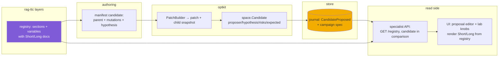

# Intern Guide: Layer Sections, Variables, and Candidate Proposals

This guide has two jobs. The first is orientation: you are joining a system spread across five repositories, and the parts you will touch sit at the meeting point of three of them. The second is a concrete design and implementation plan: we are building the machinery that lets an experimenter say *what a candidate changes* — "raise the RRF constant", "replace the summarization prompt" — as structured, documented, content-addressed data instead of hand-copied YAML. By the end you should understand why each piece exists, where it lives, and in what order to build it.

Nothing in this guide requires prior knowledge of the codebase. It does assume you are comfortable with Go, TypeScript, and the general idea of retrieval-augmented generation.

## Part I — The system you are joining

The workspace at `/home/manuel/workspaces/2026-08-24/use-optkit` contains several cooperating repositories. Their division of labor is the single most important thing to internalize, because this project's main failure mode is putting code in the wrong repo.

| Repo | Role | You will touch |
| --- | --- | --- |
| `optkit/` | Domain-neutral experiment control plane: journals, artifacts, snapshots, patches, candidates, campaigns, budgets, schedulers, measurements. Knows nothing about RAG. | **Yes** — `space/` gains sections and a registry |
| `rag-ttc/` | The RAG application: the retrieval pipeline, its layered configuration, the campaign runner, the specialist HTTP API, and the React UI. | **Yes** — configs, registry contents, manifest, API, UI |
| `ragkit/` (module dep) | Reusable RAG algorithms and data types: `Chunk`, `Representation`, `Hit`, RRF fusion, collapse, hydration. | No |
| `judgekit/` | Provider-neutral evaluation instruments. | No |
| `coinvault/` | An application whose `configs/ragopt/` directory pioneered the candidate-metadata format we are generalizing. | Read-only precedent |

The placement rule, which you should be able to recite: **a variable definition lives with the config type it mutates; the machinery for having variables at all lives one layer below everything that uses it.** Mechanism → optkit. Definitions and composition → rag-ttc. Algorithms → ragkit, untouched.

## Part II — The concepts, bottom up

### Content-addressed artifacts and the journal

Everything durable in this system is one of two things: an **artifact** (immutable bytes addressed by digest, with a schema ID and a sensitivity label) or a **journal event** (an append-only, hash-chained record in SQLite naming artifacts by reference). Read `optkit/artifact/` and `optkit/campaign/event.go` first. The consequence that shapes every design decision: *nothing is ever edited*. A change is always a new artifact plus a new event; identity is computed from content (`record.SemanticDigest`), so two semantically identical configs share an ID.

This is why "just add a field" is never trivial here: adding a field to a persisted type changes the digests of new instances, which changes identities downstream. You will hit this in Part V.

### Snapshots, variables, patches, candidates (`optkit/space/`)

This package is the heart of the project, and it is small — read it whole.

- A **snapshot** (`space/snapshot.go`) is a materialized configuration: `SnapshotRecord{ID, System, Schema, Config artifact.Ref}`. The config value is an artifact; the snapshot ID derives from it.
- A **variable** (`space/variable.go`) is a typed, named coordinate over a config type: `Variable[C, V]` carries a descriptor (ID, schema) and getter/setter closures over `C`, plus a **domain** (`space.IntRange(1,10)`).
- A **patch** is built by `NewPatchBuilder(parent, store, codec)` + `space.Set(builder, variable, value)` + `Build(ctx)`. It records, content-addressed, exactly which variables moved from what to what, and yields the **child snapshot**.
- A **candidate** (`space/candidate.go`) is the proposal envelope: `{Parent, Patch, Child, Proposer, Strategy, Hypothesis (required), Targets, Risks, CreatedAt}` — identity over all of it.

The only complete consumer is `optkit/examples/numbergame/` — a miniature system (multiply a number) that exercises the full loop: propose candidate → plan trial → reserve budget → run episodes → measure → estimate → decide, twice surviving simulated process restarts. When you are unsure how a piece is meant to be used, numbergame is the reference. The Experiment Lab UI at `/lab/numbergame` in the specialist app replays the same loop interactively (see OPTKIT-010).

### Campaigns, trials, episodes, measurements

- A **trial** (`optkit/experiment/`) expands arms × cases × repeats into **episode specs** with deterministic semantic keys.
- An **episode** executes one (arm, case, repeat) and seals a **trajectory** — the ordered event record of what happened inside.
- **Measurements** (`optkit/measure/`) are observations with explicit status (`measured`, `failed`, `satisfied`, `violated`…) and epochs identifying the instrument. Missing is never zero, anywhere, including the UI.
- **Estimates** (`experiment.PairedMean`) compare arms case-by-case. One subtlety you must preserve: estimates are computed from *recorded* values — the numbergame judge stores scores formatted to six decimals, and the paired mean uses those, not exact arithmetic. Instrument precision is part of the measurement.

### rag-ttc's layered configuration

rag-ttc models its pipeline as a twelve-layer directed graph, in canonical order:

```
corpus → chunking → representations → embeddings → indexes → retrieval
       → fusion → reranking → evidence → context → answer → judge
```

The types live in `rag-ttc/pkg/ttc/optimization/`: `ConfigRef` (one layer: identity, value schema, dependencies, resolved digest), `Graph` (the validated stack), `Diff` (which layers' identities differ between two graphs), and `Plan` (which layers can reuse materializations vs. must recompute, with reasons `direct_change` / `upstream_change` / `unchanged`). Experiment manifests (`rag-ttc/pkg/ttc/experimentworkbench/manifest.go`) carry one full graph per arm; `optkitcampaign` persists everything into a campaign spec at creation time, after which the manifest is never consulted again.

The crucial current limitation: **only the retrieval layer has real values.** `RetrievalConfig{Preparation, Route, Limit}` (`optkitcampaign/system.go`) is a genuine config whose layer identity is computed from its contents. Every other layer's identity is a frozen label like `config:fusion:fixture-v1` — a name with no operator-editable values behind it, even though the runtime has the values (the RRF constant is `SearchConfig.RRFConstant` in `rag-ttc/pkg/ttc/search/`, hardcoded to 60 at tool construction).

### The retrieval pipeline and its record

The search service (`rag-ttc/pkg/ttc/search/service.go`) runs: lexical and vector channels (each: raw → collapsed → policy-filtered) → RRF fusion → policy recheck → optional rerank → evidence hydration/return/admission. Since OPTKIT-009, each stage records its scored candidates, a per-run chunk catalog carries the content of every chunk any stage touched, and hits carry the `representation_id` of the derived text they matched. The specialist API (`rag-ttc/pkg/ttc/specialistapi/`) projects all of this read-only; the React app (`rag-ttc/apps/specialist/web/`) renders it, with a per-layer widget registry keyed by layer name and artifact schema (`src/layerwidgets/index.tsx`).

### The precedent: coinvault's candidate files

`coinvault/configs/ragopt/*/candidate.yaml` (`ragopt-candidate/v1`) is what good candidate metadata looks like in practice:

```yaml
mutation:
  asset: answer_grounding_prompt          # the ONE thing changed
  hypothesis: >-                          # falsifiable prose
    An explicit pre-tool answerability rule will make exact unknowable
    future-value requests abstain without calling any backend.
  expected_improvement:
    metric: correct_abstention            # structured, not free text
    groups: [feedback, abstention]
  regression_risks:
    - The rule may suppress legitimate current-price lookups.
evidence:
  selected_case_ids: [feedback-abstain-future-metal-price]
```

Optkit's `space.Candidate` already carries hypothesis and risks; what it lacks relative to this precedent is the structured `expected_improvement`, a structured proposer (`{kind, identity}` — human vs. LLM matters), motivating evidence, and — the subject of this ticket — a way to express the mutation itself against documented, discoverable variables.

## Part III — The problem, concretely

Three changes an experimenter wants to make, and where each fails today:

1. **"Keep 2 candidates per retriever instead of 1."** Possible today, but only by writing a complete second arm in the manifest — twelve layers of YAML for a one-integer change. The change itself is nowhere stated; the UI derives it afterwards.
2. **"Lower the RRF constant to 20."** Impossible today. `fusion` is a frozen identity; `RRFConstant` never leaves Go code.
3. **"Rewrite the summarization prompt."** Doubly impossible: representations are frozen *and* the change is an asset (a prompt text), not a scalar — a kind of variable optkit does not yet have.

And in every case: no hypothesis, no declared risks, no expected metric, no proposer — the campaign record cannot answer "what was this experiment *for*?" in structured form. The UI shows free-text descriptions (added in OPTKIT-009) as a stopgap, attached to arms rather than to the baseline→challenger relationship where they belong.

## Part IV — The design

### The central abstraction: LayerSection

The user-facing requirement: variables must be *grouped by pipeline step*, and both the group and each variable must carry documentation good enough that someone unfamiliar with the layer can orient themselves in the UI. The deliberate model for this is glazed's schema system (`~/code/wesen/go-go-golems/glazed/pkg/cmds/schema/`): a `Schema` is an ordered map of `Section{Slug, Name, Description, Definitions}`, and each `fields.Definition` has `{Name, Type, Help, Default, Choices, Required}`. We mirror that shape, with two adjustments: documentation is split into `Short`/`Long` at both levels (glazed has a single `Description`), and definitions carry experiment-specific metadata (domains, cost class, asset-ness) that a CLI flag system does not need.

```go
// optkit/space/section.go  (new)

// Section groups the editable variables of one configuration surface and
// documents them for humans. It is the experiment-system analogue of a
// glazed schema section: slug for machines, name for labels, short for
// one-line orientation, long for the paragraph a newcomer reads first.
type Section struct {
    Slug      string                 // "fusion" — stable, machine-facing
    Name      string                 // "Result fusion"
    Short     string                 // one sentence: what this step does
    Long      string                 // 1–3 paragraphs: how it works, when to touch it
    Schema    record.SchemaID        // the config value schema this section edits
    Variables []VariableDescriptor   // ordered, as they should render
}

type VariableKind string
const (
    KindInt    VariableKind = "int"
    KindFloat  VariableKind = "float"
    KindString VariableKind = "string"
    KindChoice VariableKind = "choice"
    KindAsset  VariableKind = "asset"   // value is an artifact ref (prompt, rubric)
)

type VariableDescriptor struct {
    ID       space.VariableID
    Name     string        // "rrf_k"
    Kind     VariableKind
    Short    string        // "Rank-fusion smoothing constant."
    Long     string        // the paragraph: formula, what large/small k does
    Domain   *Domain       // {Min, Max} or {Choices}; nil for assets/free text
    Default  any           // JSON-serializable
    CostHint string        // "cheap" | "recompute-downstream" | "regenerates-corpus"
    AssetSchema record.SchemaID // for KindAsset: schema of the referenced artifact
}

// Registry is the introspectable catalog the UI and the manifest loader
// share: ask it what exists, render what it says, validate against it.
type Registry struct{ sections []Section }        // ordered
func (r *Registry) Section(slug string) (Section, bool)
func (r *Registry) Validate(slug, variable string, value any) error
func (r *Registry) MarshalJSON() ([]byte, error) // served verbatim to the UI
```

Design notes worth defending in review:

- **Descriptors are data, not closures.** The existing `space.Variable[C, V]` carries getter/setter closures and cannot cross a process boundary. The descriptor is the serializable face; the typed variable remains the mutation mechanism. Each rag-ttc layer package binds them: descriptor for the registry, `Variable[Config, V]` for the patch builder, one construction site so they cannot drift.
- **`Short`/`Long` are required at both levels.** The UI renders `Short` beside every slider and section header, `Long` behind a disclosure. Documentation is part of the contract, not an afterthought — exactly the glazed philosophy, upgraded because our users are less expert than CLI users.
- **`CostHint` is a hint, not the truth.** The truth about recompute cost is `optimization.Plan` against the layer graph; the hint lets the UI color the editor before a plan exists.
- **Asset variables are refs.** A prompt change is `sha256:old → sha256:new` with the new text stored as an artifact; the patch stays small, the content stays attributable, and coinvault's parent-assets/candidate-assets model maps onto it directly.

### Structured candidate fields (optkit)

`space.Candidate` gains the fields the coinvault precedent proved out, all participating in identity:

```go
type Proposer struct { Kind string /* "human"|"llm"|"search" */; Identity string }
type ExpectedImprovement struct { Metric string; Groups []string }
type Evidence struct { SelectedCaseIDs []string; DiagnosticDigest record.Digest }
// Candidate gains: ProposerRef Proposer; Expected ExpectedImprovement; Motivation Evidence
// (Targets []string is subsumed by Expected and deprecated.)
```

### Patch-style candidates in the manifest (rag-ttc)

The manifest keeps whole-arm form for the baseline and gains a candidate form for challengers:

```yaml
arms:
- id: limit-1            # baseline: full arm as today
  config: {...}
  layers: [...]
candidates:
- id: rrf-k-20
  parent: limit-1
  proposer: {kind: human, identity: manuel}
  mutations:
  - section: fusion
    variable: rrf_k
    to: 20
  hypothesis: >-
    Lowering k sharpens rank differences so consensus across channels
    matters less than a single strong signal.
  expected_improvement: {metric: retrieval.target-coverage, groups: [multi-source]}
  regression_risks:
  - A single noisy channel can now dominate the fused ranking.
  motivating_cases: [q-comparison]
```

Loading composes: resolve parent arm → apply mutations via the registry-bound variables → recompute the mutated layer's identity → cascade downstream identities (this composition lives in `rag-ttc/pkg/ttc/optimization`, which owns the graph) → materialize the challenger arm → build the `space.Candidate` → persist candidate and patch in the campaign spec and emit `CandidateProposed` in the journal (numbergame already shows the event shape).

### Data flow, end to end



The same registry serves three consumers, which is the point: the **manifest loader** validates mutations against it, the **proposal editor** renders it as forms, and the **Experiment Lab's knobs** bind to it — playing and proposing share one vocabulary.

### API and UI surface

- `GET /api/rag/v1/registry` — the serialized registry (sections in pipeline order, each with docs and variables). Static per server build; cacheable.
- `ComparisonView` gains `candidate` (the full structured proposal) when the treatment arm was candidate-authored; the comparison screen renders hypothesis beside the verdict and regression risks as a checklist next to the paired-case evidence.
- The proposal editor (Part IV of the retrieval-lab design, OPTKIT-010 diary) renders: section picker → variable picker → kind-appropriate control (slider for int domains, side-by-side diff editor for assets) → live invalidation strip from `optimization.Plan` → hypothesis/risks/expected form → seal.
- Every section header shows `Short` with `Long` behind a disclosure; every variable control shows its `Short` inline. A user who has never heard of RRF reads: *"Rank-fusion smoothing constant — larger k flattens rank differences so agreement between channels dominates; smaller k lets a single #1 win."*

## Part V — Implementation guide

Work in this order; each step lands green independently.

**Step 1 — optkit: sections, registry, asset kind, structured candidate fields.**
Files: `optkit/space/section.go` (new), `optkit/space/candidate.go` (extend).
Pseudocode for the registry JSON — settle it first, it is the UI contract:

```json
{ "sections": [ { "slug": "fusion", "name": "Result fusion",
    "short": "Merges the keyword and semantic channels into one ranking.",
    "long": "…RRF assigns each candidate 1/(k+rank) per channel…",
    "schema": "schema:rag-ttc.config.fusion/v2",
    "variables": [ { "name": "rrf_k", "kind": "int",
        "short": "Rank-fusion smoothing constant.",
        "long": "…", "domain": {"min":1,"max":200}, "default": 60,
        "cost_hint": "recompute-downstream" } ] } ] }
```

Tests: identity stability (candidate digest changes when hypothesis changes; registry serialization round-trips); numbergame migrates to declare its multiplier through a section (one section, one variable) — proving the mechanism on the existing example. Mind the pre-commit gofmt hook; struct-tag alignment has bitten twice.

**Step 2 — rag-ttc: a real fusion config.**
Files: new `pkg/ttc/optimization/layers/fusion.go` (or the package layout review prefers), `pkg/ttc/search/` plumbing.
`FusionConfig{RRFK int}` with schema `schema:rag-ttc.config.fusion/v2`; the search tool takes it instead of the hardcoded 60; the fixture manifest writes the fusion layer with real values the way retrieval already does. **Identity warning:** this changes the fusion layer identity in every new campaign — old stores remain readable (read side never recomputes), but comparisons across the boundary will show fusion as changed. State this in the PR.

**Step 3 — rag-ttc: registry contents.**
Declare descriptors + typed variables together, per layer package: `retrieval.limit` (IntRange 1–10), `fusion.rrf_k` (IntRange 1–200). Write the `Short`/`Long` prose *now*, in the code, reviewed like code — it is the UI copy. Assemble `Registry` in one place (suggest `pkg/ttc/optimization/registry.go`).

**Step 4 — rag-ttc: manifest candidates.**
Extend `experimentworkbench.Manifest` with the `candidates:` block (strict decoding — `KnownFields(true)` means the schema must be complete before the YAML can carry it). Composition: `ApplyMutations(parentGraph, parentConfigs, mutations, registry) → (childGraph, childConfigs, patch)` in `optimization`. Persist the `space.Candidate` + patch in `CampaignSpec`; emit `CandidateProposed`. Campaign digests change again — fresh stores, episode keys stable only if case inputs are untouched.

**Step 5 — specialist API.**
`GET /registry` (serve the marshaled registry); `ComparisonView.Candidate *CandidateSummary`. Follow the additive-fields pattern from OPTKIT-009 — and raise the open question of schema version bumps in the PR rather than deciding silently.

**Step 6 — UI.**
Types for registry + candidate; proposal editor screen; comparison screen renders hypothesis/risks/expected; Experiment Lab knobs read domains and docs from `/registry` instead of hardcoding. Keep every widget honest about absence: a store without candidates renders the current description-based view, unchanged.

**Step 7 (later) — asset variables in anger.**
`representations.summary_prompt` as `KindAsset` with a diff editor and a bounded spot-check preview ("regenerate the representation for one chunk"). Blocked on the representation-generation producer; do not fake it with instant previews.

## Part VI — Pitfalls, invariants, and how to check your work

- **Digest discipline.** Any field added to a persisted type changes new identities. Decide per field whether that is correct (hypothesis: yes, it is reviewed intent) and say so in the commit message. The open question from OPTKIT-009 — whether prose edits should create new experiment identities — is still open; do not resolve it silently.
- **Missing is never zero.** Registry defaults are not measurements; a variable without a default renders as unset, not 0.
- **The store is canonical after creation.** The manifest is authoring input only; everything the UI needs must be persisted in the spec/journal, never re-read from YAML.
- **Read side never recomputes.** The API projects what was recorded. If the UI needs a value, the recording layer produces it — that lesson cost three store rebuilds in OPTKIT-009 (per-stage scores, chunk catalog, representation lineage).
- **Validate against the sealed record.** The Experiment Lab's parity tests (see `apps/specialist/web/src/test/lab-sim.test.ts`) pin browser math to exported store bundles; extend the same pattern to fusion math when `rrf_k` becomes variable (the recorded contributions are literally `1/(k+rank)` — assert it).
- **Run the full loop before calling a step done**: `GOWORK=off go test ./...` in the touched repo, `pnpm typecheck && pnpm test` in the app, then a real `campaign run` into a fresh store and a click-through of the affected screens. Screenshots into the ticket's `various/screenshots/`, diary entry per step (see OPTKIT-008/009/010 diaries for the format).

## Glossary

- **Arm** — one complete pipeline configuration participating in a trial.
- **Artifact** — immutable, digest-addressed bytes with a schema and sensitivity.
- **Candidate** — a proposed change: parent snapshot + patch + child snapshot + hypothesis/risks/expectations, content-addressed.
- **Layer / Section** — one step of the pipeline (config surface); a Section is its documented, variable-bearing face.
- **Patch** — the content-addressed record of which variables changed from what to what.
- **Registry** — the ordered, serializable catalog of sections and variables; single source of truth for manifest validation and UI rendering.
- **Snapshot** — a materialized configuration with a content-derived identity.
- **Trajectory** — the sealed event record of one episode's execution.

## Appendix — Reader's guide for the architect review

The review surface is smaller than the implementation surface. Read in this order, with these questions in hand.

**Tier 1 — decision surface (read closely):**

1. `optkit/space/` (whole package, seven small files). Load-bearing choice: the descriptor/closure split — serializable `VariableDescriptor`s for UI and manifests, typed `Variable[C,V]` closures for mutation, bound together at one site per layer. If this split is wrong, everything downstream is wrong.
2. `optkit/record/` (`SemanticDigest`, `ContentID`). Open question flagged twice and never decided: should prose (hypothesis, Short/Long docs) participate in identity? Should a prose-only edit create a new experiment identity?
3. `rag-ttc/pkg/ttc/optimization/`. Placement question: does the layered-config model stay in rag-ttc or lift to ragkit once coinvault converges on it? Cheap to decide now, expensive later.
4. `rag-ttc/pkg/ttc/experimentworkbench/manifest.go` + `optkitcampaign/campaign.go`. Invariants the `candidates:` block must respect: strict decoding, spec canonical after creation, manifest never re-read.

**Tier 2 — precedent and constraints:**

5. `optkit/examples/numbergame/demo.go` — the only complete candidate-loop consumer; changes to `space` should leave it looking natural.
6. `coinvault/configs/ragopt/` — including `shared/gate-policy.yaml` and `treatment-contract.yaml`, deliberately out of scope here. Ruling requested: do gate policies migrate into optkit now (numbergame's lexicographic decision is a hand-rolled instance) or stay app-level?
7. `glazed/pkg/cmds/schema/` + `fields/` — the mirrored pattern. Sharpest question: mirror or reuse? This design mirrors (optkit stays dependency-light; experiment variables need domains, cost hints, and asset-ness that CLI flags lack). If optkit should instead depend on glazed's schema types, that decision must come first — it rewrites Step 1.

**Tier 3 — boundaries to confirm uncrossed:** `ragkit/rag/types.go` (variables never leak into algorithms), `rag-ttc/pkg/ttc/specialistapi/types.go` (standing policy question: additive fields without schema version bumps — bless or veto), judgekit (future value-schema supplier only).
