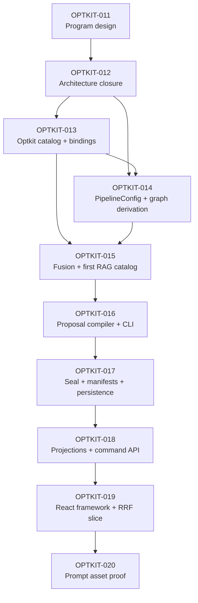

# Backend-First Optimization Workbench Program Roadmap

## Executive summary

OPTKIT-011 established the product direction: an engineer should be able to inspect a failed case, identify a meaningful optimization coordinate, preview and understand a proposed change, seal that change as a durable candidate, run a controlled trial, and compare the result with the original hypothesis and risks. The architect review then separated that product into nine implementation tickets. This document is the program-level map that keeps those tickets aligned while each one performs substantial local research.

The sequence is intentionally backend-first. The generic variable model and RAG semantic configuration must be credible before a manifest, CLI, API, or React screen depends on them. The frontend therefore does not invent mutation semantics, recomputation rules, or candidate identity. It consumes contracts proven first through Go APIs and the Glazed CLI.

This roadmap is not a substitute for the intern guide inside each child ticket. It records why each ticket exists, which earlier contracts it assumes, what it must deliver, what it must not absorb, and what evidence permits the next ticket to begin.

## Program goal

The program is complete when one registered optimization variable can travel without semantic duplication through the entire system:

```text
real configuration field
  → typed Optkit variable
  → serializable catalog descriptor
  → executable binding
  → pure proposal draft
  → child PipelineConfig
  → derived graph diff
  → invalidation plan
  → sealed patch and candidate
  → persisted campaign
  → historical read projection
  → workbench editor and preview
  → comparison against declared intent
```

The architecture must then prove the same workflow for two materially different coordinate kinds:

1. a cheap scalar coordinate, `fusion.rrf_k`; and
2. an expensive artifact coordinate, `representations.summary_prompt`.

Adding a normal future variable should require defining the semantic field, typed variable and descriptor/binding, then registering it. It must not require changes to proposal compilation, patch semantics, manifest mutation parsing, the workbench shell, or comparison semantics.

## Ground rules carried by every ticket

### Repository ownership

- `optkit/` owns domain-neutral experiment mechanics: variables, domains, lenses, codecs, catalogs, bindings, patches, snapshots, candidates, journals, trials, and measurements.
- `rag-ttc/` owns RAG semantic configuration, layer composition, registered RAG variables, proposal compilation/sealing applications, manifests, CLI commands, specialist projections, and workbench behavior.
- `ragkit/` remains algorithm-focused. This program does not move the optimization graph there.
- React owns interaction and visualization, not legality, identity, or recomputation semantics.

### Persistence and provenance

- Interactive draft compilation performs no durable writes.
- Sealing uses normal Optkit patch and snapshot mechanics; it does not reproduce them in another package.
- A campaign store is canonical after creation. Historical screens do not re-read manifests or recompute missing facts.
- Missing values remain missing. Catalog defaults are not measurements, and absent measurements are not zero.
- Every persisted identity change is deliberate, documented, and tested.

### Delivery discipline

Every child ticket contains:

- an evidence-backed intern guide;
- an implementation diary using the strict diary format;
- actionable tasks and acceptance gates;
- related-file and changelog records;
- a clean `docmgr doctor` result;
- a ticket-specific reMarkable bundle.

Implementation work later added to these tickets must use focused cross-repository commits and record exact commit hashes in the diary.

## System baseline

The current system already has useful foundations, but they do not yet form an authoring architecture.

- `optkit/space/variable.go` defines typed `Variable[C,V]` values with a descriptor, lens, domain, and codec.
- `optkit/space/patch.go` applies typed assignments, stores assignment values, and materializes a child snapshot. Its persistence is why it belongs in sealing rather than interactive compilation.
- `optkit/space/candidate.go` gives candidates a parent, patch, child, proposer, strategy, hypothesis, targets, and risks.
- `rag-ttc/pkg/ttc/optimization/graph.go` resolves twelve layer identities and dependency digests.
- `rag-ttc/pkg/ttc/optimization/invalidation.go` distinguishes direct changes, upstream invalidation, and reuse.
- `rag-ttc/pkg/ttc/experimentworkbench/manifest.go` strictly decodes full-arm manifests and currently requires an executable `RetrievalConfig` plus a manually authored graph for every arm.
- `rag-ttc/pkg/ttc/optkitcampaign/system.go` makes the Optkit snapshot contain only `RetrievalConfig`.
- `rag-ttc/pkg/ttc/search/semantic_fixture.go` fixes the RRF rank constant at `60`, even though the runtime accepts a positive `float64`.
- `rag-ttc/pkg/ttc/specialistapi/` is a read-only projection boundary.
- `rag-ttc/apps/specialist/web/src/layerwidgets/` already demonstrates specialized renderers, while `LabScreen.tsx` demonstrates an explorable but numbergame-specific campaign.

The child tickets close these gaps in dependency order.

## Ticket portfolio

### OPTKIT-012 — Architecture Closure and Optimization Workbench Contracts

**Goal:** Convert the architect brief's decisions into accepted, implementable Go and API contracts before downstream packages encode assumptions independently.

**Contents:**

- ADRs for whole-system configuration, catalog/binding separation, value schemas, candidate identity, catalog provenance, and read/write API boundaries;
- concrete `Catalog`, `Bindings[C]`, `PipelineConfig`, `CompileProposal`, and `SealProposal` sketches;
- package dependency diagram and cycle analysis;
- compatibility decision for v1 manifests and stores;
- dependency and acceptance gates for all later tickets.

**Depends on:** OPTKIT-011 only.

**Unlocks:** Every later ticket.

**Must not do:** Production behavior changes or speculative frontend implementation.

### OPTKIT-013 — Optkit Semantic Catalog and Executable Variable Bindings

**Goal:** Make typed Optkit variables discoverable and invocable from serialized authoring input without creating a second mutation algebra.

**Contents:**

- ordered sections and stable fully qualified variable IDs;
- complete discriminated value/domain descriptors;
- deterministic semantic and provenance identities for catalogs;
- executable `Bindings[C]` constructed from typed variables;
- structured candidate intent and explicit identity tests;
- numbergame as the generic proof case.

**Depends on:** Accepted OPTKIT-012 contracts.

**Unlocks:** RAG variable registration and pure proposal compilation.

**Must not do:** RAG-specific variable definitions or UI layout metadata.

### OPTKIT-014 — Whole-Pipeline RAG Configuration and Graph Derivation

**Goal:** Establish one patchable semantic RAG configuration from which the twelve-layer graph is derived, eliminating drift between executable values and manually authored graph identities.

**Contents:**

- package ownership for `PipelineConfig` and layer config values;
- migration of retrieval configuration out of the campaign adapter;
- explicit placeholders for initially frozen layers;
- layer-local lenses lifted to the aggregate configuration;
- deterministic graph derivation and identity tests;
- package-cycle prevention.

**Depends on:** OPTKIT-012 and the generic lens/binding direction in OPTKIT-013.

**Unlocks:** Real fusion configuration and proposal compilation.

**Must not do:** Implement the final UI or make manifests the source of graph truth.

### OPTKIT-015 — Real Fusion Configuration and First RAG Optimization Catalog

**Goal:** Prove that catalog variables describe real runtime behavior by making fusion configurable and registering the first retrieval and fusion coordinates.

**Contents:**

- `FusionConfig{RRFK float64}`;
- plumbing from pipeline configuration through fixture preparation to `WeightedRRF`;
- an accurate name and description for the existing final-result limit;
- RAG catalog sections, documentation, domains, and bindings;
- runtime, identity, diff, invalidation, and fixture parity tests.

**Depends on:** OPTKIT-013 and OPTKIT-014.

**Unlocks:** A meaningful proposal compiler proof and the RRF vertical slice.

**Must not do:** Describe the result limit as per-retriever top-K or change RRF to integer merely for slider convenience.

### OPTKIT-016 — Proposal Compiler and Glazed CLI

**Goal:** Build a pure application service that turns serialized mutations into an auditable candidate draft, and expose it through backend-first structured CLI commands.

**Contents:**

- canonical decoding, validation, normalization, and in-memory application;
- before/after values, graph diff, invalidation plan, diagnostics, and preview capabilities;
- deterministic handling of duplicates, unknown IDs, invalid domains, no-ops, and ordering;
- catalog list/show and proposal compile Glazed commands;
- proof that repeated compilation does not write artifacts or journal events.

**Depends on:** OPTKIT-013 through OPTKIT-015.

**Unlocks:** Sealing, manifest candidates, and browser draft compilation.

**Must not do:** Call `PatchBuilder.Build` while a user moves controls or embed business logic in Cobra handlers.

### OPTKIT-017 — Proposal Sealing, Candidate Manifests, and Campaign Persistence

**Goal:** Turn a validated draft into canonical Optkit records and support concise patch-style candidate authoring in strict manifests.

**Contents:**

- `SealProposal` replay through typed bindings and `PatchBuilder`;
- strict candidate manifest schema with parent, mutations, intent, risks, and evidence;
- persisted patches, snapshots, candidates, catalog provenance, and graph state;
- `CandidateProposed` event emission;
- deterministic/idempotent sealing and manifest-removal tests.

**Depends on:** OPTKIT-016 and accepted candidate identity policy.

**Unlocks:** Historical candidate projections and complete CLI-authored campaigns.

**Must not do:** Create manifest-specific mutation semantics or require a manifest after campaign creation.

### OPTKIT-018 — Candidate Projections and Workbench Command API

**Goal:** Expose sealed candidate meaning through historical read projections and expose compile/preview/seal operations through a separate command boundary reusable by HTTP.

**Contents:**

- candidate summaries on comparisons;
- mutation and declared-intent projections;
- current catalog read endpoint;
- application command API for compile, preview, and seal;
- HTTP adapters with authorization, sensitivity, idempotency, and error contracts;
- explicit separation between `specialistapi` historical reads and workbench commands.

**Depends on:** OPTKIT-017.

**Unlocks:** React authoring without direct knowledge of storage mechanics.

**Must not do:** Recompute historical facts or place business rules in HTTP handlers.

### OPTKIT-019 — React Workbench Framework and RRF Vertical Slice

**Goal:** Build the reusable React workbench and prove it with a complete RRF candidate workflow backed by real services and recorded evidence.

**Contents:**

- generic editors for ordinary catalog value kinds;
- specialized workbench plugin registry with generic fallbacks;
- shared `WorkbenchShell` and proposal/evidence components;
- RRF contribution inspector and deterministic preview;
- case → proposal → pipeline → trial → verdict flow;
- parity, accessibility, deep-link, loading, empty, and error tests.

**Depends on:** OPTKIT-018 and the RRF semantics from OPTKIT-015.

**Unlocks:** A product-complete scalar-variable proof and the asset-variable extension.

**Must not do:** Turn backend descriptors into a server-driven component/layout DSL or infer invalidation client-side.

### OPTKIT-020 — Asset Variable Proof for Representation Prompts

**Goal:** Prove that the same workbench architecture supports an expensive, sensitivity-aware artifact mutation without weakening provenance or pretending generation is instantaneous.

**Contents:**

- `representations.summary_prompt` artifact variable;
- old/new artifact materialization and side-by-side diff authoring;
- recomputation plan for representations and downstream layers;
- bounded one-chunk server preview;
- sensitivity, authorization, provenance, cancellation, and failure behavior;
- scalar-versus-asset conformance tests.

**Depends on:** OPTKIT-019 and the asset contracts established in OPTKIT-013/018.

**Unlocks:** Proof that the architecture generalizes beyond scalar controls.

**Must not do:** Store prompt text in patch metadata, duplicate generation in TypeScript, or claim an unbounded preview is cheap.

## Dependency graph



The graph is intentionally mostly linear. Parallel work is safe only where contracts are already accepted. For example, OPTKIT-013 and early OPTKIT-014 package research can overlap after OPTKIT-012, but OPTKIT-016 must not stabilize compiler output before OPTKIT-015 proves the first real variable.

## Program gates

### Gate 1 — Contracts are credible

OPTKIT-012 must answer the six architecture questions and show compile-oriented Go contracts. A diagram or prose preference alone is insufficient. The package graph must be acyclic, identity inputs named, and compatibility policy explicit.

### Gate 2 — Generic mutation is real

OPTKIT-013 must prove serialized input reaches an existing typed variable through one binding declaration and produces the same patch as direct typed code. Numbergame is the reference because it already exercises candidate, patch, snapshot, and campaign mechanics.

### Gate 3 — RAG semantics have one source of truth

OPTKIT-014 and OPTKIT-015 must show that changing `PipelineConfig.Fusion.RRFK` changes both the local fusion identity and actual `WeightedRRF` arithmetic. The graph may no longer be independently authored for the new path.

### Gate 4 — Draft and seal are observably different

OPTKIT-016 must prove compilation creates no durable objects. OPTKIT-017 must prove sealing creates canonical objects exactly once and that a campaign remains explainable without source authoring files.

### Gate 5 — APIs project facts, commands invoke applications

OPTKIT-018 must keep the historical read model separate from authoring commands. Browser code receives diagnostics and plans from the backend rather than reconstructing them.

### Gate 6 — Two coordinate classes use one workflow

OPTKIT-019 proves a scalar variable end to end. OPTKIT-020 proves an artifact variable using the same compiler, sealer, persistence, projection, and shell contracts.

## Status tracking

The ticket index and `tasks.md` of each child ticket are authoritative for local work. This table tracks only program-level progression and must be updated when a ticket crosses an exit gate.

| Ticket | Program role | Entry dependency | Current state |
| --- | --- | --- | --- |
| OPTKIT-012 | Architecture contracts | OPTKIT-011 | complete — contracts accepted, proven, and pinned to OPTKIT-013–018 (`b1fcf17`) |
| OPTKIT-013 | Generic catalog and bindings | OPTKIT-012 | complete — six value kinds, catalog identities, typed registry, candidate v2, and numbergame proof |
| OPTKIT-014 | Aggregate RAG configuration | OPTKIT-012/013 | complete — v2 PipelineConfig, derived graphs, lifted lenses, campaigns/manifests, projections, and parity validation |
| OPTKIT-015 | First real RAG variables | OPTKIT-013/014 | guide validated and delivered; implementation pending |
| OPTKIT-016 | Pure compiler and CLI | OPTKIT-013–015 | guide validated and delivered; implementation pending |
| OPTKIT-017 | Sealing and persistence | OPTKIT-016 | guide validated and delivered; implementation pending |
| OPTKIT-018 | Projection and command boundaries | OPTKIT-017 | guide validated and delivered; implementation pending |
| OPTKIT-019 | React framework and RRF proof | OPTKIT-018 | guide validated and delivered; implementation pending |
| OPTKIT-020 | Artifact-variable proof | OPTKIT-019 | guide validated and delivered; implementation pending |

## Required structure of every child guide

Each intern guide must answer these questions in order:

1. What user and system problem does this ticket solve?
2. Which prior contracts are assumed, and which files implement the current state?
3. What does the current runtime actually do?
4. What gap prevents the program flow from advancing?
5. Which API and data model will this ticket introduce?
6. Which invariants and identity inputs are load-bearing?
7. How does the runtime flow execute, in pseudocode and diagrams?
8. Which files should an intern change, and in what order?
9. Which tests prove behavior, compatibility policy, and failure handling?
10. What is explicitly excluded, and which next ticket consumes the result?

No guide may rely on the reader having read all earlier tickets. It must summarize prerequisites and link to the authoritative prior contract.

## Cross-ticket decisions that must not drift

- Variable IDs are fully qualified machine identities; labels and keys are separate display concepts.
- Catalog descriptors are serializable data; bindings are executable typed adapters.
- The catalog describes semantics and legality, not React layout.
- The proposal compiler is pure and may be called repeatedly.
- Sealing replays normalized values through canonical typed mutation mechanics.
- `PipelineConfig` derives the graph; graph YAML does not define executable truth.
- RRF `k` remains a positive `float64` unless OPTKIT-012 records a contrary accepted decision supported by runtime evidence.
- Historical projections read recorded facts; they do not consult current catalogs to reinterpret old candidates without sealed provenance.
- Specialized UI plugins are optional enhancements over generic editors.
- Asset content stays in artifacts; records refer to it by digest and sensitivity.

## Validation and review cadence

At the end of each ticket implementation:

```text
focused unit tests
  → full affected-repository tests
  → race/type/lint checks where relevant
  → CLI smoke or browser fixture test
  → real fresh-store campaign when persistence changed
  → docmgr relations/changelog/diary
  → docmgr doctor
  → focused commits by repository
```

A downstream ticket starts only when its upstream contract has fresh test and review evidence. Passing unrelated repository tests is not evidence that a gate is satisfied.

## Program-level risks

1. **Aggregate configuration inflation.** Modeling all twelve layers can become boilerplate. The mitigation is explicit versioned frozen values, not an untyped map that defeats typed mutation.
2. **Catalog/binding drift.** Separate hand-written descriptors and switch statements will diverge. One constructor must produce both metadata and executable behavior.
3. **Accidental persistence during drafts.** `PatchBuilder.Build` stores values and snapshots. Compile paths must not invoke it.
4. **Historical reinterpretation.** Current documentation and domains can change. Sealed catalog provenance must explain the variable as authored.
5. **Compatibility ambiguity.** The repository guidance rejects unrequested shims. OPTKIT-012 must record whether old stores/manifests are supported before code changes.
6. **Frontend semantic duplication.** Existing labels and simulations are useful precedents but must migrate to backend catalog and compiler outputs.
7. **False preview fidelity.** Deterministic scalar operations may run locally when parity-tested; expensive prompt generation remains bounded and server-side.

## Accepted compatibility decision

On 2026-08-26 OPTKIT-012 accepted explicit v2 schemas with no v1 aliases, dual-field decoding, or automatic store/manifest conversion. Checked-in authoring assets migrate to the aggregate v2 shape. Historical v1 stores remain immutable evidence and are not reinterpreted or resumed by v2 code. Any future v1 reader requires a separately approved compatibility ticket with named fixtures and support boundaries.

## References

- OPTKIT-011 design doc 01: intern guide to sections, variables, and candidate proposals.
- OPTKIT-011 design doc 02: workbench UI vision and screen requirements.
- OPTKIT-011 design doc 03: architect brief and recommended ticket cadence.
- OPTKIT-010 implementation diary: deterministic numbergame lab and recorded-precision lesson.
- `optkit/space/`: current typed variables, patches, snapshots, and candidates.
- `rag-ttc/pkg/ttc/optimization/`: current graph, diff, and invalidation plan.
- `rag-ttc/pkg/ttc/experimentworkbench/`: strict manifests and CLI application services.
- `rag-ttc/pkg/ttc/optkitcampaign/`: current retrieval-only snapshots and durable campaign specification.
- `rag-ttc/pkg/ttc/specialistapi/`: current read-only projection and HTTP boundary.
- `rag-ttc/apps/specialist/web/src/`: current specialist UI, widget registry, and numbergame lab.
