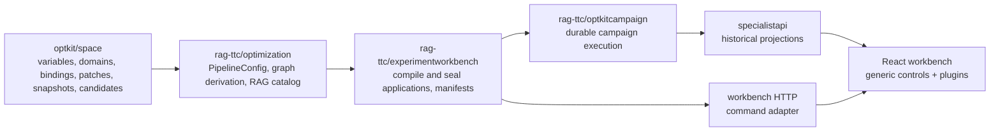

# Intern Guide to Optimization Workbench Architecture and Contracts

## 1. Executive summary

This ticket closes the architecture questions that would otherwise be answered accidentally in several repositories. The desired product is an optimization workbench, but the load-bearing work is a set of backend contracts: one patchable RAG configuration, one catalog of legal optimization coordinates, one bridge from serialized values to typed variables, one pure proposal compiler, and one durable sealing operation.

The current system already has typed variables, immutable snapshots, canonical patches, a layered RAG graph, strict manifests, a durable campaign, a read-only specialist API, and an explorable numbergame UI. The missing piece is composition. Current RAG snapshots contain only retrieval settings while the graph claims to represent twelve layers. Browser or YAML values cannot invoke `space.Variable[C,V]` without a hand-written type switch. `PatchBuilder.Build` writes artifacts, so it cannot be used every time a slider moves. These constraints determine the architecture below.

This guide recommends accepting six decisions:

1. patch a whole `PipelineConfig` and derive the graph from it;
2. separate serializable `Catalog` data from executable `Bindings[C]`;
3. use a discriminated, lossless value specification;
4. make sealed candidate intent semantic while excluding timestamps and documentation prose from candidate identity;
5. persist both semantic catalog identity and the exact catalog artifact used for authoring;
6. keep historical reads and authoring commands as separate application boundaries.

## 2. System orientation

### 2.1 Repository responsibilities



Optkit remains domain-neutral. It may know that a variable is a float range or an artifact reference, but it must not know what RRF or a representation prompt means. RAG-TTC owns those definitions because it owns the configuration and runtime they mutate.

### 2.2 Current typed mutation path

`optkit/space/variable.go:21-47` defines a serializable descriptor plus an executable `Variable[C,V]` carrying a lens, domain, and codec. `optkit/space/patch.go:43-76` validates and applies one typed assignment, encodes old/new values, stores the new value artifact, and returns an assignment record. `PatchBuilder.Build` at lines 104-151 sorts assignments, materializes a child snapshot, and derives patch identity.

That path is correct for sealing. It is intentionally not pure because durable records are its purpose.

### 2.3 Current RAG asymmetry

`rag-ttc/pkg/ttc/optkitcampaign/system.go:27-31` defines the only executable Optkit configuration as:

```go
type RetrievalConfig struct {
    Preparation string
    Route       string
    Limit       int
}
```

`rag-ttc/pkg/ttc/optimization/contracts.go:22-35`, however, declares twelve semantic layers. Full-arm manifests repeat both retrieval values and twelve `ConfigRef` entries. `ValidateManifest` only proves that the retrieval graph node agrees with the retrieval config (`manifest.go:113-174`). No equivalent proof exists for fusion or any frozen layer.

### 2.4 Current draft/seal mismatch

A workbench must compile drafts repeatedly while the user edits. Calling `PatchBuilder.Build` for `60 → 50 → 40 → 30 → 20` would store five value artifacts and five child snapshots. Those are not five reviewed candidates. Therefore draft compilation and durable sealing are separate operations, even though both use the same registered variables.

## 3. Problem statement and scope

The architecture must answer these questions before implementation:

- What concrete Go value does an Optkit snapshot contain for a complete RAG arm?
- How does `{ "variable": "fusion.rrf_k", "value": 20 }` invoke a typed `Variable[PipelineConfig,float64]`?
- How are ranges, choices, booleans, strings, and artifact references represented without losing information?
- Which intent fields alter candidate identity?
- How can an old candidate retain the variable meaning and documentation used when it was authored?
- Which service is safe to call repeatedly, and which service writes the campaign journal?
- Does the program support opening old v1 manifests/stores after the new snapshot schema lands?

This ticket designs those answers. It does not implement the child tickets.

## 4. Decision A: patchable whole-system configuration

### Decision: Use typed PipelineConfig as snapshot value

- **Context:** The snapshot currently contains only retrieval values while graph YAML independently describes all layers.
- **Options considered:** Keep separate per-layer snapshots; patch an untyped map; patch only retrieval and special-case other layers; use one typed aggregate.
- **Decision:** Introduce a typed `optimization.PipelineConfig`. Optkit snapshots for new RAG campaigns contain that aggregate. The optimization graph is derived from it.
- **Rationale:** One semantic value can be patched by generic Optkit mechanics and can deterministically derive every local layer identity. Typed layer structs preserve validation and codec behavior.
- **Consequences:** The campaign system/schema changes. Initially frozen layers still require explicit versioned values. Package ownership must avoid an `optimization ↔ optkitcampaign` cycle.
- **Status:** proposed for acceptance in this ticket.

Recommended shape:

```go
// rag-ttc/pkg/ttc/optimization/config.go
const PipelineConfigSchema record.SchemaID =
    "schema:rag-ttc.pipeline-config/v2"

type FrozenConfig struct {
    Version string `json:"version" yaml:"version"`
}

type RetrievalConfig struct {
    Preparation     string `json:"preparation" yaml:"preparation"`
    Route           string `json:"route" yaml:"route"`
    FinalResultLimit int   `json:"final_result_limit" yaml:"final_result_limit"`
}

type FusionConfig struct {
    RRFK float64 `json:"rrf_k" yaml:"rrf_k"`
}

type PipelineConfig struct {
    Corpus          FrozenConfig       `json:"corpus"`
    Chunking        FrozenConfig       `json:"chunking"`
    Representations FrozenConfig       `json:"representations"`
    Embeddings      FrozenConfig       `json:"embeddings"`
    Indexes         FrozenConfig       `json:"indexes"`
    Retrieval       RetrievalConfig    `json:"retrieval"`
    Fusion          FusionConfig       `json:"fusion"`
    Reranking       FrozenConfig       `json:"reranking"`
    Evidence        FrozenConfig       `json:"evidence"`
    Context         FrozenConfig       `json:"context"`
    Answer          FrozenConfig       `json:"answer"`
    Judge           FrozenConfig       `json:"judge"`
}
```

`FrozenConfig` is not an invitation to an untyped map. It is an explicit semantic version value that can later be replaced by a typed layer configuration without changing the aggregate architecture.

Graph derivation becomes:

```text
for layer in canonical order:
    value := layer value from PipelineConfig
    localRef := NewConfigRef(layer, schemaFor(layer), value, directDependencyIDs)
    append localRef
return NewGraph(refs)
```

## 5. Decision B: serializable catalog and executable bindings

### Decision: One declaration creates descriptor and binding

- **Context:** Go closures cannot cross HTTP/YAML boundaries, while descriptor-only metadata cannot mutate typed configurations.
- **Options considered:** Reflection over struct tags; a global type switch; descriptor and binding authored separately; a constructor around each typed variable.
- **Decision:** `Catalog` stores serializable metadata. `Bindings[C]` stores type-erased executable adapters created from typed `Variable[C,V]` values. One registration operation emits both.
- **Rationale:** This keeps one mutation algebra and makes descriptor/binding agreement testable by construction.
- **Consequences:** The binding adapter needs canonical decode, pure apply, and durable assignment operations. Registration rejects duplicate IDs and metadata mismatches.
- **Status:** proposed.

Domain-neutral contracts:

```go
type Section struct {
    ID        SectionID            `json:"id"`
    Label     string               `json:"label"`
    Short     string               `json:"short"`
    Long      string               `json:"long"`
    Variables []VariableDescriptor `json:"variables"`
}

type Catalog struct {
    Schema     record.SchemaID `json:"schema"`
    SemanticID record.Digest   `json:"semantic_id"`
    CatalogID  record.Digest   `json:"catalog_id"`
    Sections   []Section       `json:"sections"`
}

type Binding[C any] interface {
    Descriptor() VariableDescriptor
    Normalize(json.RawMessage) (json.RawMessage, error)
    ApplyPure(C, json.RawMessage) (C, error)
    Assign(*PatchBuilder[C], json.RawMessage) error
}

type Bindings[C any] struct {
    byID map[VariableID]Binding[C]
}
```

Go does not allow a generic method on a non-generic interface implementation to recover arbitrary `V` automatically. A private generic adapter solves that:

```go
type typedBinding[C, V any] struct {
    variable Variable[C, V]
}

func (b typedBinding[C,V]) ApplyPure(c C, raw json.RawMessage) (C, error) {
    v, canonical, err := decodeCanonical(b.variable.Codec, raw)
    if err != nil { return c, err }
    if err := b.variable.Domain.Validate(v); err != nil { return c, err }
    _ = canonical // returned by Normalize in the actual API
    return b.variable.Lens.Put(c, v)
}

func (b typedBinding[C,V]) Assign(pb *PatchBuilder[C], raw json.RawMessage) error {
    v, _, err := decodeCanonical(b.variable.Codec, raw)
    if err != nil { return err }
    return Set(pb, b.variable, v)
}
```

## 6. Decision C: lossless value specification

The existing `DomainDescriptor` (`optkit/space/domain.go:8-13`) supports integer bounds and `[]string` choices. `ChoiceDomain.Descriptor` sorts labels and loses the underlying values (`domain.go:66-73`). A browser cannot know that label “Small seeded noise” encodes machine value `"small"`.

### Decision: Discriminated ValueSpec with canonical JSON values

- **Context:** Serialized clients need complete legality and editing information.
- **Options considered:** Add fields to the current loose descriptor; expose Go types; JSON Schema; a small purpose-built discriminated union.
- **Decision:** Use a small workbench value specification, not a UI layout DSL.
- **Rationale:** It expresses legality and transport values without coupling Optkit to React components.
- **Consequences:** Every kind has explicit validation; unknown kinds fail closed; choices retain canonical values and labels.
- **Status:** proposed.

```go
type ValueKind string
const (
    ValueInt      ValueKind = "int"
    ValueFloat    ValueKind = "float"
    ValueBool     ValueKind = "bool"
    ValueString   ValueKind = "string"
    ValueChoice   ValueKind = "choice"
    ValueArtifact ValueKind = "artifact_ref"
)

type Choice struct {
    Value json.RawMessage `json:"value"`
    Label string          `json:"label"`
}

type ValueSpec struct {
    Kind           ValueKind       `json:"kind"`
    IntegerMinimum *int64          `json:"integer_minimum,omitempty"`
    IntegerMaximum *int64          `json:"integer_maximum,omitempty"`
    FloatMinimum   *float64        `json:"float_minimum,omitempty"`
    FloatMaximum   *float64        `json:"float_maximum,omitempty"`
    Choices        []Choice        `json:"choices,omitempty"`
    Pattern        string          `json:"pattern,omitempty"`
    ArtifactSchema *record.SchemaID `json:"artifact_schema,omitempty"`
}
```

Stable identity fields are distinct:

- `id`: fully qualified machine identity, for example `fusion.rrf_k`;
- `key`: local field name, `rrf_k`;
- `label`: human copy, `RRF rank constant`.

## 7. Decision D: candidate identity

`space.NewCandidate` currently includes parent, patch, child, proposer, strategy, hypothesis, targets, and risks in `schema:optkit.candidate-identity/v1`; `CreatedAt` is excluded (`candidate.go:23-55`). The new structured fields need equally explicit treatment.

### Decision: Intent participates; presentation and time do not

- **Context:** A candidate is a sealed proposal, not merely a child configuration.
- **Options considered:** Identity only from patch; identity from every field including timestamps/docs; identity from semantic proposal intent.
- **Decision:** Include parent, patch, child, proposer, strategy, hypothesis, expected improvement, regression risks, and motivating evidence references. Exclude `CreatedAt` and catalog documentation prose.
- **Rationale:** Two proposals with different hypotheses or declared risks are different reviewed candidates even if they test the same patch. Wall-clock time does not change semantics.
- **Consequences:** Editing sealed intent creates a new candidate. UI copy changes do not.
- **Status:** proposed.

Recommended semantic intent:

```go
type Proposer struct {
    Kind     string          `json:"kind"`     // human, llm, search
    Identity record.ActorRef `json:"identity"`
}

type ExpectedImprovement struct {
    Metric string   `json:"metric"`
    Groups []string `json:"groups,omitempty"`
}

type Motivation struct {
    CaseIDs          []string      `json:"case_ids,omitempty"`
    DiagnosticDigest record.Digest `json:"diagnostic_digest,omitempty"`
}
```

Canonicalize set-like collections before identity computation. Preserve order only where order is semantically meaningful.

## 8. Decision E: catalog provenance

### Decision: Persist semantic identity and exact catalog artifact

- **Context:** Current documentation or domains may change after a candidate is sealed.
- **Options considered:** Always render using current catalog; copy descriptors into every candidate; store only a version string; store a content-addressed catalog artifact.
- **Decision:** Compute a semantic ID from machine meaning and a full catalog ID from the complete descriptor set. Seal the catalog as an artifact and persist its reference with the candidate/campaign.
- **Rationale:** Semantic identity can remain stable across copy edits while historical rendering can recover exact authored documentation.
- **Consequences:** The campaign spec/proposal envelope gains catalog provenance. Readers must prefer the sealed artifact for historical candidates.
- **Status:** proposed.

Identity split:

```text
SemanticCatalogID := digest(section IDs, variable IDs, value schemas,
                            domains, defaults, sensitivity, binding versions)
FullCatalogID     := digest(semantic fields + labels + Short/Long documentation)
```

Candidate identity includes `SemanticCatalogID`. The durable proposal stores the full catalog artifact ref. This avoids making a punctuation edit create a new candidate while preventing historical copy drift.

## 9. Decision F: historical reads versus authoring commands

### Decision: Separate projectors from command applications

- **Context:** `specialistapi` is deliberately GET-only and reconstructs views from campaign facts. Authoring needs compile, preview, and seal commands.
- **Options considered:** Put POST handlers into `specialistapi`; build a separate network service with duplicated logic; define application commands and adapt them to CLI/HTTP.
- **Decision:** Keep specialist projectors historical and read-only. Add a transport-independent workbench application service; CLI and HTTP are adapters.
- **Rationale:** Manifests, CLI, and browser authoring then share behavior. Read projections remain deterministic and do not acquire write dependencies.
- **Consequences:** The server composition root may host both handler groups, but package dependencies and route namespaces remain distinct.
- **Status:** proposed.

```go
type Compiler interface {
    CompileProposal(context.Context, CompileProposalRequest) (CandidateDraft, error)
}

type Sealer interface {
    SealProposal(context.Context, SealProposalRequest) (SealedProposal, error)
}

type Previewer interface {
    Preview(context.Context, PreviewRequest) (PreviewResult, error)
}
```

## 10. Proposal service contracts

### 10.1 Pure compilation

```go
type RequestedMutation struct {
    Variable space.VariableID `json:"variable"`
    Value    json.RawMessage  `json:"value"`
}

type CompileProposalRequest struct {
    Parent    space.Snapshot[optimization.PipelineConfig]
    Mutations []RequestedMutation
}

type NormalizedMutation struct {
    Variable space.VariableID `json:"variable"`
    Before   json.RawMessage  `json:"before"`
    After    json.RawMessage  `json:"after"`
}

type CandidateDraft struct {
    Parent       space.SnapshotRecord          `json:"parent"`
    Catalog      record.Digest                 `json:"catalog"`
    Mutations    []NormalizedMutation          `json:"mutations"`
    ChildConfig  optimization.PipelineConfig   `json:"child_config"`
    BeforeGraph  optimization.Graph            `json:"before_graph"`
    AfterGraph   optimization.Graph            `json:"after_graph"`
    Diff         optimization.ConfigDiff       `json:"diff"`
    Plan         optimization.InvalidationPlan `json:"plan"`
    Capabilities []PreviewCapability           `json:"preview_capabilities"`
    Diagnostics  []Diagnostic                  `json:"diagnostics"`
    Sealable     bool                          `json:"sealable"`
}
```

Pseudocode:

```text
CompileProposal(request):
    assert parent schema is PipelineConfig/v2
    reject empty mutation list
    sort by variable ID for canonical output
    reject duplicate IDs
    current = parent.Value
    for mutation:
        binding = bindings.Lookup(mutation.Variable)
        normalized = binding.Normalize(mutation.Value)
        before = binding.ReadCanonical(current)
        afterConfig = binding.ApplyPure(current, normalized)
        if before == normalized: add no_effect diagnostic
        current = afterConfig
        append normalized mutation
    validate current PipelineConfig
    beforeGraph = DeriveGraph(parent.Value)
    afterGraph = DeriveGraph(current)
    return draft(diff, plan, capabilities, diagnostics)
```

No artifact store or journal appears in the compiler dependencies.

### 10.2 Durable sealing

```go
type CandidateIntent struct {
    Proposer            space.Proposer            `json:"proposer"`
    Strategy            string                    `json:"strategy"`
    Hypothesis          string                    `json:"hypothesis"`
    ExpectedImprovement space.ExpectedImprovement `json:"expected_improvement"`
    Risks               []string                  `json:"risks,omitempty"`
    Motivation          space.Motivation           `json:"motivation,omitempty"`
}

type SealProposalRequest struct {
    Campaign record.CampaignID `json:"campaign"`
    Draft    CandidateDraft    `json:"draft"`
    Intent   CandidateIntent   `json:"intent"`
    Command  record.CommandID  `json:"command"`
}
```

```text
SealProposal(request):
    verify draft is sealable and parent still matches
    verify compiler/catalog semantic IDs still match
    builder = NewPatchBuilder(parent, artifactStore, PipelineConfigCodec)
    for normalized mutation:
        bindings.Assign(builder, mutation)
    patch, child = builder.Build()
    assert child value/digest matches draft child preview
    candidate = NewCandidate(parent, patch, child, intent, catalog semantic ID)
    store full catalog artifact and candidate proposal envelope
    append CandidateProposed and SnapshotMaterialized facts idempotently
    return sealed refs
```

The command ID or idempotency key prevents retries from creating conflicting journal effects.

## 11. Durable campaign shape

The exact schema is implemented in OPTKIT-017, but this ticket must reserve the concepts:

```go
type CandidateRecord struct {
    ArmID          string               `json:"arm_id"`
    Candidate      space.Candidate      `json:"candidate"`
    Patch          space.PatchRecord    `json:"patch"`
    Catalog        artifact.Ref         `json:"catalog"`
    Mutations      []NormalizedMutation `json:"mutations"`
    ParentGraph    optimization.Graph   `json:"parent_graph"`
    ChildGraph     optimization.Graph   `json:"child_graph"`
}

type CampaignSpec struct {
    // existing trial, snapshots, arms, cases, budget, manifest ID
    Candidates map[string]CandidateRecord `json:"candidates,omitempty"`
}
```

Everything needed by comparison screens is either in the campaign creation artifact or a candidate event payload. The source manifest path is never required after creation.

## 12. Package dependency design

A safe package graph is:

```text
optkit/space
    ↑
rag-ttc/pkg/ttc/optimization
    ↑
rag-ttc/pkg/ttc/experimentworkbench
    ↑                         ↑
optkitcampaign adapter       CLI / workbench HTTP adapter
    ↑
specialist historical projector
```

`optimization` must not import `optkitcampaign`. Therefore move `RetrievalConfig` semantics to `optimization` (or a lower sibling package chosen by the ADR), then let `optkitcampaign` import it. The current direction already has `optkitcampaign → optimization` through `CampaignSpec.ConfigGraphs`; reversing that dependency would create a cycle.

A package-cycle check belongs in the acceptance evidence:

```bash
cd rag-ttc
go list -deps ./pkg/ttc/optimization ./pkg/ttc/experimentworkbench \
  ./pkg/ttc/optkitcampaign
```

## 13. Compatibility and migration policy

Repository guidance says not to add backwards-compatibility shims unless explicitly requested. The architect brief recommends old stores continue to open. These statements conflict and require an explicit decision before OPTKIT-014/017.

Recommended default if no compatibility requirement is approved:

- introduce v2 manifest, pipeline snapshot, candidate, and campaign-spec schemas;
- keep archived fixture bundles as historical evidence;
- require fresh stores for v2 campaigns;
- do not add dual decoders or silent field fallbacks;
- document how to retain old binaries/exported projections for v1 evidence.

If compatibility is required, it becomes explicit scope with fixtures and tests:

- list exactly which v1 manifests/stores must open;
- define read-only versus resume support;
- implement schema-dispatched readers rather than weak optional fields;
- never reinterpret a v1 retrieval snapshot as a v2 pipeline snapshot.

This ticket's acceptance review must record one of those policies.

## 14. Implementation plan for architecture closure

### Phase 1 — Verify evidence

Read the files listed in the reference section and reproduce the baseline package tests. Confirm the actual semantics of `retrieval.limit` and `RRFConstant`; do not rely on UI copy.

### Phase 2 — Compile the contract sketches

Create a temporary compile-only experiment under this ticket's `scripts/` or a small non-production package if needed. Prove generic binding adapters are expressible in the current Go version and that the proposed package graph remains acyclic.

### Phase 3 — Review identity tables

For each persisted type, list fields included in semantic identity, fields excluded, schema ID changes, and migration consequence. Review candidate and catalog identity separately.

### Phase 4 — Accept ADRs

Record accepted/superseded status in this guide or focused ADR docs. Update the parent roadmap if any ticket boundary changes.

### Phase 5 — Hand off contracts

Relate accepted contracts to OPTKIT-013 through OPTKIT-018 and make their implementation tasks cite the exact API revision.

## 15. Testing and verification strategy

Architecture closure is verified by evidence, not only prose:

1. Existing tests remain green:
   ```bash
   cd optkit && GOWORK=off go test ./space ./examples/numbergame -count=1
   cd rag-ttc && GOWORK=off go test ./pkg/ttc/optimization \
     ./pkg/ttc/experimentworkbench ./pkg/ttc/optkitcampaign \
     ./pkg/ttc/search ./pkg/ttc/specialistapi -count=1
   ```
2. Proposed Go interfaces compile in an isolated experiment.
3. `go list -deps` shows no package cycle.
4. Identity field matrices have explicit include/exclude rationales.
5. The compatibility policy names concrete supported artifacts.
6. `docmgr doctor --ticket OPTKIT-012 --stale-after 30` passes.

## 16. Failure cases the contracts must make explicit

- duplicate variable registration;
- a descriptor whose schema differs from its codec;
- unknown serialized value kind;
- choice label supplied instead of machine value;
- non-finite float values;
- duplicate assignment in one draft;
- a no-op mutation;
- parent changed between compile and seal;
- catalog changed between compile and seal;
- seal retry after the journal event already exists;
- historical candidate rendered without its sealed catalog artifact;
- artifact variable requested without authorization.

Each later ticket owns implementation tests for its subset, but this architecture determines the expected outcome.

## 17. Risks and alternatives

### Reflection-based registration

Reflection could enumerate struct fields but cannot naturally provide typed domains, codecs, documentation, cost semantics, or asset sensitivity. It also makes refactors silently alter machine IDs. Reject it for the core registry.

### JSON Schema as the whole catalog

JSON Schema can describe values, but section order, cost hints, semantic IDs, binding versions, and artifact behavior still need custom vocabulary. A small purpose-built value spec is easier to validate and does not pretend to be a UI language.

### Per-layer snapshots

Per-layer snapshots make local mutation natural but complicate candidate parent/child identity, atomic multi-coordinate patches, and executor preparation. They may become useful artifacts internally, but the Optkit system snapshot should remain one aggregate arm configuration.

### One combined read/write API

A combined package reduces routing boilerplate but weakens the current guarantee that historical projections cannot mutate state. Hosting separate handlers in one server process gives deployment simplicity without package-semantic coupling.

## 18. Exit criteria

OPTKIT-012 is complete only when:

- all six decisions have accepted or explicitly rejected outcomes;
- concrete APIs compile in an experiment;
- package ownership and dependencies are acyclic;
- candidate and catalog identity matrices are reviewed;
- compatibility policy is explicit;
- child tickets and the parent roadmap reflect any changed boundaries;
- baseline tests and docmgr validation pass;
- the guide and diary are delivered to reMarkable.

No production workbench behavior should change in this ticket.

## 19. File reference map

- `optkit/space/variable.go:10-57` — IDs, descriptors, typed variable validation.
- `optkit/space/domain.go:8-73` — current lossy domain descriptor and choices.
- `optkit/space/patch.go:43-151` — durable assignment and child snapshot materialization.
- `optkit/space/candidate.go:10-60` — current semantic candidate identity.
- `optkit/space/snapshot.go:24-83` — content-addressed snapshot materialization/loading.
- `rag-ttc/pkg/ttc/optimization/contracts.go:20-46` — canonical twelve layers.
- `rag-ttc/pkg/ttc/optimization/graph.go:30-165` — local identities, dependency resolution, replacement.
- `rag-ttc/pkg/ttc/optimization/invalidation.go:51-96` — direct versus upstream change planning.
- `rag-ttc/pkg/ttc/experimentworkbench/manifest.go:31-174` — full-arm manifest and retrieval-only consistency proof.
- `rag-ttc/pkg/ttc/experimentworkbench/service.go:37-88` — current dry-run/compare/run applications.
- `rag-ttc/pkg/ttc/optkitcampaign/system.go:27-143` — retrieval-only snapshot executor.
- `rag-ttc/pkg/ttc/optkitcampaign/campaign.go:68-80,220-338` — campaign specification and initialization.
- `rag-ttc/pkg/ttc/specialistapi/http.go:17-29` — current GET-only routes.
- `rag-ttc/pkg/ttc/specialistapi/projector.go:50-217` — historical reconstruction and comparisons.
