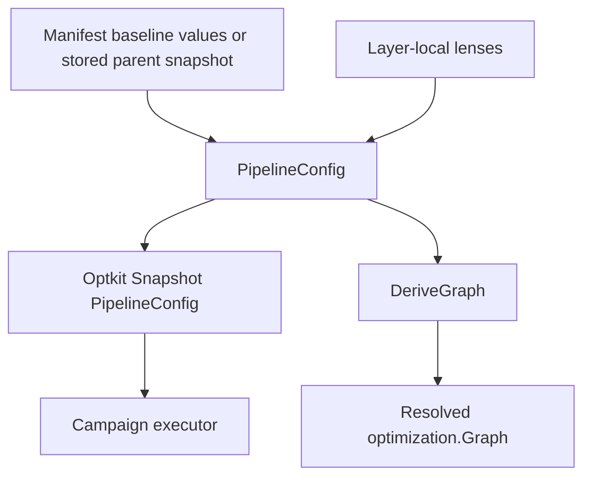

# Intern Guide to `PipelineConfig`, Layer Lenses, and Derived Graphs

## 1. Executive summary

RAG-TTC currently represents one experiment arm twice. `ManifestArm.Config` contains the executable retrieval values, while `ManifestArm.Layers` contains a complete graph of twelve semantic identities. Validation proves only that the retrieval node matches the executable retrieval config. This duplication is why fusion can remain a frozen identity even though search execution uses a real RRF constant.

This ticket introduces one typed `PipelineConfig` as the semantic value of a RAG arm. An Optkit snapshot contains that value. Layer-local typed variables are lifted to it through lenses. The twelve-layer graph is derived from the aggregate; it is no longer independently authored truth.

The important direction is:

```text
PipelineConfig values → local layer ConfigRefs → resolved Graph
```

not:

```text
manifest graph identities + partially unrelated executable config
```

## 2. Current architecture

### 2.1 Layer graph

`optimization/contracts.go:20-46` declares the canonical order:

```text
corpus → chunking → representations → embeddings → indexes → retrieval
       → fusion → reranking → evidence → context → answer → judge
```

`ConfigRef` carries the layer, its value schema, a local identity, and direct dependency identities. `NewGraph` (`graph.go:51-130`) validates all twelve refs, resolves dependency digests in canonical order, and derives a graph ID. This model should remain.

### 2.2 Retrieval-only execution

`optkitcampaign/system.go:20-31` declares `SystemIDValue`, one retrieval config schema, and `RetrievalConfig{Preparation, Route, Limit}`. `Factory.Prepare` loads snapshots using `ConfigCodec[RetrievalConfig]`; the prepared system passes that value to the executor.

The snapshot therefore cannot represent a fusion mutation.

### 2.3 Duplicated manifest truth

`experimentworkbench/manifest.go:31-42` puts both `Config RetrievalConfig` and `Layers []ConfigRef` on every arm. `ValidateManifest` derives an expected retrieval `ConfigRef` and compares it with the graph (`manifest.go:145-165`). Other local identities are accepted as authored strings.

A person must repeat roughly twelve layers for a one-field retrieval change, and the graph can claim semantics the executor never uses.

## 3. Target architecture



`PipelineConfig` has three jobs:

1. be the value patched by Optkit;
2. be the validated input to runtime preparation;
3. be the source from which local layer identities and graph dependencies are derived.

It does not contain open clients, indexes, model handles, or artifact contents. Those remain process-local or content-addressed references.

## 4. Package ownership

### Decision: Semantic configuration belongs below campaign adapters

- **Context:** `optkitcampaign` currently owns `RetrievalConfig` but already imports `optimization` for graphs. Letting `optimization` import `optkitcampaign` would create a cycle.
- **Options considered:** Keep config types in `optkitcampaign`; create `pipelineconfig` sibling package; place them in `optimization`.
- **Decision:** Prefer `pkg/ttc/optimization` for `PipelineConfig` and layer value types while they are tightly coupled to graph derivation. A sibling `pipelineconfig` package is acceptable only if dependency analysis shows cleaner cohesion.
- **Rationale:** Campaign code becomes an adapter over semantic configuration rather than its owner.
- **Consequences:** Manifest, campaign, projector, and tests import the new owner. No compatibility alias should be added unless OPTKIT-012 explicitly requires one.
- **Status:** proposed.

Safe dependency direction:

```text
search runtime       optimization config/graph       optkit/space
      ↑                         ↑                         ↑
fixture preparation ────────────┘                         │
      ↑                                                   │
optkitcampaign adapter ───────────────────────────────────┘
      ↑
experimentworkbench
```

The exact arrows may vary, but `optimization → optkitcampaign` is forbidden.

## 5. Proposed configuration model

```go
const PipelineConfigSchema record.SchemaID =
    "schema:rag-ttc.pipeline-config/v2"

type FrozenConfig struct {
    Version string `json:"version" yaml:"version"`
}

type RetrievalConfig struct {
    Preparation      string `json:"preparation" yaml:"preparation"`
    Route            string `json:"route" yaml:"route"`
    FinalResultLimit int    `json:"final_result_limit" yaml:"final_result_limit"`
}

type FusionConfig struct {
    RRFK float64 `json:"rrf_k" yaml:"rrf_k"`
}

type PipelineConfig struct {
    Corpus          FrozenConfig    `json:"corpus" yaml:"corpus"`
    Chunking        FrozenConfig    `json:"chunking" yaml:"chunking"`
    Representations FrozenConfig    `json:"representations" yaml:"representations"`
    Embeddings      FrozenConfig    `json:"embeddings" yaml:"embeddings"`
    Indexes         FrozenConfig    `json:"indexes" yaml:"indexes"`
    Retrieval       RetrievalConfig `json:"retrieval" yaml:"retrieval"`
    Fusion          FusionConfig    `json:"fusion" yaml:"fusion"`
    Reranking       FrozenConfig    `json:"reranking" yaml:"reranking"`
    Evidence        FrozenConfig    `json:"evidence" yaml:"evidence"`
    Context         FrozenConfig    `json:"context" yaml:"context"`
    Answer          FrozenConfig    `json:"answer" yaml:"answer"`
    Judge           FrozenConfig    `json:"judge" yaml:"judge"`
}
```

### Why explicit frozen values?

A frozen layer still has semantic meaning. `Version:"fixture-v1"` can derive a local identity and can later become a typed config. An untyped map or copied identity string would retain the current drift problem.

### Validation

```go
func (c PipelineConfig) Validate() error {
    validate every frozen Version as non-empty
    validate Retrieval preparation, route, positive final result limit
    validate Fusion RRFK is finite and > 0
    return joined contextual errors
}
```

Validation runs before snapshot materialization, graph derivation, runtime preparation, and after pure mutation.

## 6. Deriving local layer identities

Each layer needs a value schema and direct dependency topology. Keep topology in code, not in every manifest.

```go
type layerDefinition struct {
    Layer      Layer
    Schema     record.SchemaID
    Value      func(PipelineConfig) any
    DependsOn  []Layer
}
```

Pseudocode:

```text
DeriveGraph(config):
    config.Validate()
    refsByLayer = empty map
    refs = empty list
    for definition in canonical definitions:
        dependencies = identities of refsByLayer[definition.DependsOn]
        ref = NewConfigRef(
            definition.Layer,
            definition.Schema,
            definition.Value(config),
            dependencies,
        )
        refsByLayer[definition.Layer] = ref
        append refs, ref
    return NewGraph(refs)
```

The direct dependencies should initially match the frozen semantic fixture. Review them rather than assuming every layer depends only on the immediate predecessor: indexes currently depend on both representations and embeddings.

### Identity behavior

Changing `Fusion.RRFK`:

- changes fusion's local `ConfigRef.Identity`;
- rewires direct dependants when a graph is rebuilt;
- leaves retrieval local identity unchanged;
- changes fusion and downstream resolved digests;
- produces `direct_change` for fusion and `upstream_change` downstream in `Plan`.

`Diff` compares local identity/schema. `Plan` compares resolved digests for transitive invalidation. Preserve this distinction.

## 7. Layer-local lens lifting

Variable definitions should live beside their layer configs, not contain knowledge of the whole aggregate. Define a reusable lens composition helper or explicit lifting constructor.

```go
func LiftLens[C, L, V any](
    layer Lens[C,L],
    value Lens[L,V],
) Lens[C,V] {
    return Lens[C,V]{
        Get: func(c C) V { return value.Get(layer.Get(c)) },
        Put: func(c C, v V) (C, error) {
            local := layer.Get(c)
            updatedLocal, err := value.Put(local, v)
            if err != nil { return c, err }
            return layer.Put(c, updatedLocal)
        },
    }
}
```

Example:

```go
var PipelineFusion = space.Lens[PipelineConfig,FusionConfig]{...}
var FusionRRFK = space.Lens[FusionConfig,float64]{...}

rrfVariable := space.Variable[PipelineConfig,float64]{
    Descriptor: rrfDescriptor,
    Lens:       space.LiftLens(PipelineFusion, FusionRRFK),
    Domain:     space.FloatRange(0.001, 1000),
    Codec:      space.NewJSONCodec[float64](RRFKSchema),
}
```

Test laws at both local and lifted levels. A lifted lens that overwrites unrelated fields can silently change several layer identities.

## 8. Snapshot and executor migration

The new Optkit system factory uses:

```go
func ConfigCodec() space.JSONCodec[optimization.PipelineConfig]
```

`Factory.Prepare` loads `Snapshot[PipelineConfig]`, validates it, and gives runtime preparation the complete value. The executor interface becomes conceptually:

```go
type Executor interface {
    Execute(context.Context, optimization.PipelineConfig, RetrievalCase) (
        search.SearchOutput, error,
    )
}
```

The executor may immediately project only the settings it uses:

```text
PipelineConfig
  → prepare search fixture with Retrieval + Fusion
  → execute query with FinalResultLimit
```

Do not let the campaign adapter rebuild a graph from snapshot metadata manually. The graph is derived by `optimization.DeriveGraph` and persisted alongside the arm.

## 9. Manifest evolution

After this ticket, the baseline/full-arm form should carry one semantic pipeline config rather than a config plus hand-authored refs:

```yaml
schema: rag-ttc.experiment-manifest/v2
baseline:
  id: baseline
  pipeline:
    corpus: {version: fixture-v1}
    chunking: {version: fixture-v1}
    representations: {version: fixture-v1}
    embeddings: {version: fixture-v1}
    indexes: {version: fixture-v1}
    retrieval:
      preparation: rag.semantic-fixture/v1
      route: default
      final_result_limit: 2
    fusion:
      rrf_k: 60
    reranking: {version: fixture-v1}
    evidence: {version: fixture-v1}
    context: {version: fixture-v1}
    answer: {version: fixture-v1}
    judge: {version: fixture-v1}
```

OPTKIT-017 adds concise candidates later. This ticket only makes the baseline/config source truthful.

If compatibility is not required, do not keep `layers:` and silently ignore it. Strict decoding should reject stale v1 shape under a v2 schema.

## 10. Campaign specification changes

Current `CampaignSpec` stores `Snapshots`, arm `RetrievalConfig`, and `ConfigGraphs` (`campaign.go:68-80`). The target arm representation should avoid duplicated semantic values:

```go
type Arm struct {
    ID          string                  `json:"id"`
    Description string                  `json:"description,omitempty"`
    Snapshot    space.SnapshotRecord    `json:"snapshot"`
    Graph       optimization.Graph      `json:"graph"`
}
```

The actual `PipelineConfig` is in the content-addressed snapshot artifact. A read projection that needs values loads the sealed snapshot with its schema-aware codec; it does not trust a second copied config field.

Whether `CampaignSpec.Snapshots` remains a map or arms directly hold records is an implementation choice. There must be one canonical snapshot record per ID.

## 11. Implementation sequence

### Phase 1 — Establish config package and schemas

Add config types, constants, strict codec, validation, and unit tests without changing manifests/execution yet.

### Phase 2 — Implement graph derivation

Encode the existing topology in one ordered definition table. Golden-test the derived baseline graph against expected local and resolved semantics. The exact graph ID may change because local identities become content-derived; document that migration.

### Phase 3 — Add lens lifting

Add generic lens composition in Optkit only if OPTKIT-013 accepts it as domain-neutral. Otherwise implement RAG-local lift helpers. Prove lens laws and unrelated-field preservation.

### Phase 4 — Migrate fixture execution

Update `optkitcampaign.Factory`, executor interface, and semantic fixture preparation to consume `PipelineConfig`. Keep behavior equal at baseline values.

### Phase 5 — Migrate manifest/service

Replace duplicated arm config/layers with semantic config under the accepted schema policy. Make inspect/diff/plan derive graphs.

### Phase 6 — Migrate campaign/projector tests

Persist new snapshots and graphs. Update specialist projections only enough to preserve current read behavior; candidate projections belong to OPTKIT-018.

## 12. Tests

### Configuration

- every field validates;
- strict codec rejects unknown fields;
- canonical round-trip stable;
- frozen versions required;
- final result limit positive;
- RRF finite and positive.

### Graph derivation

- twelve layers in canonical order;
- every direct dependency correct;
- same config gives same graph ID;
- retrieval-only change changes retrieval local identity and downstream resolved digests;
- fusion-only change leaves retrieval local/resolved digest unchanged and invalidates fusion downstream;
- unrelated upstream reuse is explicit.

### Lenses

- get-put, put-get, put-put;
- lifting changes one local field only;
- applying variables in canonical order yields deterministic aggregate.

### Runtime parity

At baseline values, outputs from old fixture semantics and new `PipelineConfig` preparation must match:

- stage ordering;
- fused chunk order/scores;
- effective limit;
- measurements and estimates.

### Commands

```bash
cd rag-ttc
GOWORK=off go test ./pkg/ttc/optimization ./pkg/ttc/optkitcampaign \
  ./pkg/ttc/experimentworkbench ./pkg/ttc/specialistapi -count=1
GOWORK=off go test ./... -count=1
go list -deps ./pkg/ttc/optimization ./pkg/ttc/optkitcampaign \
  ./pkg/ttc/experimentworkbench >/tmp/optkit-014-deps.txt
```

Store any comparison or dependency-analysis script in this ticket's `scripts/` directory.

## 13. Identity and migration consequences

New semantic configs change:

- Optkit system/config schema IDs;
- snapshot IDs;
- layer local identities for values that were formerly labels;
- graph IDs and resolved digests;
- trial IDs if arm snapshot IDs participate;
- campaign artifacts for new runs.

That is expected for new semantics. Do not rewrite historical records. If old-store read compatibility is required, implement schema-dispatched reading under the policy accepted in OPTKIT-012; never recompute old IDs using new code.

## 14. Risks and review focus

- **Package cycle:** moving only half of `RetrievalConfig` can produce `optimization ↔ optkitcampaign` imports.
- **Topology drift:** graph dependency topology must have one declaration; do not repeat it in fixtures and manifests.
- **Frozen-value ambiguity:** version strings need schema and validation; empty structs would make different frozen implementations share identity.
- **Lens corruption:** a bad aggregate `Put` can zero unrelated layers.
- **Runtime/config mismatch:** every semantic field claimed by the graph must be used by preparation or explicitly frozen.
- **Read projection duplication:** avoid copying full configs into several campaign fields for convenience.

## 15. Alternatives rejected

### Keep full graph YAML

It is useful as exported/read-only evidence but not as authoring truth. Keeping it as required input preserves duplication and makes candidate composition fragile.

### Patch a map of layer blobs

This allows dynamic layers but gives up typed validation and makes variable binding depend on JSON path conventions. The present pipeline has a fixed canonical layer vocabulary; use typed fields.

### One snapshot per layer

This can model caching artifacts but complicates atomic multi-variable candidates and Optkit's parent/child semantics. The workbench candidate changes one whole arm configuration.

## 16. Out of scope

- Optkit catalog implementation (OPTKIT-013);
- actual RRF plumbing and RAG registry (OPTKIT-015);
- pure proposal compiler (OPTKIT-016);
- candidate manifest/sealing semantics (OPTKIT-017);
- frontend workbench.

## 17. Exit criteria

- `PipelineConfig` owns all twelve semantic layer values.
- Config package dependencies are acyclic.
- Graph derivation is the only new authoring path to `optimization.Graph`.
- Lifted layer lenses obey laws and preserve unrelated values.
- Snapshot/executor/manifest/campaign paths consume the aggregate.
- Baseline runtime behavior is unchanged at equivalent values.
- Identity migration is documented and tested.
- Full affected tests, diary, doctor, and reMarkable delivery pass.

## 18. File reference map

- `rag-ttc/pkg/ttc/optimization/contracts.go:20-55` — layer order and `ConfigRef`.
- `rag-ttc/pkg/ttc/optimization/graph.go:30-165` — identity derivation and graph construction.
- `rag-ttc/pkg/ttc/optimization/invalidation.go:51-96` — direct/transitive planning.
- `rag-ttc/pkg/ttc/optimization/fixture.go` — frozen topology and semantic fixture validation.
- `rag-ttc/pkg/ttc/optkitcampaign/system.go:20-143` — retrieval-only system to migrate.
- `rag-ttc/pkg/ttc/optkitcampaign/fixture.go:13-27` — fixture preparation boundary.
- `rag-ttc/pkg/ttc/optkitcampaign/campaign.go:44-80,220-338` — duplicated arm config/snapshot/graph persistence.
- `rag-ttc/pkg/ttc/experimentworkbench/manifest.go:31-174` — duplicated full-arm authoring.
- `optkit/space/lens.go:5-45` — lens composition laws.
- `optkit/space/snapshot.go:24-83` — aggregate snapshot identity.
