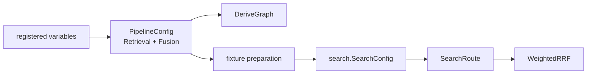

# Intern Guide to Fusion Configuration, RRF, and the First RAG Catalog

## 1. Executive summary

This ticket proves that the optimization catalog describes real behavior rather than decorative metadata. It makes the Reciprocal Rank Fusion constant a typed field in `PipelineConfig`, routes that field into the actual `WeightedRRF` call, accurately names the existing final-result limit, and registers both values as the first RAG optimization coordinates.

Two corrections from code inspection are load-bearing:

1. the runtime RRF constant is a positive `float64`, not an integer; and
2. the current Optkit `RetrievalConfig.Limit` becomes `SearchInput.Limit`, which caps final returned evidence after fusion. It is not BM25 or vector top-K.

The ticket succeeds only when mutating `fusion.rrf_k` changes actual fused scores and the graph reports fusion as the direct change with downstream invalidation.

## 2. Retrieval and fusion orientation

### 2.1 Channel preparation

`search.SearchConfig` (`search/search.go:21-35`) includes independent `BM25TopK`, `VectorTopK`, and `RRFConstant` values. A prepared `SearchRoute` carries the same channel limits and RRF constant (`search.go:44-55`).

`Service.Retrieve` uses the selected route and eventually calls:

```go
retrieval.WeightedRRF(
    channels,
    retrieval.RRFConfig{
        RankConstant: route.RRFConstant,
        Weights: map[string]float64{"bm25": 1, "vector": 1},
    },
)
```

at `search/service.go:361`.

### 2.2 What RRF computes

For each candidate and channel contribution:

```text
contribution(channel, rank) = weight(channel) / (k + rank)
score(candidate) = sum(contributions across channels)
```

With equal weights and `k=60`:

- rank 1 contributes `1/61 ≈ 0.016393`;
- rank 2 contributes `1/62 ≈ 0.016129`;
- a candidate appearing in both channels can outrank a candidate that is first in only one.

Lower `k` increases the difference between early and later ranks. Higher `k` flattens those differences and emphasizes cross-channel agreement.

### 2.3 What final-result limit computes

`SearchTool.prepare` (`search/search.go:210-239`) chooses the request limit, defaults it, and clamps it to `MaxResultsPerCall`. `RunRoute` retrieves/fuses first, then slices returned evidence to that final limit (`search.go:139-157`). BM25 and vector top-K are consumed earlier by the service.

Therefore rename the optimization coordinate conceptually to `retrieval.final_result_limit` or another reviewed equivalent. Documentation saying “candidates kept per retriever” is incorrect and must be removed from code/UI when the catalog becomes authoritative.

## 3. Current fixture gap

`NewSemanticFixtureTool` (`search/semantic_fixture.go:85-119`) constructs `SearchConfig` with:

```go
BM25TopK: 7, VectorTopK: 9, RRFConstant: 60
```

`SemanticFixtureExecutor.Execute` (`optkitcampaign/fixture.go:13-27`) creates that fixed tool, then passes only query, final limit, and route. A manifest can change retrieval limit, but no semantic value reaches RRF.

The optimization graph meanwhile labels fusion as `config:fusion:fixture-v1`. That label does not identify the `60` used by execution.

## 4. Target data flow



One value, `PipelineConfig.Fusion.RRFK`, drives both local fusion identity and runtime arithmetic.

## 5. Fusion configuration contract

```go
const FusionConfigSchema record.SchemaID =
    "schema:rag-ttc.config.fusion/v2"

type FusionConfig struct {
    RRFK float64 `json:"rrf_k" yaml:"rrf_k"`
}

func (c FusionConfig) Validate() error {
    if math.IsNaN(c.RRFK) || math.IsInf(c.RRFK, 0) || c.RRFK <= 0 {
        return fmt.Errorf("fusion rrf_k must be finite and positive")
    }
    if c.RRFK > 1000 {
        return fmt.Errorf("fusion rrf_k must be <= 1000")
    }
    return nil
}
```

The upper bound matches current `toolconfig.Validate` behavior (`toolconfig/validate.go:64-65,181-182`) unless product evidence selects a narrower experiment domain. Separate runtime validity from experiment domain if necessary: runtime may accept `(0,1000]`, while the workbench offers a reviewed smaller range.

### Decision: Preserve float64

- **Context:** The design sketch used an integer slider, but runtime configuration and `WeightedRRF` accept `float64`.
- **Options considered:** Convert runtime to integer; expose float64; use integer UI while keeping float runtime.
- **Decision:** The semantic variable remains `float64` with a float-range domain. A specialized UI may choose convenient increments without changing legality.
- **Rationale:** The registry describes runtime semantics, not component convenience.
- **Consequences:** Optkit must support finite float domains and canonical float codecs.
- **Status:** accepted by code evidence, pending implementation review.

## 6. Retrieval configuration correction

Target config:

```go
type RetrievalConfig struct {
    Preparation      string `json:"preparation" yaml:"preparation"`
    Route            string `json:"route" yaml:"route"`
    FinalResultLimit int    `json:"final_result_limit" yaml:"final_result_limit"`
}
```

The variable ID is stable and explicit:

```text
retrieval.final_result_limit
```

Do not reuse `retrieval.limit` if doing so preserves incorrect semantics. If OPTKIT-012 requires manifest compatibility, define an explicit schema migration rather than two fields that can disagree.

## 7. RAG catalog definitions

### Retrieval section

```go
Section{
    ID: "retrieval",
    Label: "Evidence selection",
    Short: "Runs prepared search routes and chooses how many fused results are returned.",
    Long: "Retrieval executes independently bounded lexical and vector channels... Final result limit is applied after fusion and evidence hydration; it does not change BM25 or vector top-K.",
}
```

Variable:

```go
Descriptor{
    ID: "retrieval.final_result_limit",
    Key: "final_result_limit",
    Label: "Final result limit",
    Short: "Maximum fused evidence results returned for the query.",
    Long: "The service retrieves channel candidates using separately prepared top-K values, fuses them, then returns at most this many results...",
    Value: IntRange(1, 100),
    CostHint: "recompute-downstream",
}
```

The fixture may use a narrower experiment domain such as `1…3`; do not claim a global maximum based only on fixture size.

### Fusion section

```go
Section{
    ID: "fusion",
    Label: "Result fusion",
    Short: "Combines lexical and semantic channel rankings into one order.",
    Long: "Reciprocal Rank Fusion adds one reciprocal contribution for every channel rank...",
}
```

Variable:

```go
Descriptor{
    ID: "fusion.rrf_k",
    Key: "rrf_k",
    Label: "RRF rank constant",
    Short: "Controls how sharply RRF distinguishes early from later ranks.",
    Long: "Each channel contributes weight/(k+rank). Lower k magnifies rank differences; higher k flattens them and emphasizes agreement...",
    Value: FloatRange(0.001, 1000),
    Default: 60.0,
    CostHint: "recompute-downstream",
    Probes: []string{"fusion.rrf-contributions/v1"},
}
```

Short/Long text is product contract. Review it beside code and test that required documentation is non-empty.

## 8. Executable variables and bindings

Define layer-local variables beside their configs, then lift into `PipelineConfig` using OPTKIT-014 lenses.

```go
func RRFKVariable() space.Variable[PipelineConfig,float64] {
    codec := space.NewJSONCodec[float64](RRFKValueSchema)
    return space.Variable[PipelineConfig,float64]{
        Descriptor: rrfDescriptor(codec.Schema()),
        Lens: space.LiftLens(PipelineFusionLens, FusionRRFKLens),
        Domain: space.FloatRange(0.001, 1000),
        Codec: codec,
    }
}
```

Register descriptor and executable binding in one call:

```go
space.Register(builder, "fusion", RRFKVariable())
space.Register(builder, "retrieval", FinalResultLimitVariable())
```

## 9. Runtime plumbing

Change fixture construction so it accepts semantic configuration rather than manufacturing `60`:

```go
func NewSemanticFixtureTool(config optimization.PipelineConfig) (*SearchTool, error) {
    fixture := LoadSemanticFixture()
    config.Validate()
    searchConfig := SearchConfig{
        DefaultResults: min(config.Retrieval.FinalResultLimit, 2),
        MaxResultsPerCall: fixtureMaximum,
        BM25TopK: 7,
        VectorTopK: 9,
        RRFConstant: config.Fusion.RRFK,
        // existing identities and roles
    }
    return NewSearchTool(..., searchConfig, ...)
}
```

Be precise about `DefaultResults`: campaign execution supplies `SearchInput.Limit`, so default behavior may remain fixture-owned. Do not inadvertently set both default and request limit from one field if they represent different contracts.

Executor:

```text
Execute(pipeline, case):
    tool = NewSemanticFixtureTool(pipeline)
    return tool.RunRoute(
        SearchInput{Query: case.Query, Limit: pipeline.Retrieval.FinalResultLimit},
        pipeline.Retrieval.Route,
    )
```

## 10. Identity and recorded evidence

A fusion config identity must derive from `{rrf_k}`. Runtime identity should also identify the selected route/config. Inspect `search/identity.go:54-77`: route semantic identity already includes `RRFConstant`. Preserve this parity.

When `rrf_k` changes, recorded stage candidate contributions should make the arithmetic auditable. Existing `StageCandidate.Contributions` and final `SearchResult.Contributions` provide a useful surface. Add tests that each contribution equals `weight/(k+rank)` at recorded precision.

## 11. Experiment plan

A small deterministic experiment should be stored through ticket scripts if one is needed:

1. load the canonical semantic fixture;
2. run identical query/channel hits with `k=60` and `k=20`;
3. export fused order, per-channel contributions, and scores;
4. derive both graphs and the invalidation plan;
5. assert upstream layers reuse and fusion/downstream recompute.

The experiment need not force a rank flip. It must prove arithmetic and identity change. If no fixture case flips, say so rather than selecting misleading copy.

## 12. Implementation phases

### Phase 1 — Semantics and naming

Rename the final-result field under the accepted migration policy. Add `FusionConfig` and validation.

### Phase 2 — Runtime injection

Parameterize semantic fixture/tool preparation and route construction. Remove the hardcoded `60` from this execution path.

### Phase 3 — Graph parity

Make `DeriveGraph` use typed fusion values. Verify direct/transitive plan behavior.

### Phase 4 — Catalog registration

Write reviewed sections/descriptors and register bindings.

### Phase 5 — Fixtures/manifests

Update baseline values and content-derived identities. Record expected identity migration.

### Phase 6 — End-to-end proof

Compile/apply variables directly, run search, inspect contributions, and compare plans.

## 13. Test strategy

### Runtime

- reject zero, negative, NaN, infinity, and values over accepted maximum;
- baseline `k=60` preserves fixture output;
- `k=20` changes contribution numbers exactly;
- selected `SearchRoute` receives configured `RRFK`;
- final-result limit changes returned evidence but not channel top-K.

### Catalog/binding

- descriptors have required docs and correct kinds/domains;
- serialized float/integer mutations apply through real bindings;
- wrong types and out-of-domain values fail;
- descriptor defaults match baseline config.

### Graph

- fusion local identity changes for `k` mutation;
- retrieval identity does not;
- `Plan` marks fusion direct and downstream upstream-changed;
- final-result-limit mutation marks retrieval direct.

### Commands

```bash
cd rag-ttc
GOWORK=off go test ./pkg/ttc/search ./pkg/ttc/optimization \
  ./pkg/ttc/optkitcampaign ./pkg/ttc/experimentworkbench -count=1
GOWORK=off go test ./... -count=1
```

## 14. Review risks

- `SearchConfig`, named routes, and toolconfig contain several RRF values. This ticket must change the Optkit semantic fixture path without accidentally overriding unrelated production route configuration.
- Changing a graph identity but not runtime input creates false provenance; changing runtime without graph identity creates hidden behavior. Test both together.
- UI step size is not the semantic domain.
- Final limit and per-channel top-K must remain distinct in names, docs, and tests.
- Float canonicalization and recorded precision must be pinned.

## 15. Implementation outcome

Implemented on 2026-08-26 in RAG-TTC commits `d9d6d086`, `5b7ad758`, and `20266fd2`.

- RAG-TTC now depends on Optkit `v0.0.0-20260826195739-5c1acb4e2688`, the published revision that contains lossless domains, catalogs, executable registries, and candidate v2.
- `FusionConfig` remains the typed `float64` value introduced by OPTKIT-014. Validation now enforces finite `RRFK` in `(0,1000]`; search configuration and named routes enforce the same bound.
- `search.NewSemanticFixtureTool(rrfConstant)` injects the semantic value into the real `SearchConfig`, selected `SearchRoute`, route identity, and `WeightedRRF` call. The campaign executor no longer accepts and ignores non-default values.
- `optimization.NewRegistry` returns ordered retrieval/fusion sections plus executable bindings for `retrieval.final_result_limit` and `fusion.rrf_k`.
- The final-result variable uses an integer domain `1…100`, canonical default `2`, value schema `schema:rag-ttc.value.final-result-limit/v1`, and the accurate post-fusion returned-result semantics.
- The RRF variable uses a finite float domain `0.001…1000`, canonical default `60`, value schema `schema:rag-ttc.value.rrf-k/v1`, and probe `fusion.rrf-contributions/v1`.
- Serialized binding application and durable `PatchBuilder` replay produce equal child pipeline values. Graph planning marks `fusion` as the sole direct change for `60 → 20`, with downstream upstream-change steps; final-result mutation marks retrieval direct.
- The semantic fixture advanced to `rag-ttc.optimization-semantic-fixture/v3`, embeds its complete baseline `PipelineConfig`, uses content-derived local identities, and fails validation if its recorded graph differs from `DeriveGraph(PipelineConfig)`.

Deterministic evidence shows that the fixture order remains stable while arithmetic and route identity change:

```text
k=60:
  chunk-a = 0.01639344262295082
  chunk-b = 0.03252247488101534
  policy  = ...dd39c4bc

k=20:
  chunk-a = 0.047619047619047616
  chunk-b = 0.09307359307359307
  policy  = ...7da50635
```

Every recorded contribution is checked against `weight / (k + rank)` at `1e-15` tolerance. A separate test proves that changing only final-result limit from one to two changes returned count but not lexical raw, vector raw, or fused stage candidates. The fixture does not produce a rank flip for `60 → 20`; the implementation records that result rather than claiming one.

Validation includes full RAG-TTC tests, golangci-lint, Glazed vet, build, focused race tests, a 255-package acyclic dependency scan, deterministic registry/runtime proof logs, clean diffs, docmgr doctor, and a completed guide/diary reMarkable bundle.

## 16. Out of scope

- BM25/vector top-K as variables;
- channel weights as variables;
- proposal compilation/sealing;
- React editor implementation;
- prompt assets;
- production route policy redesign.

## 17. Exit criteria

- real `FusionConfig` reaches `WeightedRRF`;
- RRF remains positive finite `float64`;
- final-result-limit semantics are named accurately;
- both variables are cataloged and executable;
- runtime, graph diff, and invalidation agree;
- deterministic experiment/parity evidence is recorded;
- full affected tests, diary, doctor, and reMarkable upload pass.

## 18. File reference map

- `rag-ttc/pkg/ttc/search/search.go:21-55` — runtime and route RRF values.
- `rag-ttc/pkg/ttc/search/search.go:139-170,210-239` — final return limit behavior.
- `rag-ttc/pkg/ttc/search/service.go:165-186,198-226,361` — route construction, validation, actual RRF call.
- `rag-ttc/pkg/ttc/search/identity.go:54-77` — RRF in runtime route identity.
- `rag-ttc/pkg/ttc/search/semantic_fixture.go:85-119` — hardcoded fixture value.
- `rag-ttc/pkg/ttc/optkitcampaign/fixture.go:13-27` — current executor projection.
- `rag-ttc/pkg/ttc/toolconfig/types.go:97-107,128-136` — existing production float64 configuration.
- `rag-ttc/pkg/ttc/toolconfig/validate.go:64-65,181-182` — current valid range.
- `rag-ttc/pkg/ttc/optimization/invalidation.go:51-96` — required plan behavior.
