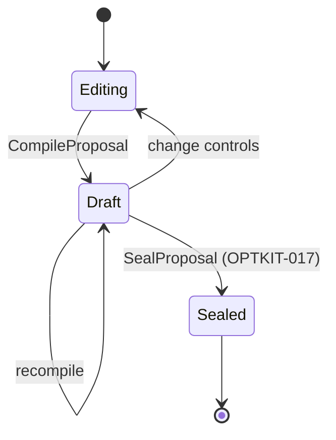

# Intern Guide to Pure Proposal Compilation and Glazed CLI Authoring

## 1. Executive summary

A proposal compiler answers: “If I apply these requested mutations to this parent configuration, what would the child be, which layers would be invalidated, and is the draft legal?” It does not answer: “Create a durable candidate now.” Separating these questions is essential because interactive controls compile many drafts before a user seals one proposal.

This ticket implements `CompileProposal` as a side-effect-free RAG-TTC application service. It resolves variable IDs through the Optkit bindings registry, canonicalizes values with real codecs, applies typed lenses in memory, derives before/after graphs, and returns diagnostics, diff, invalidation plan, and preview capabilities. Glazed CLI commands expose the same service before any browser integration.

The strongest acceptance test is negative: repeated compilation must not increase artifact count, journal version, or create snapshot/candidate IDs.

## 2. Existing application and CLI architecture

`experimentworkbench/service.go` currently provides pure `BuildDryRun`, `Compare`, and `Invalidation`, plus durable `Run`/`Resume` and read-only `Status`/`Verify`. It is already the right application layer, but comparison requires two fully authored manifests.

`cmd/.../optkitrag/config.go` defines Glazed `config inspect`, `validate`, `diff`, and `plan`. Command handlers decode settings, call `experimentworkbench`, and emit rows. `command.go:117-145` composes `config` and `campaign` groups. Preserve this thin-handler pattern.

## 3. Draft versus seal



Drafts are ordinary values returned to the caller. They may have a deterministic digest for optimistic validation, but they are not artifacts or journal events.

`PatchBuilder.Build` is excluded because `patch.go:43-76` stores assignment values and `patch.go:104-151` materializes a child snapshot.

## 4. Inputs

```go
type RequestedMutation struct {
    Variable space.VariableID `json:"variable" yaml:"variable"`
    Value    json.RawMessage  `json:"value" yaml:"value"`
}

type CompileProposalRequest struct {
    Parent    space.Snapshot[optimization.PipelineConfig] `json:"-"`
    Mutations []RequestedMutation                         `json:"mutations"`
}
```

At network/CLI boundaries, parent may initially be identified by manifest + arm, snapshot ID, or store/campaign/arm. Resolve that reference before invoking the core compiler. The compiler receives a verified loaded parent, not filesystem concerns.

For CLI convenience, support repeated `--set variable=json-value` only as an adapter into `RequestedMutation`. Avoid parsing labels or guessing strings as numbers.

## 5. Output

```go
type DiagnosticSeverity string
const (
    SeverityInfo    DiagnosticSeverity = "info"
    SeverityWarning DiagnosticSeverity = "warning"
    SeverityError   DiagnosticSeverity = "error"
)

type Diagnostic struct {
    Code     string             `json:"code"`
    Severity DiagnosticSeverity `json:"severity"`
    Message  string             `json:"message"`
    Variable space.VariableID   `json:"variable,omitempty"`
    Path     string             `json:"path,omitempty"`
}

type NormalizedMutation struct {
    Variable space.VariableID `json:"variable"`
    Before   json.RawMessage  `json:"before"`
    After    json.RawMessage  `json:"after"`
}

type CandidateDraft struct {
    Schema       record.SchemaID                 `json:"schema"`
    Digest       record.Digest                   `json:"digest"`
    Parent       space.SnapshotRecord            `json:"parent"`
    Catalog      record.Digest                   `json:"semantic_catalog_id"`
    Mutations    []NormalizedMutation            `json:"mutations"`
    ChildConfig  optimization.PipelineConfig     `json:"child_config"`
    BeforeGraph  optimization.Graph              `json:"before_graph"`
    AfterGraph   optimization.Graph              `json:"after_graph"`
    Diff         optimization.ConfigDiff         `json:"config_diff"`
    Plan         optimization.InvalidationPlan   `json:"invalidation_plan"`
    Capabilities []PreviewCapability             `json:"preview_capabilities"`
    Diagnostics  []Diagnostic                    `json:"diagnostics"`
    Sealable     bool                            `json:"sealable"`
}
```

Draft digest should cover parent ID, semantic catalog ID, normalized mutations, child semantic config digest, and graph IDs. It does not turn the draft into a durable candidate.

## 6. Compiler service

```go
type ProposalCompiler struct {
    Registry *space.Registry[optimization.PipelineConfig]
}

func (c ProposalCompiler) CompileProposal(
    ctx context.Context,
    request CompileProposalRequest,
) (CandidateDraft, error)
```

Use returned errors for invalid service state or unreadable parent contracts. Use diagnostics for operator-correctable mutation problems so CLI/UI can display all problems in one pass.

### Algorithm

```text
CompileProposal(ctx, request):
    check context
    validate compiler and registry
    validate parent system/schema/value
    beforeGraph = DeriveGraph(parent.Value)

    if no mutations:
        diagnostic(error, "empty_mutations")

    group requests by variable ID
    for duplicates:
        diagnostic(error, "duplicate_mutation")

    sort unique requests by variable ID
    current = parent.Value
    normalized = []

    for request in sorted requests:
        binding = registry.Lookup(request.Variable)
        if absent:
            diagnostic(error, "unknown_variable")
            continue
        before = binding.ReadCanonical(current)
        after = binding.Normalize(request.Value)
        if normalize failed:
            diagnostic(error, classify decode/domain failure)
            continue
        if bytes.Equal(before, after):
            diagnostic(error, "no_effect")
            continue
        current = binding.ApplyPure(current, after)
        if apply failed:
            diagnostic(error, "apply_failed")
            continue
        append normalized mutation

    validate current PipelineConfig
    afterGraph = DeriveGraph(current)
    diff = optimization.Diff(beforeGraph, afterGraph)
    plan = optimization.Plan(beforeGraph, afterGraph)
    capabilities = preview registry capabilities for changed variables/layers
    sealable = no error diagnostics and at least one semantic change
    digest = semantic digest of draft contract
    return draft
```

### Atomicity

Do not return a partially mutated child as sealable when one mutation fails. It may be useful for diagnostics, but either:

- reset child to parent on any error; or
- retain preview fields and set `Sealable=false`.

Choose one contract in tests. The second gives richer UI feedback but requires clear naming.

## 7. Determinism rules

- Sort mutation processing/output by fully qualified variable ID.
- Reject duplicate assignments rather than choosing first or last.
- Canonicalize through typed codecs.
- Keep diagnostics in deterministic `(severity, variable, code)` order.
- Derive preview capabilities from registered variable/layer capabilities, not request order.
- Reject no-op drafts from sealing.
- Do not include request timestamps in draft digest.

Applying two independent variables should yield the same child regardless of request order. If lenses overlap, registration/design must declare conflict rather than rely on order.

## 8. Diagnostics taxonomy

Recommended stable codes:

```text
empty_mutations
unknown_variable
duplicate_mutation
invalid_json
wrong_value_type
out_of_domain
no_effect
parent_schema_mismatch
parent_invalid
apply_failed
child_invalid
graph_derivation_failed
preview_unavailable
```

Messages are human-readable and may evolve; clients branch on codes. Diagnostics must never include sensitive artifact contents.

## 9. Preview capabilities

The compiler does not execute previews. It tells callers what is honestly available:

```go
type PreviewMode string
const (
    PreviewDeterministicLocal PreviewMode = "deterministic_local"
    PreviewBoundedServer      PreviewMode = "bounded_server"
    PreviewUnavailable        PreviewMode = "unavailable"
)

type PreviewCapability struct {
    Variable space.VariableID `json:"variable"`
    Mode     PreviewMode      `json:"mode"`
    Probe    string           `json:"probe,omitempty"`
    Reason   string           `json:"reason,omitempty"`
}
```

`fusion.rrf_k` can advertise deterministic contribution preview. Prompt assets later advertise a bounded server probe. Generic variables may have no preview and remain fully authorable.

## 10. CLI design

Extend `rag-ttc experiment optkit-rag`:

```text
catalog
  list
  show --variable fusion.rrf_k
proposal
  compile --manifest baseline.yaml --parent baseline \
          --set fusion.rrf_k=20
```

Alternative input for multiple/complex values:

```text
proposal compile --manifest baseline.yaml --parent baseline \
  --mutations proposal-mutations.yaml
```

The mutation file uses the same core DTO as later manifests/API. Do not create a CLI-only semantic schema.

### `catalog list` rows

```text
catalog_id, semantic_catalog_id, section, variable, label,
kind, default, cost_hint, short
```

### `catalog show` row/document

Emit full descriptor including Long docs and complete choices/domain. Glazed structured outputs must remain useful in JSON/YAML; avoid pre-formatting nested values into prose-only strings.

### `proposal compile` output

For table output, one row per normalized mutation or plan step with shared draft fields. For JSON, preserve the full draft contract. If one command cannot serve both cleanly, add output projection helpers rather than changing application DTOs.

## 11. Glazed implementation conventions

Follow existing commands:

```go
type proposalCompileCommand struct {
    *cmds.CommandDescription
}

var _ cmds.GlazeCommand = (*proposalCompileCommand)(nil)
```

Use `RunIntoGlazeProcessor`, decode a settings struct from `schema.DefaultSlug`, call an application service, and add `types.Row` values. Handler code must not perform binding lookup or graph planning.

Suggested files:

```text
cmd/rag-ttc/cmds/experiments/optkitrag/catalog.go
cmd/rag-ttc/cmds/experiments/optkitrag/proposal.go
pkg/ttc/experimentworkbench/proposal.go
pkg/ttc/experimentworkbench/proposal_test.go
```

## 12. No-write proof

A unit test can provide a registry and parent value without any store. That is the strongest compile-time architecture proof: `ProposalCompiler` should have no `artifact.Store` or journal field.

An integration test can snapshot store state before/after repeated CLI compilation:

```text
before artifacts = count files/digests
before journal head = version
compile same draft 100 times
after artifacts == before artifacts
after journal head == before journal head
all draft digests equal
```

Store the counting experiment script in this ticket's `scripts/` directory if it is not expressed entirely as Go tests.

## 13. Integrating existing config commands

Current `config diff/plan` load two manifests and compare graphs. Keep them for whole-config comparisons if useful, but centralize graph derivation and output types. Do not have proposal compilation call Cobra commands.

A useful migration:

- `config inspect/validate`: derive graph from `PipelineConfig`;
- `proposal compile`: apply registered deltas and return diff/plan;
- `config diff/plan`: compare two loaded semantic configs through shared helpers.

All three paths should produce the same `optimization.ConfigDiff` and `InvalidationPlan` for equivalent before/after configs.

## 14. Implementation phases

1. Define DTOs, diagnostic codes, and draft digest schema.
2. Implement compiler over loaded parent and registry.
3. Add exhaustive deterministic/failure tests.
4. Add catalog CLI commands.
5. Add proposal compile CLI command and mutation-file parser.
6. Reconcile existing config helpers with shared graph derivation.
7. Run no-write integration proof and CLI structured-output smoke tests.

## 15. Test strategy

### Compiler matrix

- empty list;
- unknown ID;
- duplicate ID;
- malformed JSON;
- wrong scalar kind;
- domain failure;
- no-op;
- one valid variable;
- multiple independent variables in reversed order;
- parent/schema mismatch;
- child validation failure;
- graph derivation failure;
- deterministic draft digest.

### CLI

- command interfaces satisfy `cmds.GlazeCommand`;
- help lists catalog/proposal groups;
- required flags fail clearly;
- JSON output retains nested values;
- table rows deterministic;
- CLI and direct service return equivalent drafts.

### Validation commands

```bash
cd rag-ttc
GOWORK=off go test ./pkg/ttc/experimentworkbench \
  ./cmd/rag-ttc/cmds/experiments/optkitrag -count=1
GOWORK=off go run ./cmd/rag-ttc experiment optkit-rag catalog list --output json
GOWORK=off go run ./cmd/rag-ttc experiment optkit-rag proposal compile \
  --manifest <fixture> --parent baseline --set fusion.rrf_k=20 --output json
GOWORK=off go test ./... -count=1
```

Use the repository's actual Glazed output flags discovered from tests/help rather than copying the illustrative command blindly.

## 16. Risks and review focus

- A hidden store dependency can make compilation durable accidentally.
- Parsing `--set` with string splitting can mishandle JSON strings; define escaping and prefer mutation files for complex values.
- Diagnostic order and code stability are API contracts.
- A draft digest is not a candidate ID and must not be treated as one.
- Partial drafts must never become sealable.
- Existing config commands must not maintain a second implementation of graph semantics.
- CLI output projection should not mutate application DTOs.

## 17. Out of scope

- Durable patch/snapshot/candidate writes (OPTKIT-017);
- campaign manifest candidate block beyond shared DTO preparation;
- HTTP handlers (OPTKIT-018);
- React controls and previews;
- prompt generation.

## 18. Exit criteria

- `CompileProposal` is pure by dependencies and observed store state.
- All mutation validation is routed through registered typed bindings.
- Draft output includes normalized values, graphs, diff, plan, diagnostics, and capabilities.
- Ordering and digest are deterministic.
- Glazed catalog/proposal commands expose the application service.
- Existing config comparison agrees for equivalent values.
- focused/full tests, diary, doctor, and reMarkable delivery pass.

## 19. File reference map

- `rag-ttc/pkg/ttc/experimentworkbench/service.go:15-88` — current application services.
- `rag-ttc/pkg/ttc/experimentworkbench/manifest.go:63-174` — strict input/loading baseline.
- `rag-ttc/cmd/rag-ttc/cmds/experiments/optkitrag/command.go:117-153` — command groups.
- `rag-ttc/cmd/rag-ttc/cmds/experiments/optkitrag/config.go:24-190` — thin Glazed handlers and output rows.
- `rag-ttc/cmd/rag-ttc/cmds/experiments/optkitrag/campaign_commands.go:16-176` — durable command precedent.
- `optkit/space/patch.go:43-76,104-151` — write path forbidden during compile.
- `rag-ttc/pkg/ttc/optimization/invalidation.go:51-96` — authoritative draft diff/plan.
