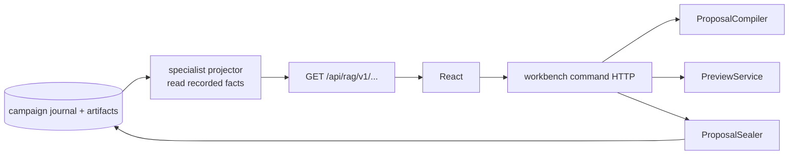

# Intern Guide to Candidate Read Projections and the Workbench Command API

## 1. Executive summary

The specialist API currently answers historical questions: what campaigns ran, how arms compared, what happened in an episode, and which artifacts prove it. Candidate authoring adds a second category of operation: compile a mutable draft, request a preview, and seal a candidate. These responsibilities should coexist in one product without becoming one package or one state model.

This ticket extends historical projections with sealed candidate intent and mutation summaries. Separately, it defines a transport-independent workbench command service over the compiler/sealer/preview applications, then adds thin HTTP adapters. The browser receives legality, diff, invalidation, diagnostics, and recorded facts from backend contracts; it never reconstructs them from layer order or current manifests.

## 2. Current read boundary

`specialistapi.Server.Handler` (`http.go:17-29`) registers only GET routes for health, cockpit, comparison, case pages, pipeline, and provenance. `health` explicitly reports `read_only:true`.

`Projector.loadFacts` (`projector.go:50-127`) verifies the journal, reads all events, rebuilds overview, decodes the campaign creation spec/estimates/observations/completions, expands episode specs, and loads budget. `Comparison` (`projector.go:170-217`) projects arm summaries, stored graphs, `optimization.Diff`, `Plan`, paired cases, and metrics.

This is a good historical architecture. Extend it with recorded candidate facts; do not make it compile or seal drafts.

## 3. Boundary design



The same server process may mount both handlers. The separation is application semantics, not necessarily deployment.

## 4. Candidate historical projection

Extend comparison output additively under the accepted API/schema policy:

```go
type CandidateSummary struct {
    ID                  record.CandidateID        `json:"id"`
    Parent              record.SnapshotID         `json:"parent"`
    Child               record.SnapshotID         `json:"child"`
    Proposer             space.Proposer            `json:"proposer"`
    Strategy             string                    `json:"strategy"`
    Hypothesis           string                    `json:"hypothesis"`
    ExpectedImprovement  space.ExpectedImprovement `json:"expected_improvement"`
    Risks                []string                  `json:"risks,omitempty"`
    Motivation           space.Motivation          `json:"motivation,omitempty"`
    Mutations            []MutationSummary         `json:"mutations"`
    SemanticCatalogID    record.Digest             `json:"semantic_catalog_id"`
}

type MutationSummary struct {
    Variable space.VariableID `json:"variable"`
    Label    string           `json:"label"`
    Before   json.RawMessage  `json:"before"`
    After    json.RawMessage  `json:"after"`
}

type ComparisonView struct {
    // existing fields
    Candidate *CandidateSummary `json:"candidate,omitempty"`
}
```

Use the candidate/catalog artifact sealed with the campaign. Do not label an old variable using the current registry unless no sealed descriptor exists; if fallback policy is allowed, emit a diagnostic.

### Candidate lookup

`CampaignSpec.Candidates` should map treatment arm ID to candidate record. The projector selects the record for the requested treatment and verifies its parent/child snapshots correspond to baseline/treatment arms. A mismatch is a diagnostic or corruption error, not a best-effort guess.

## 5. Catalog read API

Authoring needs the current server catalog:

```text
GET /api/rag/workbench/v1/catalog
GET /api/rag/workbench/v1/catalog/variables/{variable}
```

Response:

```go
type CatalogResponse struct {
    APIVersion string        `json:"api_version"`
    Catalog    space.Catalog `json:"catalog"`
}
```

The catalog is static per build/composition and cacheable by full catalog ID/ETag. It is not historical. Historical candidate projections carry sealed catalog provenance.

Do not expose executable bindings or Go implementation details.

## 6. Workbench application service

```go
type ParentResolver interface {
    ResolveParent(context.Context, ParentRef) (
        space.Snapshot[optimization.PipelineConfig], error,
    )
}

type WorkbenchService struct {
    Parents  ParentResolver
    Compiler experimentworkbench.ProposalCompiler
    Preview  PreviewService
    Sealer   experimentworkbench.ProposalSealer
}
```

Operations:

```go
func (s WorkbenchService) Compile(ctx context.Context, cmd CompileCommand) (CandidateDraft, error)
func (s WorkbenchService) Preview(ctx context.Context, cmd PreviewCommand) (PreviewResult, error)
func (s WorkbenchService) Seal(ctx context.Context, cmd SealCommand) (SealedProposal, error)
```

A command contains authenticated actor/context and idempotency separately from semantic request fields. Application methods enforce policy before reading restricted artifacts or sealing.

## 7. HTTP command contracts

Suggested namespace:

```text
POST /api/rag/workbench/v1/proposals:compile
POST /api/rag/workbench/v1/previews:run
POST /api/rag/workbench/v1/proposals:seal
```

Action suffixes make draft/seal distinction explicit. REST resource alternatives are acceptable if they do not imply drafts are durable resources.

### Compile request

```json
{
  "parent": {"campaign":"campaign:...","arm":"baseline"},
  "mutations":[{"variable":"fusion.rrf_k","value":20}]
}
```

Compile response is the full `CandidateDraft` plus API version. HTTP 200 can carry `Sealable:false` and diagnostics for operator errors; malformed envelopes/auth failures use normal errors. Decide consistently.

### Preview request

```json
{
  "draft_digest":"sha256:...",
  "parent": {"campaign":"campaign:...","arm":"baseline"},
  "mutations":[...],
  "probe":"fusion.rrf-contributions/v1",
  "case_id":"q-comparison"
}
```

Server recompiles or verifies draft semantic inputs before preview. It does not trust client graph/child fields.

### Seal request

```json
{
  "idempotency_key":"client-generated-stable-key",
  "campaign":"campaign:...",
  "parent":"snapshot:...",
  "draft_digest":"sha256:...",
  "mutations":[...],
  "intent":{...}
}
```

Require an `Idempotency-Key` header or request field, not both as disagreeing sources. The application receives one normalized key.

## 8. Authorization and sensitivity

Scalar catalog reads may be broadly available, but parent configs, cases, previews, prompt assets, and sealing are different capabilities.

Recommended policy interface:

```go
type Authorizer interface {
    Check(context.Context, Principal, Action, Resource) error
}
```

Actions:

```text
catalog.read
proposal.compile
preview.run
proposal.seal
artifact.read.restricted
artifact.write.restricted
```

Rules:

- authenticate actor before resolving restricted parent/case content;
- never echo sensitive raw values in diagnostics/logs;
- derive candidate proposer identity from authenticated principal or verify delegated identity;
- preview result sensitivity is at least the maximum of inputs and produced content;
- sealed artifact refs preserve declared sensitivity.

## 9. Error contract

Use stable codes and request correlation:

```go
type APIError struct {
    Code      string       `json:"code"`
    Message   string       `json:"message"`
    RequestID string       `json:"request_id,omitempty"`
    Details   []Diagnostic `json:"details,omitempty"`
}
```

Examples:

```text
invalid_request
unauthenticated
forbidden
parent_not_found
parent_changed
catalog_changed
draft_not_sealable
preview_not_supported
preview_failed
idempotency_conflict
campaign_conflict
internal_error
```

Do not branch status codes by searching error strings as current projection helpers sometimes do (`http.go:154-161`). Add typed/sentinel application errors for new command APIs.

## 10. Idempotency and concurrency

Compile is naturally repeatable and read-only. Preview may consume resources but should be idempotent for an explicit request ID where practical. Seal must be strongly idempotent.

Seal flow:

```text
normalize idempotency key
look up prior command result
if same semantic request: return prior result
if different request: 409 idempotency_conflict
load journal head and parent
recompile and seal
append using expected version
on concurrent version conflict: reload and check whether command committed
```

HTTP handlers do not implement this algorithm; they pass normalized commands to the application.

## 11. Preview service boundary

```go
type PreviewService interface {
    Run(context.Context, PreviewRequest) (PreviewResult, error)
}
```

Dispatch by registered probe/capability, not by React component name:

```text
fusion.rrf-contributions/v1 → deterministic fusion preview
representations.one-chunk/v1 → bounded generation preview
```

Preview outputs are typed envelopes with provenance:

```go
type PreviewResult struct {
    Probe         string          `json:"probe"`
    DraftDigest   record.Digest   `json:"draft_digest"`
    CaseID        string          `json:"case_id,omitempty"`
    PayloadSchema record.SchemaID `json:"payload_schema"`
    Payload       json.RawMessage `json:"payload"`
    Sensitivity   artifact.Sensitivity `json:"sensitivity"`
}
```

## 12. HTTP adapter implementation

Use standard `net/http` and `http.ServeMux`, matching current code. A handler should do only:

```text
parse path/body with size limit and strict JSON
obtain principal/request ID
normalize idempotency header
call application method
map typed error to status/code
write JSON with security/cache headers
```

Add request-body limits, reject trailing JSON, and handle context cancellation. Compile/catalog responses may be cached by ETag; command responses generally must not be cached.

## 13. Historical projection implementation

Extend `campaignFacts` to decode candidate facts or use the candidate map in the campaign creation spec. Verify artifacts when loaded. Then:

```text
Comparison(baseline, treatment):
    load facts
    existing arm/graph/diff/plan/metrics projection
    candidateRecord = facts.spec.Candidates[treatment]
    if present:
        verify parent/child arm linkage
        load sealed catalog artifact
        build CandidateSummary labels from sealed descriptors
    else:
        preserve current description-based view
    return
```

Fallback for non-candidate historical arms remains absence, not a fabricated candidate.

## 14. Implementation phases

1. Extend campaign fact loading and candidate projection types/tests.
2. Add current catalog projection and ETag behavior.
3. Define principal/authorization/typed error interfaces.
4. Implement workbench application service over compiler/preview/sealer.
5. Add strict HTTP command handlers and security tests.
6. Wire separate read and command handlers in serve composition.
7. Export fixtures/handoff types for OPTKIT-019.

## 15. Testing strategy

### Projection

- candidate present/absent;
- correct parent/treatment linkage;
- sealed descriptor labels/docs used;
- missing/corrupt catalog diagnostics;
- no mutation of existing missing-measurement semantics;
- historical full-arm fallback unchanged.

### Commands

- strict body decoding/size/trailing data;
- auth matrix;
- diagnostic response behavior;
- stale parent/catalog;
- seal idempotent retry and conflict;
- cancellation and internal error redaction;
- no business logic unit tests tied only to HTTP.

### Security

- no prompt/config values in logs/errors;
- restricted preview requires action;
- actor spoof rejected;
- headers and content types preserved.

### Commands

```bash
cd rag-ttc
GOWORK=off go test ./pkg/ttc/specialistapi ./pkg/ttc/experimentworkbench -count=1
GOWORK=off go test ./... -count=1
```

Run live server tests in tmux per workspace guidance and stop it cleanly after curl/browser smoke.

## 16. Risks and review focus

- Adding POST routes directly to `specialistapi` can erode the read-only guarantee.
- Current error mapping uses string matching; new commands need typed errors.
- Historical labels must come from sealed catalogs, not current catalog.
- Request logging can leak prompt/config content.
- Idempotency must survive process restart and journal races.
- Preview capability names are backend contracts, not frontend plugin IDs.
- Candidate absence on old/full-arm campaigns is normal.

## 17. Implementation outcome

Implemented on 2026-08-26 in RAG-TTC commits `3144759e`, `8c263f75`, `9952f13d`, `bf734fda`, `b675fb6d`, `4c38094a`, `f3d42719`, and `07e3bbe8`.

### Historical candidate projection

`specialistapi.ComparisonView` now includes an optional `CandidateSummary`. Candidate-backed treatment comparisons verify baseline/treatment snapshot ancestry, load the exact sealed catalog artifact, validate its semantic ID against the candidate, and label normalized before/after mutations from sealed descriptors. They never consult `optimization.NewRegistry` or current catalog prose.

The summary exposes candidate ID, parent/child snapshots, proposer, strategy, hypothesis, expected improvement, ordered risks, motivation, semantic catalog ID, and mutations. A direct/full-arm historical comparison with no candidate record returns no fabricated candidate. Missing/corrupt sealed catalogs and lineage mismatches are corruption errors, not label fallbacks.

The existing specialist route tree remains GET-only under `/api/rag/v1/`; its health response still reports `read_only:true`.

### Current catalog and workbench application

The separate current catalog service exposes the immutable runtime registry as serializable values. Authenticated workbench endpoints are:

```text
GET  /api/rag/workbench/v1/catalog
GET  /api/rag/workbench/v1/catalog/variables/{variable}
POST /api/rag/workbench/v1/proposals:compile
POST /api/rag/workbench/v1/previews:run
POST /api/rag/workbench/v1/proposals:seal
```

Catalog responses carry `rag-ttc.workbench-api/v1`, complete nested domains/descriptors, and a strong ETag equal to the quoted full catalog ID. `If-None-Match` returns 304. The semantic catalog ID remains `sha256:d3034d1d61cb5da92649bf9d199015e25a6e5223ed50741f594ceba2093730b6`.

`WorkbenchService` is transport-independent. It owns:

- campaign/spec/snapshot parent and case resolution;
- current catalog reads;
- authorization checks;
- proposal compilation;
- deterministic RRF before/after preview execution;
- authenticated proposer binding;
- idempotent proposal sealing.

The RRF preview dispatches only `fusion.rrf-contributions/v1`, executes the actual semantic fixture executor with parent and draft child configs, returns typed before/after search output under `schema:rag-ttc.preview.rrf-contributions/v1`, and marks the payload internal. Unsupported probes and stale/non-sealable drafts are typed application errors.

### Authorization, errors, and HTTP boundary

The action set is closed:

```text
catalog.read
proposal.compile
preview.run
proposal.seal
artifact.read.restricted
artifact.write.restricted
```

`Principal` is an `actor:` identity. Seal rejects a caller-supplied different proposer and always binds the persisted proposer identity to the authenticated principal. The composed local server requires an explicit secret `--workbench-token` and validated `--workbench-actor`; bearer comparison is constant-time.

Application errors carry stable codes and safe messages. HTTP status mapping uses typed errors rather than message searches. Internal causes are never emitted. Compiler diagnostics also redact binding/domain/apply details for descriptors marked sensitive while retaining stable codes and variable IDs. Command requests require `application/json`, are limited to 1 MiB, disallow unknown fields, reject trailing JSON, and propagate cancellation. Seal accepts exactly one `Idempotency-Key` header and no body alias. Responses include request correlation and security headers; command and error responses use `Cache-Control:no-store`.

The HTTP handlers parse/authenticate, call applications, and project results only. Compiler, preview, parent resolution, state/idempotency, and sealing behavior remain outside transport code.

### Server composition and live evidence

`campaign serve` mounts two disjoint handlers into one standard-library `http.ServeMux`:

```text
/api/rag/v1/           -> specialistapi read handler
/api/rag/workbench/v1/ -> workbenchapi command handler
```

The live built-binary smoke created a running campaign and proved:

```text
specialist_read_only: true
unauthorized_catalog_status: 401
draft_digest: sha256:b56f41ebc27ea8dbca4964a9d5592f94aafd96503703304c9e904647c09c0e4e
preview_probe: fusion.rrf-contributions/v1
candidate_id: candidate:3fc3c902b5d459be5f60ffc40c60ad5941c4c9287cb437afd45e478b93b83314
candidate_actor: actor:live-smoke
idempotent_retry_equal: true
```

Sanitized live JSON responses for health, cockpit, catalog, compile, preview, seal, and unauthorized errors are retained as frontend contract artifacts. TypeScript handoff types cover candidate summaries, complete catalog domains, pipeline/graph/draft contracts, compile/preview/seal requests and responses, API errors, and sealed proposal artifacts.

Validation includes full RAG-TTC lint/test/vet/build, focused race suites, 45 specialist frontend tests, TypeScript checking, production frontend build, a 373-package acyclic dependency scan, live HTTP smoke with clean shutdown, strict diary/slip audits, docmgr doctor, and completed guide/diary delivery. No React authoring UI was added; that remains the accepted PBUI/OPTKIT-023 boundary.

## 18. Out of scope

- React WorkbenchRegistry/shell (OPTKIT-019);
- actual prompt preview implementation (OPTKIT-020);
- provider-scale auth platform redesign;
- promotion/approval APIs;
- recomputing historical facts.

## 19. Exit criteria

- comparisons project sealed candidate intent/mutations when present;
- old/full-arm comparisons retain current behavior;
- current catalog is exposed with stable ETag;
- compile/preview/seal share transport-independent applications;
- HTTP handlers are thin, strict, authorized, and idempotent;
- specialist historical projector remains read-only;
- tests, live smoke, diary, doctor, and upload pass.

## 20. File reference map

- `rag-ttc/pkg/ttc/specialistapi/http.go:13-29` — current GET-only server.
- `rag-ttc/pkg/ttc/specialistapi/http.go:134-185` — parsing/errors/security headers.
- `rag-ttc/pkg/ttc/specialistapi/projector.go:31-127` — fact reconstruction.
- `rag-ttc/pkg/ttc/specialistapi/projector.go:170-217` — comparison projection.
- `rag-ttc/pkg/ttc/specialistapi/types.go:48-61,131-143` — arm/comparison response contracts.
- `rag-ttc/pkg/ttc/experimentworkbench/service.go:37-148` — current transport-independent operations.
- `rag-ttc/cmd/rag-ttc/cmds/experiments/optkitrag/serve.go` — composition root.
