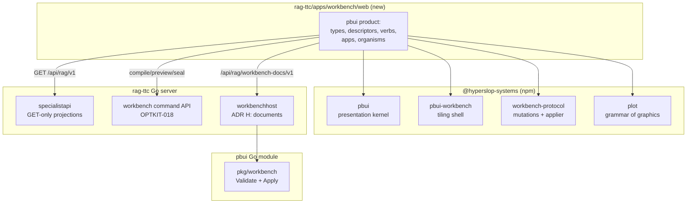

# Intern Guide: PBUI Adoption ADRs and the Workbench Vocabulary

## 1. What problem this ticket solves

OPTKIT-019 designed a bespoke React shell (`WorkbenchShell`, `WorkbenchProvider`,
a custom plugin registry, a route-per-screen architecture) for the candidate
authoring workflow. Before implementation started, the program decided to build
the frontend on the PBUI stack instead — the presentation-based UI system in the
sibling `pbui` repository, already proven by the `datalab` product. OPTKIT-019
is closed as superseded; this ticket is the architecture-closure step for its
replacement.

The reasoning is recorded in section 3. The consequence is that a set of
decisions which OPTKIT-019 made implicitly (what a screen is, how state is
held, how objects travel between parts of the UI) now have to be made
explicitly against PBUI's contracts: which repository owns the product package,
where the Go workbench service lives, what workbench document formats exist,
which presentation types and verbs the product declares, and how verbs turn
into backend commands.

This ticket produces **decisions and contracts, not code**. Its role for the
frontend is exactly the role OPTKIT-012 played for the backend: without it, the
type map and verb vocabulary would emerge accidentally across several PRs, and
the program's rule that "one vocabulary describes playing and proposing" would
be unenforceable.

**Deliverables:**

- ADRs G through L (sections 4–9), reviewed and accepted.
- The presentation vocabulary table (types, value shapes, tones, translators)
  and the verb inventory, pinned in this document.
- The workbench document format specifications.
- A package/dependency diagram proving the layering is acyclic.

**Explicitly excluded:** any React or Go implementation (OPTKIT-022 and
OPTKIT-023 consume the accepted contracts), any change to the backend program
tickets OPTKIT-015–018, and any agent-facing work beyond name reservation
(OPTKIT-024).

## 2. The two systems being joined

An intern implementing OPTKIT-022/023 must understand both sides precisely.
This section is the minimum working model, with file references into the
sibling repositories under `/home/manuel/workspaces/2026-08-24/use-optkit/`.

### 2.1 The optimization workbench program (backend side)

The program state as of 2026-08-26:

- **Built (OPTKIT-012–014):** typed variables with serializable catalogs and
  executable bindings in `optkit/space/` (`catalog.go`, `binding.go`,
  `valuespec.go`, `section.go`, `candidate.go` with v2 intent identity), and
  the aggregate `PipelineConfig` with derived graphs in
  `rag-ttc/pkg/ttc/optimization/` (`config.go`, `derive.go`, `lenses.go`).
- **Designed, not yet built (OPTKIT-015–018):** real `FusionConfig.RRFK`
  plumbing, the pure `CompileProposal` service, `SealProposal` with candidate
  manifests and campaign persistence, and the read projections plus workbench
  command API.
- **Read side today:** `rag-ttc/pkg/ttc/specialistapi/` serves six GET routes
  under `/api/rag/v1` (campaign cockpit, comparison, paired case, pipeline,
  provenance) consumed by the existing specialist SPA at
  `rag-ttc/apps/specialist/web/`.

The API surface the frontend will eventually call is specified by OPTKIT-018:

```text
specialistapi (historical reads, unchanged):
  GET  /api/rag/v1/...                                   six existing routes
  plus additive candidate projections (CandidateSummary on comparisons)

workbench command API (new, from OPTKIT-018):
  GET  /api/rag/workbench/v1/catalog
  GET  /api/rag/workbench/v1/catalog/variables/{variable}
  POST /api/rag/workbench/v1/proposals:compile           pure, no durable writes
  POST /api/rag/workbench/v1/previews:run                probe-dispatched
  POST /api/rag/workbench/v1/proposals:seal              durable, idempotent
```

Two backend properties are load-bearing for every frontend decision in this
document:

- **Compile is pure.** `CompileProposal` may be called on every slider
  movement; it never writes artifacts or journal events. Only `SealProposal`
  creates durable records. (OPTKIT-016/017; architect brief section 3.)
- **The store is canonical.** Historical screens project recorded facts; they
  never recompute, never substitute defaults for missing values, and label the
  sealed catalog provenance rather than reinterpreting old candidates with
  current documentation. (OPTKIT-012 ADR E/F.)

### 2.2 PBUI (frontend side)

PBUI is two deliberately independent layers plus a wire protocol, all in the
`pbui` repository.

**The presentation layer** (`pbui/src/presentation/`) is the CLIM-derived
object model:

- A **presentation type** is a key of a product-defined `PresentationValues`
  interface. An **object** is a `PresentationReference {type, value}`. The type
  is the type *as the interface understands it* — `{docId, name}` and
  `{docId, channel}` are both objects to TypeScript, but one is a `field` and
  one is a `channel`, and that distinction is the whole mechanism.
- A **descriptor** (`PresentationDescriptor`) is REPRESENTATION only, one
  pure file per type: `label(value, env)`, `describe(value, env)`, `tone`.
  Descriptors hold no React, no store access, and — since pbui 0.8.0 — no
  actions.
- **Actions are kernel declarations** (PBUI-ACTIONS-2/3). The product builds
  a `createActionRegistry({graph, scopes, contributions})` over a nominal
  type graph; a contribution is an exact rule, an inherited rule, or a
  bounded family. A rule's `test` returns four-state availability
  (`available` / `unavailable(reason)` / `inapplicable` / `hidden`), its
  `bind` returns a **serializable verb, never a closure**, and its metadata
  (`label`, `group`, `order`, `danger`, `primary`) is presentation-only —
  changing it never changes which rule wins. Unavailable actions render
  greyed with their reason and carry NO bound verb; hiding a verb hides the
  rule that makes it unavailable. A tie between rules is returned as data
  and renders as a non-executable diagnostic row.
- `createPbui({registry, defaultEnvironment, actions, snapshotFor,
  translators})` returns `{Provider, Presentation, ObjectMenu, MouseDocLine,
  AcceptBanner, AcceptChooser, usePbui}`. `actions` + `snapshotFor` are
  REQUIRED: rules never read live stores — `snapshotFor(query, env)` builds
  an immutable `SelectionSnapshot {revision, scopes, modes, capabilities,
  product}` and every resolution is a pure function of registry + query +
  snapshot. Clicking a menu row **re-resolves against a fresh snapshot**
  before the verb is delegated (same action, same candidate, still
  available — else the click is refused). The Provider's `onPerform(verb)`
  is **the product boundary where verbs become effects** — the only seam.
- A bare left click resolves the kernel's **primary invocation**: the unique
  available action marked `metadata.primary` performs (through the same
  fresh revalidation); zero or several open the menu. The per-instance
  `activate` prop remains for host-owned clicks (selection, expansion).
- **Accept mode** (`pbui.accept({types, prompt, filter})`) is the cross-tile
  object-request protocol: while a request is pending, every presentation
  whose reference satisfies the request lights up
  (`data-state="acceptable"`) in every tile and workspace, and a left click
  resolves the promise. Satisfaction is typed: a graph SUBTYPE satisfies the
  request with the ORIGINAL reference, and **translator edges** let one type
  stand in for another — a genuine tie between edges opens an explicit
  chooser instead of picking by registration order.

Key files: `pbui/src/presentation/types.ts` (the exact interfaces),
`pbui/src/presentation/actions/` (the action kernel: type graph, registry,
resolver, availability, fresh revalidation),
`pbui/src/presentation/translators/` (typed accept),
`pbui/src/presentation/createPbui.tsx` (the integration surface),
`pbui/src/presentation/registry.ts` (`createPresentationRegistry` — the
representation-only descriptor registry). The guide targets **pbui 0.8.0**,
which deleted every pre-kernel mechanism (descriptor `actions()`,
`conversions`, the legacy engine); nothing in this program may reference
them.

**The workbench layer** (`pbui/packages/pbui-workbench/`) is the tiling shell:

- An **app** is an `AppDescriptor` (`src/apps.ts`): `{id, title, tone,
  singleton, duplicable?, docBound?, bindings?, titleFor?, group?, blurb?,
  available?, Component}`. Registration is an **explicit list** passed to
  `createWorkbench({apps, initial, onMutate, onRejected})` — never
  import-side-effect registration.
- The persisted UI state is a **`WorkbenchDocument`** (protobuf,
  `pbui/proto/hyperslop/pbui/workbench/v1/workbench.proto`): workspaces, each a
  binary split tree of `Node = Leaf{viewId} | Split{direction, ratio, a, b}`;
  `AppView {id, appId, documents: map<string,string>, title?}`; and
  `DocumentPayload {id, format, schemaVersion, body}` — product-owned domain
  content.
- **View ≠ tile.** One `AppView` can be placed twice (a linked view); both
  placements render the same object and stay in lockstep, because
  `AppProps = {placementId, view}` and the component is a pure function of
  `view.documents` plus product stores.
- Every layout change is one of 15 typed `Mutation`s, applied by parallel
  Go (`pbui/pkg/workbench/mutation.go`) and TS
  (`pbui/packages/workbench-protocol/src/client/apply.ts`) appliers, kept in
  parity by 26 shared JSON fixtures.
- Server persistence (the datalab pattern): `POST/GET/PUT/DELETE
  /v1/workbenches[/{id}]`, `POST /v1/workbenches/{id}/mutate`, and an SSE
  stream carrying revision bumps. The Go module validates documents against an
  `ApplicationCatalog` and a `DocumentValidator`
  (`pbui/pkg/workbench/model.go`, `validate.go`).

**Reference product:** `pbui/packages/datalab-ui/` (30 apps, 15 descriptors)
and the `datalab` Go server (`datalab/pkg/workbenchapp/catalog.go`,
`datalab/pkg/server/handlers_workbenches.go`). The three playbooks under
`pbui/docs/playbooks/` — especially
`building-a-new-hyperslop-systems-app-on-pbui.md` — are the intended entry
points and must be read in full before OPTKIT-022 starts.

### 2.3 plot

`@hyperslop-systems/plot` is a pure grammar-of-graphics compiler
(`plot/src/render.ts`: document + schema + bounded rows → scene graph →
`SvgRenderer`). Its interaction seam is `PlotHit` — every mark and legend entry
can carry a typed data object, and `PlotHost`'s `renderInteractive(hit,
element)` lets the consumer wrap each mark in its own component.
`pbui/packages/datalab-ui/src/components/organisms/ChartPanel/ChartPanel.tsx`
demonstrates the pattern this program will copy: each mark becomes a
`<Presentation>` with a typed reference. Hover, tooltips, and brushing are not
implemented in plot today (its Phase 6); v1 of this program is click-only.

## 3. Why PBUI (the adoption rationale, recorded)

This section records the reasoning so the decision does not have to be
re-litigated. The program adopts PBUI because the optimization domain matches
the presentation model unusually well:

- **Everything already has identity.** Campaigns, arms, candidates, cases,
  chunks, artifacts, and layers are content-addressed or journal-assigned. A
  `PresentationReference` needs a stable identity and a small value; the domain
  provides both without invention.
- **The work loop is multi-surface.** "Read failures → hypothesize → mutate →
  understand cost → preview → seal → trial → compare" wants a failure gallery
  beside an autopsy beside a proposal editor. A split tree with linked views
  models this; a page router forces sequential navigation through it.
- **Accept mode supplies the missing interaction.** Attaching motivating
  evidence to a candidate, adding a mutation by picking a variable, choosing a
  comparison arm — each is a typed object request satisfied by clicking an
  object anywhere on screen. The current specialist SPA has no equivalent, and
  OPTKIT-019 would have needed to invent one.
- **Draft versus seal maps onto document versus journal.** A candidate draft is
  a natural `DocumentPayload` — cheap, revisioned, mutable, shareable across
  sessions via the workbench service. Sealing is the single verb that crosses
  into optkit's journal. The program's most load-bearing distinction becomes
  spatial and structural instead of a state flag inside one screen.
- **Verbs-as-data extends "one vocabulary" to agents.** optkit's
  `Candidate.Proposer` already anticipates non-human proposers. Because PBUI
  verbs are serializable and traced with actor attribution (the pbui-chat
  pattern), an agent-proposed mutation and a human slider movement produce the
  same verb, satisfying the architect brief's invariant with no parallel
  mechanism.

What PBUI does **not** change: the backend dependency chain. OPTKIT-015 → 016 →
017 → 018 remain prerequisites for authoring exactly as before. PBUI replaces
only the OPTKIT-019 shell architecture, and it permits the read-only evidence
tiles (OPTKIT-022) to proceed in parallel with the backend chain because they
need only `specialistapi`.

## 4. ADR G — Product packaging

**Question.** Where does the PBUI product live: a new package, or an evolution
of the existing specialist SPA at `rag-ttc/apps/specialist/web/`?

**Decision (recommended: new product application in rag-ttc).**

Create a new Vite application at:

```text
rag-ttc/apps/workbench/web/
```

with the package layering copied from the pbui-chat demo (the modern, compact
product shape — `pbui/packages/pbui-chat/demo/src/`), not from datalab-ui
(which predates `pbui-workbench` and uses the deprecated side-effect
registry):

```text
rag-ttc/apps/workbench/web/src/
  pbui/            types.ts, verbs.ts, registry.ts, runtime.tsx,
                   descriptors/<type>.ts        (one file per presentation type)
  apps/            <Name>App/<Name>App.tsx      (thin containers)
  components/      atoms/ molecules/ organisms/ (the pixels)
  api/             one RTK Query file per backend surface
  documents/       formats.ts, validators mirrored from Go (types only)
  workbench.ts     createWorkbench({apps: [...], initial, onMutate})
  App.tsx          Provider + Surface + MouseDocLine + AcceptBanner
```

Dependencies: `@hyperslop-systems/pbui`, `@hyperslop-systems/pbui-workbench`,
`@hyperslop-systems/workbench-protocol`, `@hyperslop-systems/plot`, React 19,
RTK Query. The application is not published to a registry initially; it builds
into the rag-ttc binary the way the specialist SPA does.

**The specialist SPA is neither deleted nor forked.** Its screens contain
organisms this product reuses (slope graph, chunk grid, stage flow, layer diff
widgets, ID trays). The migration rule:

- Presentational components (graphs, panels, chips) move into
  `apps/workbench/web/src/components/` as organisms, imported by tiles.
- Screen-level components (`ComparisonScreen`, `PipelineScreen`, …) stay in the
  specialist SPA until the corresponding tile reaches parity; then the screen
  is retired. The specialist SPA remains the durable, linkable read-only record
  during the transition.
- No component may exist in both trees in modified forms. If a tile needs a
  change to a shared organism, the organism moves first.

**Rejected alternative:** embedding a `WorkbenchInstance` inside the specialist
SPA (the datalab lesson-panel pattern). Rejected because the specialist SPA's
router, screen chrome, and page-scoped state duplicate exactly what the
workbench shell provides, and the two navigation models would compete
permanently.

**Consequences.** rag-ttc gains a second frontend application and a build
dependency on the `@hyperslop-systems` packages. The dev proxy story from the
specialist SPA (same-origin `/api` proxy, `SPECIALIST_API` override, no
wildcard CORS) carries over unchanged.

## 5. ADR H — Go workbench service placement

**Question.** Which Go package hosts the pbui workbench document service
(validation catalog, document validator, `/v1/workbenches` routes) for
rag-ttc?

**Decision.** New package:

```text
rag-ttc/pkg/ttc/workbenchhost/
  catalog.go       ApplicationCatalog: the app ids OPTKIT-022 registers,
                   with Singleton flags and required DocumentBindings
  documents.go     DocumentValidator for the ragttc.* formats (ADR I)
  http.go          route registration; storage via the pbui Go module
```

mounted by the same server binary that serves `specialistapi`, under
`/api/rag/workbench-docs/v1/` (distinct from the OPTKIT-018 command API under
`/api/rag/workbench/v1/` — documents are UI state, commands are domain
operations, and the two must be separately authorizable).

The implementation model is `datalab/pkg/workbenchapp/` plus
`datalab/pkg/server/handlers_workbenches.go`: the catalog mirrors the frontend
app registry; `workbench.Validate(ctx, doc, workbenchhost.Dependencies(),
limits)` runs on every write; mutation application uses
`pbui/pkg/workbench/mutation.go`, never a local applier; the SSE stream carries
revision bumps only.

**Boundary rules:**

- `workbenchhost` imports the pbui Go module and the document format
  definitions. It imports **nothing** from `specialistapi`,
  `experimentworkbench`, or `optimization` — a workbench document stores
  references (campaign IDs, arm IDs, variable IDs) as opaque strings, and
  referential validity is checked by the tiles at read time, not by the
  document validator. This keeps UI-state persistence decoupled from domain
  schema evolution.
- `specialistapi` remains read-only GET and is not modified by this track.
- The OPTKIT-018 command API remains the only path to compile/preview/seal.

**Rejected alternative:** putting the catalog inside `specialistapi`. Rejected
because it would make the read-only projection boundary depend on the pbui
module and on write-path routes, violating OPTKIT-012 ADR F.

## 6. ADR I — Workbench document formats

**Question.** What product-owned `DocumentPayload` formats exist, and what may
they contain?

**Decision.** Three formats, all versioned, all strictly validated
(unknown top-level keys rejected, matching the manifest `KnownFields(true)`
discipline):

### 6.1 `ragttc.proposal-draft/v1` — the authoring document

```yaml
format: ragttc.proposal-draft/v1
body:
  campaign: "campaign:..."         # opaque id, string
  parent: "arm:baseline"           # parent arm/candidate reference
  mutations:                        # authoring input, ordered
    - variable: "fusion.rrf_k"     # fully qualified catalog id
      to: 20.0                      # JSON value, decoded by the backend binding
  intent:
    hypothesis: ""                  # prose
    expected_improvement:
      metric: ""
      groups: []
    risks: []                       # ordered prose list
    evidence: []                    # case/verdict references attached via accept
```

**The derived-state rule (load-bearing).** The document stores **authoring
input only**. Everything `CompileProposal` returns — draft digest, normalized
mutations, before/after values, graph diff, invalidation plan, diagnostics,
`sealable` — is derived server state, fetched on demand and never written into
the document. This is the same split datalab enforces between its authoring
`datadrop.gog.document` and the DuckDB result, and it is what keeps the
workbench document small, mergeable, and free of staleness bugs: a draft
re-opened after the catalog changed re-compiles against current reality instead
of trusting a stored plan.

Sealing consequences: after a successful seal, the tile writes the sealed
candidate id into the document (`sealed: "candidate:..."`), which flips the
bound tiles into their read-only "sealed" rendering. The draft body is
retained as a record of authoring input; the campaign store is canonical for
everything else.

### 6.2 `ragttc.comparison/v1` — a comparison pointer

```yaml
format: ragttc.comparison/v1
body:
  campaign: "campaign:..."
  baseline: "arm:baseline"
  challenger: "arm:limit-2"
```

### 6.3 `ragttc.focus/v1` — a case/arm focus pointer

```yaml
format: ragttc.focus/v1
body:
  campaign: "campaign:..."
  case: "case:q-hybrid"            # optional
  arm: "arm:baseline"              # optional
  episode: "episode:..."           # optional — autopsy/judge/chunk content
                                   # is episode-scoped in the projections
  chunk: "chunk:..."               # optional — the chunk tile's subject
```

(`episode` and `chunk` were added during OPTKIT-022 implementation: a chunk
tile cannot fetch content without the episode whose chunk catalog holds it.
Both are opaque bounded ids exactly like the original three; the derived-
state rule is untouched.)

Pointer documents exist so doc-bound evidence tiles (`autopsy`, `judge`,
`chunk`, `compare`) get linked-view behavior and idempotent "go to existing
tile" opening (`view.open` reuses a view with identical bindings) for free.

**Validation invariants** (implemented in `workbenchhost/documents.go`):
format string and version recognized; body decodes strictly; string fields are
bounded (ids ≤ 256 bytes, prose fields ≤ 64 KiB total per document); `mutations`
entries have exactly `variable` and `to`; no compiled/derived keys accepted
(`draft_digest`, `plan`, `diff`, `diagnostics` are rejected by name to make the
derived-state rule mechanical). The validator does **not** check that ids
resolve — see ADR H boundary rules.

## 7. ADR J — The presentation vocabulary

**Question.** Which presentation types does the product declare, with what
value shapes, tones, and translators?

**Decision.** The v1 vocabulary below. Adding a type later is one descriptor
file plus a registry line (the normal PBUI extension path); *changing* a value
shape after OPTKIT-024 exports the vocabulary to agents requires a vocabulary
version bump.

Value shapes follow the datalab rule: **a presentation value carries what its
menu needs to decide, resolved by the component that already knows it.**
Values are small; they carry ids plus the few fields `label`/`actions` need,
never full projections.

### 7.1 Read-side types (backed by specialistapi)

| Type | Value shape (sketch) | Tone token |
|---|---|---|
| `campaign` | `{campaignId, name, status}` | neutral |
| `arm` | `{campaignId, armId, description}` | green |
| `case` | `{campaignId, caseId, query, description}` | neutral |
| `verdict` | `{campaignId, caseId, armId, score?, label, missing?}` | red/green by label |
| `layer` | `{armId, layer, digest, change: "direct"\|"upstream"\|"unchanged"}` | purple/yellow/green by change |
| `stage` | `{armId, caseId, stage, candidateCount}` | neutral |
| `chunk` | `{chunkId, documentId, title}` | neutral |
| `representation` | `{representationId, chunkId, kind, model}` | neutral |
| `artifact` | `{digest, schema, sensitivity}` | dither/neutral |
| `trial` | `{campaignId, trialId, armId, status}` | neutral |
| `episode` | `{trialId, episodeId, caseId, status}` | neutral |
| `delta` | `{campaignId, caseId, baseline, challenger, delta?, missing?}` | red/green by sign |
| `decision` | `{campaignId, policy, status, reason}` | by status |
| `journalEvent` | `{campaignId, seq, kind}` | neutral |

### 7.2 Authoring types (backed by the OPTKIT-018 command API)

| Type | Value shape (sketch) | Tone token |
|---|---|---|
| `section` | `{slug, name, short}` | purple |
| `variable` | `{id, key, label, kind, costHint, sensitive}` | purple |
| `mutation` | `{draftDocId, variable, before?, after}` | purple |
| `draft` | `{docId, parent, sealable, diagnosticCount}` | purple |
| `candidate` | `{campaignId, candidateId, parent, hypothesis}` | purple |
| `planStep` | `{draftDocId, layer, status, costHint}` | yellow |
| `previewResult` | `{draftDocId, probe, caseId}` | neutral |

### 7.3 Tone semantics

Tones are CSS custom-property references (never hex literals in descriptors),
and they reuse the specialist design language so the two frontends stay
readable side by side during migration: **purple** = direct change and
authoring; **yellow** = transitive invalidation and warnings; **green** =
healthy, improvement, reuse; **red** = failure and regression; **uncolored
dither** = missing or unavailable — missing is never rendered as zero, and a
missing measurement's presentation says so in its label.

### 7.4 Translators

Registered with `createPbui({translators})`; each is a DECLARED EDGE
`{id, from, to, match, translate}` with a stable id, resolved by the kernel's
nearest-scope-then-priority ladder — a genuine tie between edges opens the
`AcceptChooser` rather than picking by registration order. All eight edges
are unconditional (no `when`); the translate functions are pure:

```text
ragttc.verdict-to-case      verdict         → case   (a verdict stands in where a case is accepted)
ragttc.delta-to-case        delta           → case
ragttc.candidate-to-arm     candidate       → arm    (its child arm)
ragttc.trial-to-arm         trial           → arm
ragttc.episode-to-case      episode         → case
ragttc.stagecand-to-chunk   stage-candidate → chunk  (a ranked result stands in for its chunk)
ragttc.layer-to-section     layer           → section
ragttc.arm-to-campaign      arm             → campaign
```

Translators are why "ATTACH EVIDENCE ↦ click a case" also lights up every
verdict chip and every slope-graph mark: the accept request names `case`, and
the edges supply the rest. Graph SUBTYPING needs no edge at all — if the
vocabulary ever grows a subtype (say `rrf-variable` under `variable`), a
click on it satisfies a `variable` request with the ORIGINAL reference.

### 7.5 Environment and snapshot — two readers, cleanly split

pbui 0.8.0 makes the split structural. **Descriptors** (representation) read
the environment; **rules** (actions) read only the immutable
`SelectionSnapshot` that `snapshotFor` builds per query. Nothing reads both.

```ts
/** Representation only: what labels need. */
interface WorkbenchEnvironment {
  campaignName(id: string): string;
  armDescription(id: string): string;
}

/** What rules decide on. Derived facts only; revision moves iff they move. */
interface WorkbenchFacts {
  activeDraftDocId: string | null;   // where "add mutation" lands
  draftSealable: boolean;            // from the last compile, for row reasons
}

function snapshotFor(query, env): SelectionSnapshot<WorkbenchFacts> {
  return {
    revision: `${facts.activeDraftDocId}|${facts.draftSealable}|${caps}`,
    scopes: ["workbench", "global"],
    modes: new Set(),                       // e.g. "sealed-view" later
    capabilities: new Set(canSeal ? ["seal"] : []),  // from OPTKIT-018 auth
    product: facts,
  };
}
```

Authorization is a CAPABILITY, not an environment boolean: the
`proposal.seal` rule tests `snapshot.capabilities.has("seal")`, which is the
same mechanism the pbui-chat demo's approver flow proved — and it means the
SealBar and the menu row render from one resolved action and cannot
disagree. Anything a rule needs beyond the snapshot is carried in the
presentation value by the component that presented it.

## 8. ADR K — Verbs and the verb sink

**Question.** What is the verb inventory, and how do verbs become effects?

**Decision.** Verbs are a single discriminated union in
`src/pbui/verbs.ts`, in three families. The sink is one `onPerform`
implementation that routes by family. Workbench layout verbs
(`tile.split`, `view.open`, `workspace.*`, …) come from `pbui-workbench`
unchanged and are not restated here.

### 8.1 Navigation verbs (resolve to layout verbs + pointer documents)

```text
open.cockpit      {campaignId}
open.failures     {campaignId}
open.autopsy      {campaignId, caseId, armId}
open.judge        {campaignId, caseId, armId}
open.chunk        {chunkId}
open.compare      {campaignId, baseline, challenger}
open.provenance   {ref}
```

Each writes-or-finds a pointer document (`ragttc.focus/v1` /
`ragttc.comparison/v1`) and issues `view.open {appId, documents}`; pbui's
idempotent open (identical bindings → go to existing tile) prevents tile
proliferation. The click-to-open gestures are declared as kernel rules with
`metadata.primary` — a left click on a case chip performs `open.autopsy`
through fresh revalidation; there is no separate `activate` wiring.

### 8.2 Draft verbs (mutate the `ragttc.proposal-draft/v1` document)

```text
draft.create        {campaignId, parent}         → documentPut + view.open(proposal)
draft.setParent     {docId, parent}
mutation.add        {docId, variable, to?}       → appends; editor opens focused
mutation.edit       {docId, variable, to}
mutation.remove     {docId, variable}
intent.setHypothesis{docId, text}
intent.setRisks     {docId, risks[]}
evidence.attach     {docId, ref}                 → from accept of case/verdict
evidence.remove     {docId, ref}
draft.discard       {docId}                      → documentDelete (danger)
draft.fork          {docId}                      → copy document, new id
```

These are **local** in the sense that they become workbench-document mutations
(`documentPut`) through the protocol applier; the server persists them via the
ADR H service. They never touch the campaign store.

### 8.3 Command verbs (call the OPTKIT-018 command API)

```text
proposal.compile  {docId}            implicit, debounced; also explicit retry
preview.run       {docId, probe, caseId, chunkId?}
proposal.seal     {docId, idempotencyKey}        DANGER verb
trial.run         {campaignId, candidateId}      DANGER verb (spends budget)
```

Rules:

- `proposal.compile` is fired by the sink automatically after draft verbs
  (debounced), reflecting the backend guarantee that compilation is pure.
  Results land in an RTK Query cache keyed by `(docId, documentRevision)`.
- Danger verbs carry `danger: true` in their RULE METADATA, render with the
  danger affordance, and require the confirmation step in the performing tile
  (`intent`'s SealBar; `trial`'s run bar). The seal rule's availability tests
  `capabilities.has("seal")` (§7.5), so an unauthorized menu row is greyed
  with its reason and carries NO bound verb — nothing downstream can execute
  it. Seal sends the OPTKIT-018 idempotency key; a retry after a network
  failure re-sends the same key.
- The sink returns per-verb success/failure and **must propagate rejection**:
  a verb that touched nothing must not report as performed (the pbui-workbench
  lesson; agents read "performed" as "the change landed").
- Every performed verb is appended to an in-memory trace (rendered by the
  `trace` tile); wiring that trace to a server endpoint is deferred to
  OPTKIT-024, but the trace record shape `{seq, actor, verb, target, outcome}`
  is fixed now so OPTKIT-024 does not have to migrate it.

### 8.4 Sink architecture

```text
onPerform(verb)
  ├── isWorkbenchVerb(verb)      → performWorkbenchVerb(handlers, verb)
  ├── family(verb) == "navigate" → ensure pointer doc → view.open
  ├── family(verb) == "draft"    → protocol Mutation(documentPut) → store
  │                                 → schedule debounced proposal.compile
  └── family(verb) == "command"  → RTK mutation → API → cache/invalidations
```

Business rules live in the backend; the sink contains routing, debouncing, and
document bookkeeping only. This mirrors OPTKIT-018's rule that HTTP handlers
contain no business logic, applied to the frontend boundary.

## 9. ADR L — Agent vocabulary (reservation only)

OPTKIT-024 will export the type and verb vocabulary in the pbui-chat
`Vocabulary` shape (types with doc/idHint/tone/verbs/example; verbs with
doc/fields/danger) so an agent can mention objects in prose and propose draft
verbs under actor attribution, with `proposal.seal` behind human approval.

This ticket only **reserves** the constraints that make that export possible
later without breakage:

- type names and verb names above are the wire names; renaming after OPTKIT-024
  ships is a vocabulary version bump;
- every verb is fully serializable (already guaranteed by ADR K);
- danger flags are part of the verb definition, not the UI, so approval
  requirements transfer to agents automatically;
- the export is GENERATED from the action registry and type graph
  (`listReachable()`, rule metadata, danger flags) plus descriptor labels —
  never hand-maintained — so "the menu and the agent disagree about what
  exists" is unrepresentable, and renaming a rule IS the vocabulary bump
  (PBUI-ACTIONS-3 Phase B lands the generator in pbui just before
  OPTKIT-024 starts).

No agent implementation happens before OPTKIT-023 proves the human path.

## 10. Package and dependency picture



Acyclicity claims to verify at review: `plot` imports nothing of pbui;
`workbenchhost` imports the pbui Go module but nothing from `specialistapi` or
`optimization`; the product package imports the npm packages and calls three
HTTP surfaces; `specialistapi` and the command API import nothing frontend.

## 11. What this changes in the program roadmap

- OPTKIT-019 is superseded (closed 2026-08-26). Its exit criterion moves
  verbatim to OPTKIT-023.
- OPTKIT-020's backend content is unchanged; its React editor section is
  amended to land as a workbench plugin (specialized `variable` editor plus
  preview renderer) in the OPTKIT-022 product.
- OPTKIT-018 gains two small additive notes: the worst-first verdict
  projection needed by the `failures` tile, and the statement that the
  workbench document service (ADR H) mounts beside it without merging with it.
- New dependency edges: OPTKIT-021 → OPTKIT-022 → OPTKIT-023; OPTKIT-023
  additionally depends on OPTKIT-018 (and transitively 015–017); OPTKIT-024
  depends on OPTKIT-023. OPTKIT-022 does **not** depend on 015–017, which is
  the schedule win: evidence tiles proceed in parallel with the backend chain.

## 12. Acceptance gates for this ticket

- ADRs G–L reviewed and marked accepted, with rejected alternatives recorded.
- The vocabulary tables (7.1–7.4) and verb inventory (8.1–8.3) frozen as the
  v1 contract; OPTKIT-022/023 may add entries but not reshape existing ones
  without returning here.
- Document format specs (ADR I) reviewed against the pbui `DocumentValidator`
  interface and the strict-decoding discipline.
- The dependency diagram's acyclicity claims spot-checked against the actual
  package imports.
- No production code changed.

## 13. Pitfalls (read before implementing anything)

- **Do not copy datalab-ui's registration style.** Its module-level
  `registerApp` side-effect registry predates `pbui-workbench`; the explicit
  `createWorkbench({apps: [...]})` list is the current contract.
- **Do not store compiled results in the draft document.** The rejection list
  in ADR I is mechanical on purpose; resist the temptation to cache a plan "for
  offline viewing" — staleness bugs in recomputation bills destroy trust in
  the tool.
- **Do not let snapshots evaluate.** `snapshotFor` derives cheap facts only
  (ids, flags, schema-level lookups), and its `revision` must be composed
  from exactly those facts so it moves iff they move. Anything requiring a
  fetch belongs in the presentation value (resolved by the presenting
  component); rules read `snapshot.product` and nothing else.
- **Do not hide unavailable actions.** `unavailable(reason)` renders the row
  greyed with its reason, per the pbui rule; `inapplicable` is for
  not-relevant (permits an override fallback), `hidden` for
  policy-suppressed (blocks the fallback too). Choosing between them is a
  semantics decision, not styling.
- **Do not put referential validation in the document validator** (ADR H
  boundary); a workbench document naming a deleted campaign must still load so
  its tiles can render honest error states.

## 14. Glossary

- **Presentation / object / reference:** a rendered value tagged with its
  interface-level type; `{type, value}`.
- **Descriptor:** the pure per-type definition of label, description, actions,
  tone.
- **Verb:** a serializable action payload; the only thing menus, buttons, and
  agents emit.
- **Accept mode:** a pending typed object request satisfied by clicking any
  matching presentation anywhere.
- **App / tile / view / placement:** an app is a registered kind; a view is a
  logical instance bound to documents; a placement is a leaf of the split tree
  showing a view; a tile is the rendered placement.
- **Workbench document:** the persisted `WorkbenchDocument` protobuf holding
  workspaces, views, and product `DocumentPayload`s.
- **Draft / seal:** pure, repeatable compilation of a proposal versus the
  single durable creation of patch, snapshot, candidate, and journal event.
