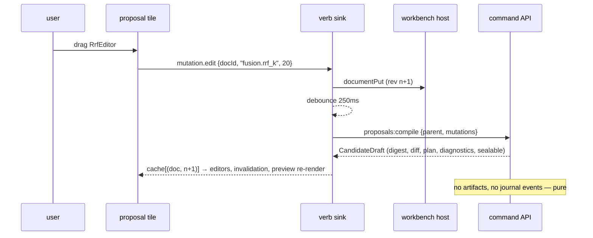

# Intern Guide: The Propose Workspace, Draft Documents, and the RRF Vertical Slice

## 1. What this ticket proves

**Exit criterion (inherited verbatim from the superseded OPTKIT-019):** a user
can open a case, change RRF `k`, immediately understand what is structurally
invalidated, preview deterministic fusion behavior, write a hypothesis and
risks, seal the candidate, run it, and see the resulting comparison against
that declared intent.

On PBUI, that sentence decomposes into: a **Propose workspace** whose tiles are
bound to one `ragttc.proposal-draft/v1` document; an accept-driven mutation and
evidence workflow; a debounced pure-compile loop against the OPTKIT-018 command
API; a plugin registry whose first specialized plugin is fusion; and a seal
flow that crosses — exactly once, behind a danger verb — from workbench
document into optkit journal.

This is the program's Gate 6 first half: a scalar variable end to end.
OPTKIT-020 then proves an artifact variable using the same compiler, sealer,
persistence, projection, and tile contracts — its editor arrives as one more
plugin, which is the test that this ticket built an architecture rather than a
feature.

## 2. Prior contracts assumed

| Contract | Source | What this ticket consumes |
|---|---|---|
| Vocabulary, verbs, document formats | OPTKIT-021 (accepted ADRs) | authoring types (§7.2), draft/command verb families (§8.2/8.3), `ragttc.proposal-draft/v1` |
| Product scaffold | OPTKIT-022 | registry, sink, workbench host, evidence tiles, trace store |
| Real fusion semantics | OPTKIT-015 | `fusion.rrf_k` is a live runtime coordinate (float64) with catalog docs |
| Pure compilation | OPTKIT-016 | `CandidateDraft` fields, diagnostic codes, `PreviewCapability` modes |
| Sealing | OPTKIT-017 | deterministic, idempotent `SealProposal`; campaign persistence |
| Command API + projections | OPTKIT-018 | the five endpoints below; `CandidateSummary` on comparisons; `APIError` codes |

The endpoints (OPTKIT-018, restated for reference):

```text
GET  /api/rag/workbench/v1/catalog                       ETag by full-catalog-ID
GET  /api/rag/workbench/v1/catalog/variables/{variable}
POST /api/rag/workbench/v1/proposals:compile             pure, repeatable
POST /api/rag/workbench/v1/previews:run                  dispatched by probe name
POST /api/rag/workbench/v1/proposals:seal                durable, idempotent
```

Backend truths that shape every flow here: compile never writes;
seal writes exactly once per idempotency key; the invalidation plan comes from
the server in server order; diagnostics use the stable OPTKIT-016 codes
(`unknown_variable`, `wrong_value_type`, `out_of_domain`, `no_effect`,
`parent_changed`, …); previews are honest by mutation kind
(`deterministic_local | bounded_server | unavailable`, each with a reason).

## 3. The draft document in practice

OPTKIT-021 ADR I fixed the format; this section fixes the runtime behavior.

### 3.1 Lifecycle

```mermaid
flowchart LR
    A[draft.create\nverb] -->|documentPut| B[draft doc rev 1]
    B -->|mutation.add / intent.set*\n= documentPut| C[draft doc rev n]
    C -->|debounced\nproposals:compile| D[CandidateDraft\nRTK cache]
    D -->|sealable + intent complete| E[SealBar armed]
    E -->|proposal.seal\ndanger verb| F[SealedProposal\ncandidate in journal]
    F -->|documentPut sealed:candidate-id| G[draft doc read-only]
```



- Every draft verb becomes a `documentPut` mutation through the protocol
  applier — no local document mutation code exists. The workbench host
  revision increments; other sessions (and later, agents) see the change via
  the SSE revision stream.
- Compile results are cached keyed by `(docId, documentRevision)`. A response
  arriving for an older revision is discarded (stale-response guard). The
  cache entry carries the full `CandidateDraft`: normalized mutations,
  before/after values, config diff, invalidation plan, diagnostics, preview
  capabilities, `sealable`, and the draft digest.
- The **seal state machine** (salvaged from OPTKIT-019, now derived rather
  than stored):

```text
state(doc, cache, inflight):
  sealed(doc)                          → "sealed"
  inflight.seal                        → "sealing"
  cache[doc.revision] missing          → "compiling"
  cache[doc.revision].sealable
    && intentComplete(doc)             → "sealable"
  otherwise                            → "editing"
```

  `intentComplete` requires a non-empty hypothesis; expected improvement and
  risks are strongly encouraged by the UI (the SealBar names what is missing)
  but only hypothesis is mandatory, matching the optkit `Candidate` contract
  where `Hypothesis` is the required intent field.
- Seal sends the draft digest with the request; the backend rejects with
  `parent_changed`/`catalog_changed` if reality moved underneath, and the tiles
  surface that as a diagnostic on the SealBar with a "recompile" affordance.
  After success the sink writes `sealed: <candidate-id>` into the document;
  all bound tiles flip to their read-only sealed rendering, which links to the
  comparison.

### 3.2 Concurrency

Two sessions editing one draft converge through workbench-document revisions:
the host applies mutations serially; a conflicting snapshot PUT returns the
current revision and the client rebases (the datalab `useRemoteWorkbench`
conflict surface). Because compiled state is derived, there is nothing else to
merge — this is the payoff of the derived-state rule.

## 4. The Propose workspace and its tiles

Default layout (ratios indicative):

```text
┌──────────────┬──────────────────────────────┬──────────────────┐
│ catalog      │ proposal                     │ intent           │
│ (sections,   │ (mutations, editors,         │ (hypothesis,     │
│  variables,  │  diagnostics)                │  risks, evidence,│
│  Short/Long) ├──────────────────────────────┤  SealBar)        │
│              │ invalidation   │ preview     │                  │
└──────────────┴──────────────────────────────┴──────────────────┘
```

`proposal`, `invalidation`, `preview`, and `intent` are four **linked-view
siblings**: distinct views, all bound to the same draft document id, so
opening a second placement of any of them stays in lockstep. `catalog` is a
singleton.

### 4.1 `catalog` — singleton

Sections in catalog order, variables with `label`, `key`, kind badge, cost
hint, sensitivity badge, and the Short doc inline; Long doc in a disclosure.
Data: `GET .../catalog` (ETag-cached). Emits `section` and `variable`
presentations. The `variable` menu's primary action is
`mutation.add {docId: env.activeDraftDocId, variable}` — greyed with
`disabledBecause: "no proposal draft is open"` when none is (the OPTKIT-022
descriptor already declares this; here it comes alive).

### 4.2 `proposal` — docBound to the draft

The mutation list: one row per mutation with variable label, before → after,
per-mutation diagnostics, and the editor (resolution order in §5). Header: the
parent arm (with `draft.setParent` via accept of an `arm`), the campaign, and
the draft digest in an ID tray. Footer: draft-level diagnostics with their
stable codes rendered as prose. Emits `mutation` and `draft`.

Accept flow: **ADD MUTATION ↦ click a \<variable\> anywhere** — the catalog
tile, a layer chip in an autopsy (via the `layer → section` conversion the
user can drill from), or a lab knob. The accept prompt names the draft:
`ADD MUTATION to draft <parent> ↦ click a VARIABLE anywhere`.

### 4.3 `invalidation` — docBound to the draft (linked)

The recomputation bill. Renders `CandidateDraft.invalidation_plan.Steps` in
**server order**: layer name, status (`direct_change` purple,
`upstream_change` yellow, `unchanged`/reused green), cost hint. Never inferred
client-side; color is supplemental to the words (both salvaged OPTKIT-019
rules). While `compiling`, the previous plan renders dimmed with a
"recomputing" notice — never a spinner replacing content. Emits `planStep` and
`layer`.

### 4.4 `preview` — docBound to the draft (linked)

Renders the preview for the selected mutation according to its
`PreviewCapability`:

- `deterministic_local` → the plugin's local preview (fusion: §6), parity-pinned;
- `bounded_server` → a "run preview" action issuing `preview.run` with the
  probe name and case/chunk selection (OPTKIT-020's one-chunk representation
  preview will land here without changes to this tile);
- `unavailable` → the reason, verbatim from the backend, plainly rendered.

The tile never pretends: capability modes and reasons come from the compile
response, honoring "previews are honest by mutation kind".

### 4.5 `intent` — docBound to the draft (linked)

Hypothesis (prose textarea), expected improvement (metric + groups), ordered
risks, and the **evidence tray**: references attached via accept —
**ATTACH EVIDENCE ↦ click a \<case\> or \<verdict\>** in the failure gallery,
a slope-graph mark (`delta → case` conversion), or an autopsy header. Each
evidence entry renders as a live presentation with its own menu (open the
case, open the autopsy) so a reviewer can audit the motivation.

At the bottom, the **SealBar**: the seal state, what is missing when not
sealable (named, not just disabled), and the seal action — a danger verb with
an explicit confirmation step that restates what sealing does ("creates the
patch, child snapshot, candidate, and journal event; this is durable"). The
idempotency key is minted at confirmation and reused on retry.

### 4.6 Trial and comparison integration

Sealing links to the existing evidence tiles: the sealed rendering offers
`trial.run` (danger verb — spends budget) and `open.compare {baseline: parent,
challenger: child}`. The OPTKIT-022 `compare` tile already renders
`CandidateSummary` (hypothesis, expected improvement, risks, mutation summary,
sealed-catalog labels) beside the slope graph — the moment the declared intent
confronts the evidence. No new tile is needed; that is the point of building
evidence tiles first.

## 5. Editors: generic by ValueSpec kind, specialized by plugin

Salvaged from OPTKIT-019 and mapped onto the product registry.

### 5.1 Generic editors

One editor per `ValueSpec` kind (the six kinds from `optkit/space/valuespec.go`):

```ts
type GenericEditors = {
  int:          IntegerRangeEditor,   // bounded number input + slider when range is tight
  float:        FloatRangeEditor,
  bool:         BooleanEditor,
  string:       StringEditor,
  choice:       ChoiceEditor,         // renders {value,label} pairs; submits value
  artifact_ref: ArtifactRefEditor,    // read-only ref + "open in plugin" (OPTKIT-020)
};

interface EditorProps {
  descriptor: VariableDescriptor;     // mirrored TS type of the Go descriptor
  before: JsonValue | undefined;      // parent value, from the compile response
  value: JsonValue | undefined;       // current draft value
  diagnostics: Diagnostic[];          // this mutation's diagnostics
  disabled: boolean;
  onChange(next: JsonValue): void;    // emits mutation.edit
}
```

Rules: an unknown kind renders a **visible unsupported state** — never silent
coercion, never a hidden control; editors submit machine values (`choice`
submits `value`, displays `label`); domain violations are shown from backend
diagnostics, not pre-empted by client-side validation logic beyond input
affordances (the backend's codec/domain is the single validator).

### 5.2 The plugin registry

```ts
interface WorkbenchPlugin {
  section: string;                                   // catalog section slug
  variableEditors?: Record<string, ComponentType<EditorProps>>;  // by variable id
  layerInspectors?: Record<string, ComponentType<InspectorProps>>;
  previewRenderers?: Record<string, ComponentType<PreviewProps>>; // by probe name
}
```

Resolution order, fixed: **specialized variable editor → generic editor by
value kind → visible unsupported fallback.** Preview renderers resolve by
**probe name** (`fusion.rrf-contributions/v1`), matching the backend dispatch
rule — never by React component name. Duplicate registrations are rejected in
dev/test. The registry lives in the product (`src/workbench/plugins.ts`), and
a plugin is one directory: `src/plugins/fusion/{index.ts, RrfEditor.tsx,
FusionInspector.tsx, RrfPreview.tsx}`.

This registry is UI-experience extension only; legality, domains, and
documentation always come from the backend catalog (the "generic semantics;
specialized experience" rule from the architect brief).

## 6. The fusion plugin — the proving slice

`fusion.rrf_k` (float64, `FloatRange(0.001, 1000)`, default 60.0, probe
`fusion.rrf-contributions/v1`) exercises every part:

- **RrfEditor** — a float editor with a log-scaled slider plus exact numeric
  entry, showing before → after and the domain bounds from the descriptor.
  Nothing more: the editor edits; the inspector explains.
- **FusionInspector** — renders the actual arithmetic for the selected case:
  per channel and per chunk, `contribution = weight / (k + rank)` with the
  operands visible, summed to the fused score, at both the parent's `k` and
  the draft's `k`, with rank changes highlighted. Every chunk row is a
  `chunk` presentation; every channel a `stage`.
- **RrfPreview** — the `deterministic_local` preview: recomputes fused
  ordering for the selected case's recorded stage candidates under the draft
  `k`. **Parity rule (the OPTKIT-010 lesson, mandatory):** the browser
  computation is pinned by golden tests against recorded Go results at
  recorded precision — scores quantized exactly as the Go side records them
  (`strconv.FormatFloat(f, 'f', 6, 64)` ⇒ `Number(x.toFixed(6))` before
  comparison and aggregation, the `recordedScore` pattern in
  `rag-ttc/apps/specialist/web/src/lab/sim.ts`). Export a fixture of recorded
  RRF contributions from the Go tests during OPTKIT-015 and commit it beside
  the parity test. If parity cannot be pinned for an input class, the preview
  declares itself `unavailable` for that class rather than showing unverified
  numbers.

The compile loop sequence for one slider movement:



## 7. Verbs completed in this ticket

The OPTKIT-022 sink refuses the draft and command families with a reason;
this ticket implements them per OPTKIT-021 §8.2/8.3:

- draft family → `documentPut`/`documentDelete` through the protocol applier,
  plus the debounced compile trigger;
- `proposal.compile` → RTK mutation with revision-keyed caching and the
  stale-response guard;
- `preview.run` → RTK mutation; results keyed by `(docId, draftDigest, probe,
  caseId)`;
- `proposal.seal` → confirmation step, idempotency key, error mapping for the
  OPTKIT-018 `APIError` codes (`draft_not_sealable`, `parent_changed`,
  `catalog_changed`, `idempotency_conflict` each get specific prose);
- `trial.run` → danger verb with budget statement in the confirmation.

All performed verbs land in the trace store with outcomes; refusals carry
reasons. The sink still contains no business rules.

## 8. Testing

- **Golden parity** for RrfPreview against recorded Go contributions at
  six-decimal recorded precision (fixture committed; test fails if the
  fixture is regenerated with different values — that is a semantic change
  needing OPTKIT-015 review).
- **Compile-loop tests** with MSW: debounce coalescing, stale-response
  discard, revision keying, diagnostics rendering by code.
- **Seal tests**: idempotent retry with the same key; every `APIError` code
  mapped to visible prose; `sealed` document flip; no seal offered while
  `sealable` is false or intent is incomplete (with the missing pieces named).
- **Editor contract tests**: each generic editor against its ValueSpec kind;
  unknown-kind fallback visible; choice editors submit values not labels.
- **Plugin registry tests**: resolution order; duplicate rejection; probe-name
  dispatch.
- **Accept flows** by keyboard: add-mutation and attach-evidence end to end.
- **Workspace test**: the Propose workspace's four linked tiles stay in
  lockstep across a placement duplication.

## 9. Implementation order

1. Draft document format registration in `workbenchhost` + TS types/guards;
   `draft.create`/`draft.discard` verbs; empty `proposal` tile rendering the
   document; commit.
2. Catalog tile over `GET /catalog`; `variable` presentation actions come
   alive; accept-driven `mutation.add`; commit.
3. Compile loop (debounce, cache, stale guard); diagnostics rendering; generic
   editors; commit.
4. `invalidation` tile over the plan; `preview` tile with capability modes;
   commit.
5. `intent` tile with evidence accept flow and SealBar states (seal disabled
   until backend ready); commit.
6. Fusion plugin (editor, inspector, preview + parity fixture); commit.
7. Seal + trial verbs against the live OPTKIT-017/018 services; sealed
   rendering; comparison hand-off; full-slice test on a fresh campaign store;
   commit.

Steps 1–6 can run against MSW fixtures generated from the OPTKIT-016 CLI
(`proposal compile` output recorded as fixtures), so frontend work needs only
the compiler CLI to exist, not the HTTP API; step 7 needs OPTKIT-018.

## 10. Exclusions

- No asset/prompt editing UI beyond the read-only `artifact_ref` editor stub
  (OPTKIT-020 supplies the representations plugin).
- No agent verbs (OPTKIT-024); the trace and vocabulary stay agent-ready.
- No client-side invalidation inference, no local patch semantics, no
  durable writes on control movement — restated because they are the three
  most tempting shortcuts, and each violates an accepted program rule.

## 11. What OPTKIT-020 and OPTKIT-024 inherit

OPTKIT-020 adds `plugins/representations/` (prompt diff editor bound to the
`artifact_ref` kind, `representations.one-chunk/v1` preview renderer) and its
`DraftAsset` field on draft-document mutations — no changes to tiles, sink,
or registry. OPTKIT-024 exports the by-then-stable vocabulary and attaches
the agent actor to the same verbs. If either requires modifying this ticket's
architecture, that is a defect in this ticket — file it as such rather than
patching around it.
