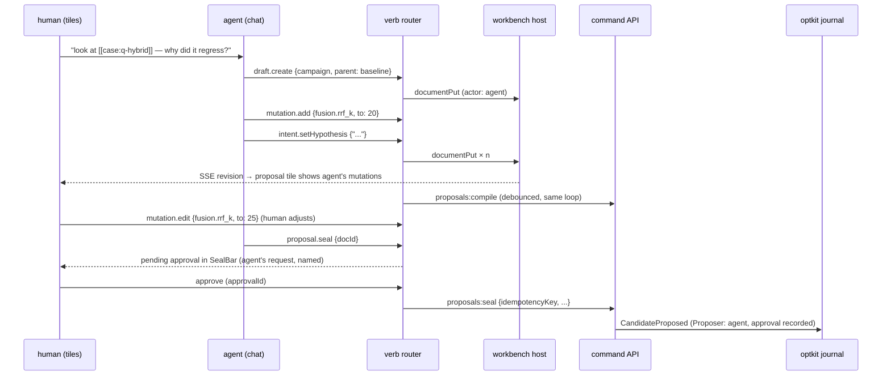

# Intern Guide: The Agent Seat over the Workbench Vocabulary

## 1. What this ticket adds, and why it is last

optkit's `Candidate` already records a `Proposer`, and the program brief's
strongest invariant — a knob in a lab and a mutation in a real candidate refer
to the same registered variable — was extended by OPTKIT-021 with a third
clause: *and an agent proposing that mutation uses the same verb a human's
slider produces.* This ticket implements that clause.

Concretely, after this ticket an agent participating in a chat session can:

- **mention** domain objects in prose (`[[case:q-policy-negative]]`,
  `[[variable:fusion.rrf_k]]`) and have them render as live presentations with
  full object menus;
- **propose** draft verbs (`draft.create`, `mutation.add`,
  `intent.setHypothesis`, `evidence.attach`) that land in the same shared
  `ragttc.proposal-draft/v1` document a human is looking at, attributed
  `actor: "agent"` in the verb trace;
- **request** but never perform sealing: `proposal.seal` and `trial.run` are
  danger verbs, and danger verbs from an agent become approval requests a
  human resolves in the intent tile's SealBar.

It is deliberately last. The human path (OPTKIT-023) must be proven first
because every agent affordance here is a *re-use* of it: if the agent needs a
capability the human tiles do not have, that is a gap in OPTKIT-023, not a
feature of this ticket. This mirrors the program's scalar-before-asset
sequencing logic.

**Exit criterion.** In one session: the agent reads a failure the human
mentions, proposes a draft with a `fusion.rrf_k` mutation and a written
hypothesis, the human watches the mutation appear in the open proposal tile
(attributed to the agent, compiled by the same pure loop), adjusts the value,
approves the agent's seal request, and the sealed candidate's `Proposer`
records the agent with the human approval — all visible in the verb trace and
the journal.

## 2. The pbui-chat machinery being reused

File references into `/home/manuel/workspaces/2026-08-24/use-optkit/pbui/`.
Read the pbui-chat demo (`packages/pbui-chat/demo/`, the "Gold Coin Shop")
before implementing; it is the complete reference for every mechanism below.

### 2.1 Vocabulary

The single source of truth about what exists, GENERATED from the product's
action registry and type graph and embedded by the Go chat server
(`pkg/pbuichat/vocabulary.go`):

```go
type Vocabulary struct {
    SchemaVersion int
    Product       string
    Types         map[string]TypeSpec // {Doc, IDHint, Tone, Verbs []string, Example}
    Verbs         map[string]VerbSpec // {Doc, Fields map[string]string, Danger bool}
    Conversions   []Conversion        // {From, To} — from the translator edges
    // Widget/Sandbox omitted for this product's v1
}
```

The vocabulary is used three ways: it generates the agent's system prompt
section describing the objects and verbs; it validates model output before a
verb reaches the router; and it answers the agent's describe-types tool.

The export is NOT hand-maintained. PBUI-ACTIONS-3 Phase B (a small pbui
release landing just before this ticket starts) provides the generator: it
walks the action registry (`listReachable()`, rule metadata, danger flags),
the type graph, the translator edges, and the descriptors' doc prose, and
emits the wire shape above. The build step (`pnpm vocab`) runs the generator
and a golden JSON test pins the output — so "the menu and the agent disagree
about what exists" is unrepresentable, and renaming a rule IS the vocabulary
bump ADR L reserved. The OPTKIT-021 tables remain the reviewed v1 contract
the generated output is checked against.

Documentation in the vocabulary comes from the same prose as the human UI:
type docs from the OPTKIT-021 tables, variable docs from the backend catalog's
Short/Long fields. The agent and the human read the same words — describing
variables differently in Go, manifest docs, React copy, and agent prompts is
on the program's forbidden list.

### 2.2 Mentions

`packages/pbui-chat/src/mentions/mentions.ts` parses `[[type:id|label]]` in
prose into `<Presentation>` components. The product supplies a resolver from
`(type, id)` to a presentation value (a thin lookup over the RTK caches; a
miss renders an inert chip with a "not loaded" doc line rather than
fabricating a value).

### 2.3 Verb router families and attribution

`packages/pbui-chat/src/router/createVerbRouter.ts` splits verb handling into
families with actor attribution. Mapping for this product:

| Family | Verbs | Behavior |
|---|---|---|
| `local` | navigation, draft family, `proposal.compile`, `preview.run` | routed to the OPTKIT-022/023 sink unchanged; attributed `agent` in the trace |
| `agent` | "send to agent" actions on presentations (e.g. "ask the agent about this failure") | template + references sent into the chat |
| approval-gated | `proposal.seal`, `trial.run` | becomes a pending approval rendered in the owning tile; a human resolves it; the resolution carries `approvalId` |

Approval is implemented as a CAPABILITY GRANT, not bespoke plumbing: the
agent's snapshot simply lacks the `seal` capability, so the kernel resolves
`proposal.seal` unavailable for agent-invoked resolution (the same mechanism
that greys the human SealBar without authorization). A human approval mints
a one-shot grant; the router re-resolves with the granted capability and
performs through fresh revalidation, carrying the `approvalId`.

Attribution is not cosmetic: every performed verb is posted to the chat
server's verb log (`VerbPerformedCommand {clientSeq, actor, verb, target,
outcome, approvalId}` → durable `TraceEntry`), and the OPTKIT-022 trace tile
renders both actors. A refused verb reports `refused` with the reason — the
pbui rule that a verb which touched nothing must never read as performed is
doubly important here, because the agent plans against outcomes.

## 3. Draft co-editing

No new mechanism. The agent's draft verbs become `documentPut` mutations
through the same workbench-host applier; the human's open tiles update through
the same SSE revision stream that already synchronizes two human sessions
(OPTKIT-023 §3.2). The derived-state rule does the heavy lifting once more:
because compiled results are never stored in the document, agent and human
edits cannot corrupt a plan — every revision recompiles.

Sequence for the exit-criterion session:



## 4. Proposer identity and provenance

`optkit/space/candidate.go` carries `Proposer` inside the v2 identity. This
ticket defines how the agent seat populates it:

- `Proposer` records the agent identity (model/version/session) as the
  proposing actor; the approving human is recorded in the seal request's
  auditable metadata per the OPTKIT-017 sealing contract.
- The `CandidateIntent` prose is whatever stands in the draft document at
  seal time — co-authored text is simply the document's text; the journal does
  not distinguish who typed which sentence. The verb trace does, and the trace
  is the audit surface for that question.
- Motivating evidence attached by the agent uses the same reference shape as
  human-attached evidence.

Open question to settle during implementation review (flag, do not decide
silently — the ADR D lesson): whether the approving human's identity
participates in candidate identity or only in journal metadata. Recommended:
journal metadata only, matching ADR D's exclusion of presentation and
timestamps.

## 5. Authorization and safety

- The agent authenticates as a principal; the OPTKIT-018 `Authorizer` actions
  (`proposal.compile`, `preview.run`, `proposal.seal`, `artifact.read.restricted`)
  apply to it exactly as to humans. The agent's principal is granted compile
  and preview but **not** seal — the approval flow is how seal happens, which
  makes "agent cannot seal alone" an authorization fact rather than a UI
  convention.
- Sensitivity: restricted artifact text (chunk contents, prompts) reaches the
  agent's context only under the same `artifact.read.restricted` check; a
  denial renders in chat as the same metadata-only fallback the tiles show.
- Budget: `trial.run` follows the same approval gating as seal, and the
  approval prose states the budget consequence.
- Vocabulary versioning: the exported vocabulary carries the OPTKIT-021
  version; renaming a type or verb afterwards is a schema-version bump and a
  regeneration, validated by a vocabulary round-trip test.

## 6. Implementation sketch

1. Vocabulary export build step from `src/pbui/types.ts` + `verbs.ts`,
   with a golden test pinning the generated JSON; commit.
2. Mention resolver + chat tile integration (the pbui-chat `ChatApp` bound to
   a conversation document, added to the app list and Go catalog); commit.
3. Verb router wiring: local family delegation to the product sink with
   attribution; verb log posting; trace tile renders both actors; commit.
4. Approval flow for danger verbs: pending-approval state in SealBar and
   trial bar, `approvalId` plumbing through seal; commit.
5. Authorization: agent principal with compile/preview grants; denial
   rendering; commit.
6. Exit-criterion session test (scripted agent against fixtures, then live).

## 7. Exclusions

- No agent-authored workbench layout beyond what `view.open` navigation verbs
  produce (no `workbench.plan` batches in v1).
- No sandbox/widget vocabulary (pbui-sandbox) in v1.
- No autonomous trial execution or campaign creation; the agent proposes
  within an existing campaign only.
- No calibration/judge-disagreement tooling — that remains a read-side
  feature request independent of the agent seat.
