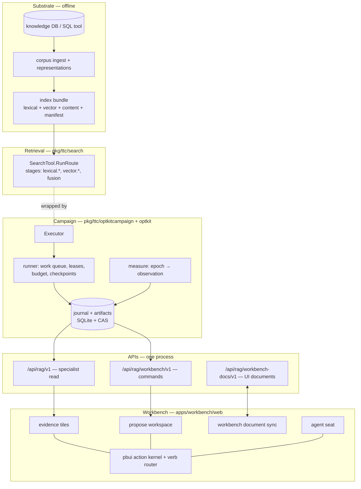

# Intern Guide: The Whole System, from Knowledge DB to Agent-Approved Candidate

All repository paths are relative to `/home/manuel/workspaces/2026-08-24/use-optkit/`
unless prefixed. The four repositories that matter here: `rag-ttc` (the
product), `optkit` (the experiment substrate, vendored as a Go module),
`pbui` (the presentation/chat framework family), `judgekit` (the
LLM-evaluation library). This guide explains what exists **today**; the
companion analysis document in this ticket explains what is missing for a
live campaign and how we will build it.

## 1. What this program is

The Tree Center (TTC) runs a customer-facing RAG system: a hybrid retrieval
pipeline over a knowledge base of product data and growing guides, exposed
as a search tool to an assistant. This program makes that pipeline
**optimizable as a scientific instrument**: every configuration is a
content-addressed identity, every trial is a journaled campaign with
budgets, every score is a typed observation from a named instrument, and
every proposed change — human- or agent-authored — travels through one
verb vocabulary into a durable, verifiable record.

The chain, end to end:

```text
knowledge DB ──▶ index bundle ──▶ retrieval pipeline ──▶ executor
                                                            │ episodes
     workbench UI ◀── three HTTP APIs ◀── campaign store ◀──┘
        │  ▲                                (journal + artifacts + budget)
        ▼  │
   human + agent seats ──▶ proposals ──▶ sealed candidates ──▶ trials
```

The single most important invariant, stated in the program brief and
enforced in three places you will meet below: *a knob in a tile, a mutation
in a sealed candidate, and a verb an agent proposes all refer to the same
registered variable.* One vocabulary, every seat.

## 2. The layer map



## 3. The substrate: knowledge DB to index bundle

The customer app's composition root is the reference for how the real
system is assembled — read it before anything else:

- `rag-ttc/internal/customer/ragsearch/ragsearch.go` — opens an **index
  bundle** by path, builds a provider bundle with
  `raggeppetto.NewBundle(…, Roles{Embedding: true})` (the embedding client
  used at query time), loads the tool config, and constructs the search
  tool: `ttcsearch.NewSearchTool(bundle.Lexical, bundle.Vector,
  bundle.Content, sources, config, description)`.
- The index bundle (`indexbundle.Bundle`) holds: the lexical (BM25) index,
  the vector index, the content store (chunk text), and a **manifest**
  recording representation count and identities. The bundle is built
  offline from the knowledge DB by the corpus/representation commands
  (`rag-ttc inspect corpus …`, the representations experiment under
  `cmd/rag-ttc/cmds/experiments/`).

Two cost regimes to keep straight:

- **Index-build spend** (offline): embedding every chunk representation.
  Happens once per bundle; the bundle digest pins it.
- **Query-time spend** (per episode): embedding the query for the vector
  side. This is what campaign budgets must meter.

## 4. The retrieval pipeline: `pkg/ttc/search`

`SearchTool.RunRoute(ctx, SearchInput{Query, Limit}, route)` executes the
hybrid pipeline and returns a `SearchOutput` whose **stage records** are
the raw material for every autopsy you have seen:

```text
lexical.raw ─▶ lexical.collapsed ─▶ lexical.policy_filtered ─┐
                                                             ├─▶ fusion (RRF) ─▶ final
vector.raw  ─▶ vector.collapsed  ─▶ vector.policy_filtered ──┘
```

- Stage names are constants in `pkg/ttc/search/service.go`
  (`StageLexicalRaw`, `StageVectorPolicyFiltered`, …). Each stage records
  input/output counts and chunk ids; fusion records per-chunk
  contributions `weight / (k + rank)` — the exact numbers the workbench's
  recorded-precision parity test pins
  (`apps/workbench/web/src/test/rrf-parity.test.ts`).
- `SearchConfig` (`pkg/ttc/search/search.go`) carries the real knobs:
  `BM25TopK`, vector top-k, `RRFK`, final result limit, routes, source
  policies. **These fields are what the optimization catalog's variables
  bind to** — the catalog is "runtime-honest" because a variable that does
  not correspond to a real field may not exist (OPTKIT-015's rule).
- Identity: `pkg/ttc/search/identity.go` computes a semantic
  `RetrievalPolicyID` from the effective configuration — the same
  content-addressing discipline as everything else.

## 5. The optimization model: `pkg/ttc/optimization` + optkit

- `PipelineConfig` (`pkg/ttc/optimization/config.go`) is the WHOLE
  pipeline's configuration as data: preparation id, route, retrieval
  fields, fusion fields. It compiles to a layered **config graph** whose
  per-layer identities let the invalidation planner say "reuse vs
  recompute" per layer.
- The **catalog** (`GET /catalog` on the command API) lists sections and
  variables — id, type, constraints, cost hint, docs prose. The workbench
  catalog tile renders it; the agent vocabulary embeds the same prose.
- optkit's `space` package owns candidates: a **candidate** is a sealed,
  content-addressed record `{parent, mutations, intent{proposer,
  hypothesis, …}, child snapshot}`. `space.Proposer` is
  `{Kind: human|llm|search, Identity}` — after OPTKIT-024, non-human
  proposers seal through an approving principal
  (`pkg/ttc/experimentworkbench/workbench_service.go`, `Seal`).

Pseudocode for the compile loop (server side, pure):

```text
CompileProposal(parent, mutations):
  parent_graph  = derive_graph(parent.config)
  child_config  = apply(mutations, parent.config)   # typed by catalog
  child_graph   = derive_graph(child_config)
  diff          = per-layer identity comparison
  plan          = for each layer: reuse | recompute (direct/upstream)
  digest        = sha256(canonical(parent, mutations))   # content address
  return {digest, diff, plan, diagnostics, sealable}
```

Same inputs → same digest, across stores and sessions. The frontend's
draft documents store **authoring input only**; every derived key
(`draft_digest`, `plan`, `diagnostics`, …) is rejected BY NAME by the
document host (`pkg/ttc/workbenchhost/documents.go`,
`derivedStateKeys`) so a reopened draft recompiles against reality.

## 6. The campaign machinery: `pkg/ttc/optkitcampaign`

This is the part that turns "run an experiment" into a durable record.

### 6.1 The moving parts

- **`Executor`** (`system.go`): `Execute(ctx, PipelineConfig,
  RetrievalCase) → ttcsearch.SearchOutput`. The seam between the campaign
  machinery and the real system. Today only
  `SemanticFixtureExecutor` (`fixture.go`) implements it; the live
  executor is this ticket's core deliverable.
- **`RunOptions`** (`campaign.go`): store root, arms, cases, repeats,
  executor, `StopAfter Checkpoint` (`after_lease`,
  `after_terminal_result`, `after_observation` — how demo stores are
  seeded in a RUNNING state; CLI: `campaign run --stop-after`).
- **The store**: one directory = one SQLite DB (`optkit.db`: tables
  `campaign_events`, `campaign_heads`, `campaign_commands`, `work_items`,
  `budget_limits`, `budget_reservations`) + a content-addressed artifact
  tree (`artifacts/sha256/xx/yy/…`). Every event's payload is an artifact
  ref; `campaign verify` re-hashes everything.
- **The journal**: an append-only hash-chained event log per campaign.
  Kinds you will see: `CampaignCreated`, `PlanCompiled`,
  `SnapshotMaterialized`, `BudgetReserved`, `EpisodeScheduled`,
  `EpisodeLeaseGranted`, `EpisodeAttemptStarted`, `EpisodeCompleted`,
  `ObservationRecorded`, `UsageCommitted`, `EstimateRecorded`,
  `CandidateProposed`, `CampaignCompleted`.
- **Budget**: limits per resource at creation (today hardcoded:
  `retrieval.queries`, `retrieval.results` — `campaign.go:306`); each
  episode **reserves** before running and **commits** actual usage after
  (`budgetQuantities` folds `episode.ResourceUsage` generically, so new
  resources are additive).
- **The work queue**: `work_items` rows with leases
  (`EpisodeLeaseGranted`, lease duration in options); a runner claims,
  executes, records. `queued/active/completed/failed_terminal` are the
  counts you saw in every summary table.

### 6.2 An episode's life (pseudocode)

```text
for each (arm × case × repeat):        # expanded by experiment.Expand
  reserve budget {queries:1, results:100}       -> BudgetReserved
  lease work item                                -> EpisodeLeaseGranted
  output = executor.Execute(arm.config, case)    -> EpisodeAttemptStarted
  store output artifact + trajectory             -> EpisodeCompleted
  score  = coverage(output, case.RequiredGroups) # §6.3
  observation = NewObservation(epoch, score)     -> ObservationRecorded
  commit actual usage                            -> UsageCommitted
when all episodes done:
  estimates (per-arm means + paired deltas)      -> EstimateRecorded
                                                 -> CampaignCompleted
```

### 6.3 Measurement: constructs, instruments, epochs

The measurement model (optkit `measure`) is measurement theory made
mechanical, and it is why the LLM judge slots in cleanly:

- A **construct** is the property you care about
  (`retrieval.target-coverage`).
- An **instrument** is the named procedure that produces a proxy score
  (`rag-ttc.deterministic-target-coverage/v1`).
- A **protocol** says how instances are run (`complete-block/v1`).
- An **epoch** freezes (construct, instrument, protocol, implementation)
  — scores from different epochs are never silently mixed.
- An **observation** is one measurement of one subject (an episode) in one
  epoch, with status (`measured`, `failed`, `unknown`, `inapplicable`),
  a typed value, and evidence artifact refs.

Today the runner scores exactly one instrument, hardcoded in
`scoreObservation` (`campaign.go:766`): deterministic target coverage =
fraction of a case's `RequiredGroups` with at least one retrieved target.
**Missing is never zero** — an unmeasured episode yields status
`unknown`, and every projection downstream preserves that.

`judgekit` (its own repo) models the LLM half of this chain: spec →
protocol → instance+evidence → assessment → audit/calibration. Its
GLOSSARY.md maps each concept to a package. The judge integration design
lives in this ticket's analysis document.

## 7. The three HTTP APIs

One `campaign serve` process mounts all three (see
`cmd/rag-ttc/cmds/experiments/optkitrag/serve.go`):

### 7.1 Specialist read projections — `/api/rag/v1` (no auth)

`pkg/ttc/specialistapi`. Recorded facts only; projectors order and count,
never recompute.

| Endpoint | Returns |
|---|---|
| `GET /health` | `{status, api_version, read_only}` |
| `GET /campaigns/{c}/cockpit` | arms (config, snapshot, mean, n), cases, estimates, budget snapshot, journal seq |
| `GET /campaigns/{c}/comparisons/{base}/{treat}` | per-construct metric deltas + candidate summary |
| `GET /campaigns/{c}/cases?baseline&treatment&limit&after` | paired per-case results (cursor-paged) |
| `GET /campaigns/{c}/failures?arm&limit` | worst-first ranking of recorded observations (OPTKIT-022 §9) |
| `GET /campaigns/{c}/episodes/{e}/pipeline` | the stage-by-stage pipeline view + chunk catalog |
| `GET /campaigns/{c}/provenance/episode/{e}` | episode spec + artifact lineage |

### 7.2 Command API — `/api/rag/workbench/v1` (bearer auth, per-principal grants)

`pkg/ttc/workbenchapi` over `pkg/ttc/experimentworkbench`. Principals
since OPTKIT-024: the human token holds all actions; the agent token
(`--agent-token`) holds `catalog.read`, `proposal.compile`, `preview.run`
and is **403 on seal** (`cmd/…/optkitrag/principals.go`).

| Endpoint | Action checked | Notes |
|---|---|---|
| `GET /catalog`, `GET /catalog/variables/{id}` | `catalog.read` | sections, variables, docs prose |
| `POST /proposals:compile` | `proposal.compile` | pure; request IS the cache key |
| `POST /previews:run` | `preview.run` | deterministic probes (e.g. `fusion.rrf-contributions/v1`) against a named case |
| `POST /proposals:seal` | `proposal.seal` | `Idempotency-Key` header; recompiles server-side; verifies digest; proposer rules §5 above |

### 7.3 Workbench document host — `/api/rag/workbench-docs/v1`

`pkg/ttc/workbenchhost`. UI state only, strictly separate from domain
commands. Snapshot PUT with `X-Workbench-Revision`, `POST …/mutate`
(MutationBatch), SSE revision stream. Strict validators per format:
`ragttc.focus/v1`, `ragttc.comparison/v1`, `ragttc.proposal-draft/v1`
(derived keys rejected by name), `ragttc.watchlist/v1`,
`ragttc.conversation/v1`, `pbui.widget`. The frontend sync client is
`apps/workbench/web/src/sync.ts` (adopt on start, debounced snapshot PUT,
server wins conflicts, honest badge: `docs synced / refused / local`).

## 8. The workbench frontend: `rag-ttc/apps/workbench/web`

The product is a pbui workbench: tiles over documents, one action kernel,
one verb sink, and (since OPTKIT-024) one router shared with the agent.

- **Presentation kernel** (`src/pbui/`): 23 presentation types
  (campaign, arm, case, verdict, delta, chunk, variable, mutation, draft,
  candidate, … plus `unresolved`), a type graph with abstract
  `inspectable`/`watchable`, ~20 action rules + inherited
  inspect/watch/evidence-remove. Menus resolve through the kernel; a bare
  left click performs the unique available PRIMARY action; everything
  re-validates freshly at click time.
- **Verbs** (`src/pbui/verbs.ts`): serializable data, four families —
  navigation (`open.*`), local (inspect/watch/compare.with), draft
  (`draft.*`, `mutation.*`, `intent.*`, `evidence.*` — document mutations
  only), command (`proposal.compile`, `preview.run`, `proposal.seal`,
  `trial.run` — the last two are danger verbs).
- **The sink** (`src/sink.ts`): the only effect boundary. Routes by
  family, records every outcome in the ADR-K trace
  `{seq, actor, verb, target, outcome, because}` — a verb that touched
  nothing never reads as performed.
- **The chat layer** (`src/chat/`): the wire vocabulary
  (`vocabulary.json`, generated by `pnpm vocab`, golden-pinned), the
  reference codec over `refKey`/`refFromKey`, and the router — every verb
  from either seat is validated against the vocabulary and attributed.
  Danger verbs from the agent PARK as approvals; a human's approve is a
  one-shot grant carrying `approvalId` into the verb and the trace.
- **Documents**: layouts, pointer docs, drafts, watchlist, conversations
  — all in ONE workbench document, synced to the host, validated
  server-side.

## 9. Tile reference (ASCII screenshots)

Layout chrome first: every tile has the family title bar; the masthead and
status strip frame the canvas.

```text
┌──────────────────────────────────────────────────────────────────────┐
│ R A G - T T C   W O R K B E N C H      [token ••••]  [⌘K] [reset]    │  masthead (dark)
│ AGENT REQUESTS: SEAL the proposal appr-… [Approve — durable] [Deny]  │  approval strip (danger tone)
├──────────────────────────────────────────────────────────────────────┤
│  … tiles …                                                           │
├──────────────────────────────────────────────────────────────────────┤
│ READY hover anything · L is the default verb · R opens its menu      │  mouse-doc line
│                                            docs synced               │  sync badge
└──────────────────────────────────────────────────────────────────────┘

tile chrome:  ┌ ⠿ TITLE · binding ─────────────── [⬌][⬍][✕] ┐
              (drag handle, app name + short doc id, split/close)
presentation chip:  ▌label      (4px tone edge names the type;
                                 L-click = primary verb, R-click = menu)
```

### campaigns (cockpit, singleton)

```text
┌ ⠿ CAMPAIGNS ──────────────────────────────── [⬌][⬍][✕] ┐
│ [campaign:… input          ] [Open]                     │  open-by-id + recents
│ recent: campaign:51717a2f5e0…                           │
│ CAMPAIGN                                                │
│ ▌campaign:51717a2f5e0…          ← campaign chip (menu:  │
│  status    running                open cockpit/failures)│
│  episodes  0/6 done, 0 failed                           │
│  journal   verified · seq 22                            │
│  budget    within budget                                │
│ ARMS · 2                                                │
│ ▌limit-1   mean 0.8333 · n=3   ← arm chips (menu:       │
│ ▌limit-2   mean 1.0000 · n=3     compare, draft, watch) │
│ CASES · 3                                               │
│ ▌How large does Blue Ice grow?  ← case chips (autopsy,  │
│ ▌Which inventory table …          judge, evidence)      │
└─────────────────────────────────────────────────────────┘
```

### failures (doc-bound: focus)

```text
┌ ⠿ FAILURES · ptr-… ────────────────────────────────────┐
│ WORST FIRST · limit-1                                  │
│ ▌q-comparison: 0.5000 on limit-1 · 2 episodes          │ ← verdict chips,
│ ▌q-hybrid:     1.0000 on limit-1 · 2 episodes          │   server-ranked
│ ▌q-missing:    MISSING (unknown) · 0 episodes          │ ← missing after
└────────────────────────────────────────────────────────┘   measured, never 0
```

### autopsy (doc-bound: focus with case)

```text
┌ ⠿ AUTOPSY · ptr-… ─────────────────────────────────────┐
│ ▌case q-comparison   on ▌arm limit-1   ▌episode ab12…  │
│ PIPELINE                                               │
│  #1 lexical.raw            120 → 120                   │
│  #2 lexical.collapsed      120 →  40                   │
│  #3 lexical.policy_filtered 40 →  38                   │
│  #4 vector.raw             100 → 100    (12 stages)    │
│  …                                                     │
│  #9 fusion                  78 →  30                   │
│  chunks: ▌chunk-a ▌chunk-b ▌chunk-c  ← open content    │
└────────────────────────────────────────────────────────┘
```

### judge / chunk / compare

```text
┌ ⠿ JUDGE · ptr-… ─────────────┐ ┌ ⠿ CHUNK · ptr-… ──────────────┐
│ verdict · q-comp on limit-1  │ │ ▌chunk-a  from ▌doc: Blue Ice │
│ ▌verdict score 0.5           │ │ TEXT                          │
│ evidence: ▌chunk-a ▌chunk-b  │ │  "Blue Ice grows to …"        │
│ (LLM judge lands here:       │ │ REPRESENTATION                │
│  claims + rationale + gold)  │ │  kind, model, prompt digest   │
└──────────────────────────────┘ └───────────────────────────────┘

┌ ⠿ COMPARE · ptr-… ─────────────────────────────────────┐
│ PAIR   baseline ▌limit-2    challenger ▌limit-1        │
│ METRICS   construct        base    chall   Δ     pairs │
│           target-coverage  1.0000  0.8333  -0.17   3   │
│ SLOPE                                                  │
│   1.0 ●───────────●   ← every point is a live delta    │
│       │ ╲  bold=mean      presentation (renderInter-   │
│   0.5 │  ╲________●       active); missing named below │
│       baseline  challenger                             │
│ CASES · BY |Δ|                                         │
│ ▌q-comparison: -0.5000   ▌q-hybrid: +0.0000            │
└────────────────────────────────────────────────────────┘
```

### the propose workspace (catalog / proposal / invalidation / preview / intent)

```text
┌ ⠿ CATALOG ───────────────┐ ┌ ⠿ PROPOSAL · draft-… ─────────────┐
│ semantic sha256:d3034d…  │ │ DRAFT ▌draft from limit-1          │
│ EVIDENCE SELECTION       │ │  campaign  campaign:51717a…        │
│ ▌Final result limit      │ │  digest    sha256:7285a6d…         │
│   int · medium cost      │ │ MUTATIONS · 1                      │
│ RESULT FUSION            │ │ ▌fusion.rrf_k [────●──] [30]       │
│ ▌RRF rank constant       │ │               60 → 30              │
│   float · high cost      │ │ DIAGNOSTICS  none — sealable       │
│ (L-click = add mutation) │ └────────────────────────────────────┘
└──────────────────────────┘
┌ ⠿ INTENT · draft-… ────────────────────────────────────┐
│ HYPOTHESIS  [lower rrf_k sharpens early-rank credit…]  │
│ EXPECTED IMPROVEMENT [retrieval.target-coverage]       │
│ RISKS       [k too small may drop late-rank evidence]  │
│ EVIDENCE · 2  ▌case q-comparison  ▌verdict …           │ ← live chips w/
│ [pending agent approval renders HERE too]              │   contextual remove
│ ── SealBar ─────────────────────────────────────────   │
│ Sealing creates the patch, child snapshot, candidate,  │
│ and journal event — this is durable.                   │
│        [SEAL — durable]  [cancel]                      │
└────────────────────────────────────────────────────────┘
```

### ambient singletons (inspector / trace / watchlist)

```text
┌ ⠿ INSPECTOR ─────────────┐ ┌ ⠿ TRACE ──────────────────────────┐
│ <arm> limit-1            │ │ #31 AGENT SEAL … approval:appr-…  │
│ describe():              │ │     performed                     │
│  campaignId  campaign:…  │ │ #29 AGENT SEAL … refused: parked  │
│  armId       limit-1     │ │ #28 HUMAN set fusion.rrf_k        │
│ IDs: ▌snapshot:53fd…     │ │ #27 AGENT open the intent tile    │
│      ▌config-graph:03c…  │ │ (actor column; refusals in red)   │
└──────────────────────────┘ └───────────────────────────────────┘
┌ ⠿ WATCHLIST ─────────────┐
│ ▌arm limit-2             │  ← shared ragttc.watchlist/v1 doc;
│ ▌case q-comparison       │    menu offers same verbs anywhere
└──────────────────────────┘
```

### chat layer tiles (registered; conversation needs the chat server)

```text
┌ ⠿ CHAT · conv-… ─────────────────────────────┐
│ human: look at ▌case q-hybrid — why did      │ ← mentions render as
│        it regress?                           │   live presentations
│ agent: I compared ▌delta q-hybrid … I        │
│        propose lowering ▌variable rrf_k      │
│ [tool: pbui_propose → approve/reject card]   │
│ [compose…                    ] [@] [send]    │
└──────────────────────────────────────────────┘
plus: conversations (list), chat-events, chat-runs, chat-tools,
widget (agent-authored pbui.widget documents, "open in tile")
```

### planned in this ticket (see analysis doc §5 for full mockups)

`runner` (live episode queue), `budget` (per-resource burn bars),
`substrate` (index-bundle provenance).

## 10. The CLI, in the order you will use it

```bash
rag-ttc experiment optkit-rag campaign dry-run  --manifest M --store S   # exact work + budget, no store writes
rag-ttc experiment optkit-rag campaign run      --manifest M --store S \
    [--reset] [--stop-after after_lease]        # create (+execute); stop-after seeds a RUNNING campaign
rag-ttc experiment optkit-rag campaign resume   --store S --campaign C   # work the queue to completion
rag-ttc experiment optkit-rag campaign status   --store S --campaign C
rag-ttc experiment optkit-rag campaign verify   --store S --campaign C   # journal + payload verification
rag-ttc experiment optkit-rag campaign serve    --store S --listen … \
    --workbench-token T --workbench-actor actor:… \
    [--agent-token T2 --agent-actor actor:agent-workbench] \
    [--workbench-docs-store DIR]                # mounts all three APIs
# frontend
pnpm dev        # vite on 5198, /api proxied to SPECIALIST_API
pnpm vocab      # regenerate + pin the agent vocabulary artifact
pnpm test && pnpm typecheck
```

## 11. Invariants that will bite you if you forget them

- **Documents store authoring input only.** Derived state is recomputed;
  the host rejects it by key name.
- **Missing is never zero.** Statuses propagate; projections sort missing
  after measured; plots exclude and NAME missing pairs.
- **Content addressing is load-bearing.** Same input → same digest across
  stores; the seal recompiles server-side and verifies the digest —
  a stale digest rejection is the contract working.
- **Campaign ids are journal-assigned**, not deterministic; completed
  campaigns refuse new candidates (`campaign_conflict`). Seed demo stores
  with `--stop-after after_lease`.
- **Attribution is not authorization.** The trace records who; the
  authorizer decides who may. The agent's missing `seal` grant is a fact
  (403), not a UI convention.
- **A verb that touched nothing never reads as performed** — and the
  router's "performed" only means *delegated*; the sink's trace row is
  the outcome of record.
- **Sealed candidates are candidate records, not arms** — a trial
  materializes them; comparison endpoints rightly refuse until then.
