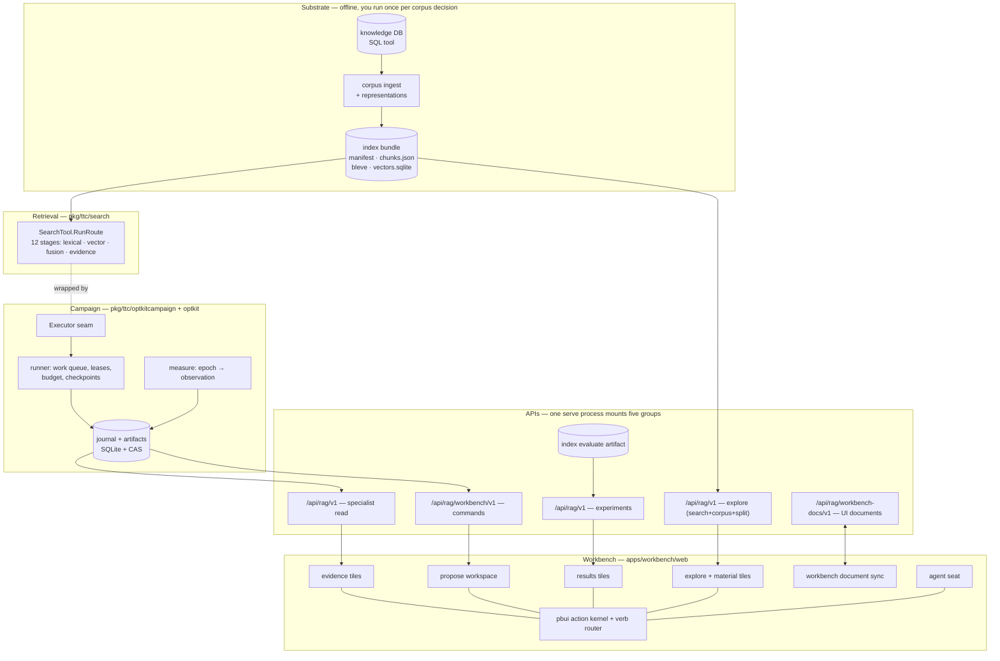

# Intern Guide: The RAG-TTC Optimization System, End to End

All repository paths are relative to
`/home/manuel/workspaces/2026-08-24/use-optkit/` unless prefixed. This guide
explains what exists **today** and what is **designed but not built**, and it
does so in one place. The per-ticket intern guides (OPTKIT-025 for the live
campaign and judge, OPTKIT-027 for the explore workbench, OPTKIT-029 for the
results surface) are deeper on their slice; this guide is the map that shows
how the slices fit and which layer owns what.

If you read only one section, read §1 and §2: they state the one invariant
the rest of the system exists to preserve, and the layer map that makes the
invariant enforceable.

## 1. What this program is

The Tree Center (TTC) runs a customer-facing RAG system: a hybrid retrieval
pipeline over a knowledge base of product data and growing guides, exposed
as a search tool to a customer-facing assistant. This program — the
**rag-ttc optimization system** — makes that pipeline **optimizable as a
scientific instrument**. Three properties define it:

- Every configuration is a **content-addressed identity**. Same inputs
  produce the same digest across stores and sessions, so a result can be
  named, verified, and reproduced.
- Every trial is a **journaled campaign** with budgets. An append-only
  hash-chained event log records what was tried, by whom, under which
  approval, measured by which epoch; a finite budget reserves before and
  commits after each unit of work.
- Every proposed change — whether a human clicks a menu or an agent proposes
  in chat — travels through **one verb vocabulary** into a durable, verifiable
  record. There is no side channel.

The chain, end to end:

```text
knowledge DB ──▶ index bundle ──▶ retrieval pipeline ──▶ executor
                                                            │ episodes
     workbench UI ◀── five HTTP APIs ◀── campaign store ◀──┘
        │  ▲                               (journal + artifacts + budget)
        ▼  │
   human + agent seats ──▶ proposals ──▶ sealed candidates ──▶ trials ──▶ results ──▶ findings
```

The single most important invariant, stated in the program brief and
enforced in three places you will meet below: *a knob in a tile, a mutation
in a sealed candidate, and a verb an agent proposes all refer to the same
registered variable.* One vocabulary, every seat.

### 1.1 Who the program is for

The primary user is the operator accountable for whether TTC's retrieval
actually works — the person who has to say "this configuration is better than
that one, and here is why," and be right about it. Two secondary users
appear throughout: the **assistant** (the coding agent, which proposes and
prepares but must not commit), and the **inheritor** (a colleague, a new
hire, or the same person six months later) who has to understand why the
system is configured the way it is without being told the story in person.
The needs that define the program are written down as forty-eight user
stories in
[`analysis/01-user-stories-…`](../analysis/01-user-stories-the-person-who-makes-the-rag-system-good.md);
the coverage of those stories by the code today is in
[`analysis/02-coverage-…`](../analysis/02-coverage-of-user-stories-by-pbui-optkit-and-rag-ttc.md).
This guide explains the system those stories are about.

## 2. The layer map

The system is four explicit ownership layers, plus a read surface and a
product. The boundaries are enforced in code, not in convention.



The four layers and what each one may not do:

- **`ragkit`** (a sibling Go module) defines reusable RAG-domain contracts and
  deterministic implementations: documents, chunks, representations, vectors,
  retrieval, reranking, generation, evaluation, execution, and digests. It is
  the algorithm layer.
- **`optkit`** is the domain-neutral control plane: snapshots, trials,
  trajectories, durable campaign control, budgets, measurement epochs,
  estimates, and the read-only query plane. **Optkit never imports ragkit,
  ragopt, judgekit, or rag-ttc**; `optkit/internal/boundary/boundary_test.go`
  enforces this over the module's direct imports. This is what keeps the
  control plane reusable.
- **`judgekit`** (a sibling module) owns provider-neutral attributed
  evaluator contracts and reports — the LLM-as-judge half of the measurement
  chain.
- **`rag-ttc`** owns the product: prepared routes, source policy, direct
  retrieval and answer services, TTC benchmark data, product integration,
  the campaign machinery, and the workbench UI. It is the only layer that may
  compose all the others.

A fifth concern, **`pbui`**, is the UI framework family the workbench is
built *on*: the `pbui-workbench` package (tiles, split panes, the store, the
launcher, `defineApp`), the `pbuichat` package (the chat server, the agent
vocabulary, mentions, tools, the trace), and Go packages for chat, workbench
documents, and auth. Pbui is a framework, not a product surface; a story is
"covered by pbui" when the framework capability the story needs already
exists, even if rag-ttc has not yet assembled a tile from it.

## 3. The substrate: from knowledge DB to index bundle

Everything downstream is only as good as the bundle. Read the composition root
before anything else: `rag-ttc/internal/customer/ragsearch/ragsearch.go` is
the reference for how a real search is assembled, and the explore and live
paths both copy what it does.

### 3.1 What a corpus is

A corpus is a JSON array of `rag.Document` records (`ragkit/rag`):

```go
type Document struct {
    ID            string
    SourceURI     string
    Title         string
    Text          string
    ContentDigest string
    Metadata      map[string]string
}
```

Three corpora are committed in `rag-ttc/datasets/ttc/`, all real TTC content:

| File | Documents | What it is |
|---|---|---|
| `corpus.json` | 200 | the custody-bound candidate set the first experiments used |
| `corpus-2000.json` | 2,000 | intermediate slice |
| `corpus-full.json` | 3,149 | the complete published content — 483 articles, 19 guides, 2,594 products, 3.0M words |

Alongside them, `evaluation.json` holds `candidate:ttc-expansion-v1` — **148
queries with 243 graded judgments**, valid against all three corpora. This is
the only evaluation set that exists today; it is a committed JSON file, not
a workbench-authored artifact (see §11 on Theme 2).

### 3.2 What the build does

`rag-ttc index build` (`cmd/rag-ttc/cmds/indexes/build.go`) runs four phases:

```text
chunk        chunking.Apply(chunker, documents)         → []rag.Chunk
represent    per chunk, per kind                         → []rag.Representation
embed        embedder over representation texts          → []rag.Vector
index        bleve (lexical) + sqlite (exact vector)     → bundle directory
```

The chunker is selected by `selectChunker` (`build.go:57`) and there are
exactly two:

- **`markdown`** — split at headings, then window the oversized sections with
  `--chunk-runes` and `--overlap-runes`;
- **`markdown-heading`** — keep heading sections whole, merging sections
  below `--min-section-runes` into the next.

Representations are `raw` (always present — the hydration invariant needs a
source representation, or a bundle could retrieve something it cannot cite)
plus any of `summary`, `contextual`, `question`, `entities`. Generated kinds
cost one model call per chunk per kind, which is why `--generation-budget`
exists and why `raw` alone costs nothing but embeddings. The default
summarizer is `extractive` (free); real LLM summaries need **both**
`--representations raw,summary` **and** `--summarizer generator`.

Two cost regimes to keep straight:

- **Index-build spend** (offline): embedding every chunk representation.
  Happens once per bundle; the bundle digest pins it. A full corpus with
  summaries is 17,749 generation calls — the hour-long job that motivates
  OPTKIT-028's job view.
- **Query-time spend** (per episode): embedding the query for the vector
  side. This is what campaign budgets must meter.

### 3.3 What a bundle contains

A bundle is an immutable directory. Its manifest
(`ragkit/rag/indexbundle/types.go`) is the identity of everything
downstream:

```go
type Manifest struct {
    SchemaVersion       int
    BundleID            string
    CorpusDigest        string
    CorpusPath          string
    DocumentCount       int
    ChunkCount          int
    RepresentationCount int
    Chunker             ChunkerIdentity   // {Name, MaximumRunes, OverlapRunes, MinSectionRunes}
    RepresentationKinds []string
    Lexical             BackendIdentity   // {Backend, Version, Channel, TitleBoost, BodyBoost}
    Vector              *VectorIdentity   // {Backend, Provider, Model, Dimensions, …}
}
```

Note what the manifest already records: **the chunker and its parameters**.
That is why the split tile (§10.5) can eventually say "this is exactly what
bundle X did" rather than "this is what these settings would do".

Two read APIs matter, and both are pure library calls with no server:

```go
inspection, err := indexbundle.Inspect(ctx, bundlePath)
// → *Inspection{Path, Manifest, Chunks []rag.Chunk, Documents []Document, Corpus}
statistics := indexbundle.Measure(inspection, indexbundle.StatisticsOptions{ShortRunes: 300})
// → Statistics{Chunks, Histogram, Uncounted, Signals, Percentiles, TotalChunks, MaximumRunes}
```

`Inspect` reads `manifest.json` and `chunks.json` and nothing else — not the
vectors, not bleve — so it is cheap and safe to call on every request.
`Measure` computes the histogram, percentiles, and signals (short chunks,
chunks at the chunker limit). `Statistics` reports `Uncounted` explicitly so
a histogram whose bars do not sum to the chunk count says so rather than
lying quietly. That is the house style throughout this codebase and you
should preserve it.

### 3.4 The composition root

`internal/customer/ragsearch/ragsearch.go` is the reference for assembling a
live search. Read it before writing anything; the explore CLI, the explore
HTTP handler, and the live executor all do what it does.

```go
handle, err := ragsearch.Open(ctx, ragsearch.Options{
    RepositoryRoot:   root,          // absolute; every other path resolves under it
    IndexBundle:      bundlePath,    // the immutable directory
    ToolConfig:       configPath,    // yaml: limits, top-Ks, RRF constant, routing
    ScratchDirectory: scratchPath,   // verifier scratch
    Settings:         settings,      // resolved geppetto inference settings
})
defer handle.Close()

registry, tool, err := handle.NewSessionRegistry()   // fresh evidence ledger
out, err := tool.RunRoute(ctx, ttcsearch.SearchInput{Query: q, Limit: n}, route)
```

What `Open` does, in order (`ragsearch.go:46`):

1. `toolconfig.Load` — reads the yaml, refuses if search is disabled;
2. `raggeppetto.NewBundle(Roles{Embedding: true})` — resolves the embedding
   provider from the geppetto profile;
3. `indexbundle.LoadVerifiedDocuments` — verifies source metadata **before**
   opening the serving index, because bleve holds an exclusive lock for the
   lifetime of an open handle;
4. `indexbundle.Open` — opens lexical, vector, and content stores with the
   query embedder attached;
5. `ttcsearch.NewSourceCatalog` — document metadata for citation;
6. builds a `ttcsearch.SearchConfig` from the tool config (`DefaultResults`,
   `MaxResultsPerCall`, `BM25TopK`, `VectorTopK`, `RRFConstant`,
   `AllowedSourceRoles`, plus the bundle and config digests);
7. compiles named routes and optional connected-RAG augmentation.

Two operational facts that will cost you an hour each if you learn them the
hard way:

- **Bleve's exclusive lock** means one process may hold a bundle open. The
  server opens it once at startup, not per request.
- **`NewSessionRegistry` per request** is correct and cheap. The evidence
  ledger is turn-scoped by design — search evidence must never cross session
  boundaries — and the tool is a thin wrapper over shared, already-open
  stores.

## 4. The retrieval pipeline: `pkg/ttc/search`

`SearchTool.RunRoute(ctx, SearchInput{Query, Limit}, route)` executes the
hybrid pipeline and returns a `SearchOutput` whose **stage records** are the
raw material for every autopsy, trail, and explanation surface.

### 4.1 The twelve stages

The stages are constants in `pkg/ttc/search/service.go`, verified by running
`rag-ttc search --stages` against a real bundle rather than read off a
design document:

```text
lexical.raw               bleve BM25 over representation texts   → ranked hits
lexical.collapsed         best representation per chunk          → one per chunk
lexical.policy_filtered   source-role policy filter              → allowed only
vector.raw                exact vector search over embeddings    → ranked hits
vector.collapsed          best representation per chunk          → one per chunk
vector.policy_filtered    source-role policy filter              → allowed only
retrieval.fused           reciprocal rank fusion of the channels → fused ranking
retrieval.augmented       connected-RAG augmentation (optional)   → expanded
retrieval.policy_recheck  policy applied again post-fusion       → survivors
retrieval.reranked        reranker, or a pass-through when off   → final order
evidence.hydrated         chunk text loaded from the content store
evidence.admitted         evidence-ledger admission budget
evidence.returned         what the caller actually receives
```

Two observations that matter for the UI: the lexical and vector channels
have **symmetric** stage triples, so a trail can show them side by side; and
policy is applied twice — once per channel and once after fusion — so "why
did this disappear?" has two possible answers and the stage name
distinguishes them.

### 4.2 What a search records — and this is the important part

```go
type SearchOutput struct {
    Query                string
    Route                SearchRouteObservation
    Identity             RuntimeIdentity
    Stages               []RetrievalStage
    EffectiveLimit       int
    Results              []SearchResult
    ChunkCatalog         []ChunkSummary
}

type RetrievalStage struct {
    Name              string
    Status            string
    InputCount, OutputCount int
    ChunkIDs          []string
    Candidates        []StageCandidate    // ← the good stuff
    ErrorClass        string
}

type StageCandidate struct {
    ChunkID          string
    Rank             int
    Channel          string
    RepresentationID string              // what it matched ON
    Score            *float64            // pointer: nil ≠ zero
    RerankerScore    *float64
    Contributions    []rag.Contribution  // {Channel, Rank, Weight, Value}
}
```

Three things to internalise, because they are the difference between a
surface that explains and one that fabricates:

- **`Score` is a pointer.** A stage that tracked only membership leaves it
  nil, and the UI must render "kept" rather than "0.00". Fabricating a score
  is worse than omitting one. This is the same discipline as optkit's
  "missing is never zero" (§6).
- **`RepresentationID` names the derived text the hit matched.** Once a bundle
  carries summaries, this is the field that tells you whether a match came
  from the author's words or a model's paraphrase — the S12 story.
- **`ChunkCatalog` carries the text of every chunk any stage touched**,
  including ones filtered out later, so a reviewer can read the candidate
  that lost, not just the winners.

`SearchConfig` (`pkg/ttc/search/search.go`) carries the real knobs:
`BM25TopK`, vector top-k, `RRFK`, final result limit, routes, source
policies. **These fields are what the optimization catalog's variables bind
to** — the catalog is "runtime-honest" because a variable that does not
correspond to a real field may not exist (OPTKIT-015's rule). Identity lives
in `pkg/ttc/search/identity.go`, which computes a semantic
`RetrievalPolicyID` from the effective configuration — the same
content-addressing discipline as everything else.

## 5. The optkit control plane

Optkit is the mechanism layer behind the honesty stories and the budget
stories. It is fully built. Read `optkit/README.md` for the package map and
`optkit/docs/01-optkit-records-artifacts-and-control-model.md` for the
field-level reference. This section is the orientation; the docs are the
specification.

### 5.1 Canonical identity — `record` and `artifact`

Everything that matters gets a content-addressed identity. The `record`
package owns typed identifiers and SHA-256 digests; the `artifact` package
owns immutable byte custody, with a memory store and a filesystem
content-addressed store plus corruption checks.

```text
artifact.Ref = {Store, Schema, Digest}
digest       = sha256(canonical-JSON(payload))     # content addressing
verify       = re-hash every referenced payload     # campaign verify
```

The discipline is load-bearing: same input → same digest across stores and
sessions, so a result can be named, verified, and reproduced. A stale
digest rejection at seal time is the contract working, not a bug.

### 5.2 Configuration space — `space`

`space` owns the typed configuration model. The shape, in one line: a
**candidate** is a sealed, content-addressed record
`{parent snapshot, mutations, intent, child snapshot}`.

```go
type Candidate struct {
    ID                  record.CandidateID
    Parent              record.SnapshotID   // the configuration it descends from
    Patch               record.PatchID      // the mutations applied
    Child               record.SnapshotID   // the resulting configuration
    Proposer            Proposer            // human | llm | search
    Strategy, Hypothesis string
    ExpectedImprovement ExpectedImprovement // {Metric, Groups}
    Risks               []string
    Motivation          Motivation          // {CaseIDs, DiagnosticDigest}
    SemanticCatalogID   record.Digest
    CreatedAt           time.Time
}

type Proposer struct {
    Kind     ProposerKind    // human | llm | search
    Identity record.ActorRef
}
```

The pieces that compose a candidate:

- A **domain** declares the variables and their constraints.
- A **variable** is a typed, named configuration coordinate bound to a real
  field (the runtime-honest rule).
- A **lens** is a lawful projection over a snapshot.
- A **snapshot** is a complete configuration value.
- A **patch** is a set of mutations.
- A **catalog** lists the variables a user or agent may turn.

The compile loop that turns a draft into a candidate is in §8.2.

### 5.3 Episodes, trajectories, and spans — `episode`

An episode is one execution of one arm over one case. Its life is a
**trajectory**: an ordered list of events, each carrying a span and an
optional parent span, so a trajectory is a tree.

```go
type Event struct {
    ID      record.EventID
    Episode record.EpisodeID
    Seq     uint64
    Kind    EventKind
    Span    record.SpanID
    Parent  *record.SpanID     // nil at the root → a trajectory is a span tree
    Payload artifact.Ref       // every event's payload is an artifact
}
```

This is the structure that makes multi-turn evaluation possible without a
new measurement theory: a conversation's turns are spans, retrieval events
nest beneath their turn's span, and a turn-level observation is just an
observation whose subject is a span (§6, §11.3).

### 5.4 The work queue and leases — `scheduler` + `store`

The durable work queue is SQLite. `work_items` rows carry leases; a runner
claims a lease, executes, records. States are `queued / active / completed /
failed_terminal`. Leases expire and may be reclaimed; terminal commits are
idempotent. This is **engine A** of the two-work-engine story (§11.1).

### 5.5 Budgets — `budget`

A budget is a finite set of resource limits. Each unit of work **reserves**
its worst case before running and **commits** actual usage after; the
reservation model means a half-finished run never reports itself as complete.

```go
type Limit struct { Resource Resource; Units int64 }
type Reservation struct {
    Requested []Quantity    // claimed before
    Actual    []Quantity    // committed after
    Status    ReservationStatus  // reserved | committed | released
    Overage   bool          // custody of overage is visible, not hidden
}
```

`budgetQuantities` (in `optkitcampaign`) folds `episode.ResourceUsage`
generically, so adding a new resource (e.g. `judge.tokens`) is additive and
does not change the runner. Today the limits are `retrieval.queries` and
`retrieval.results`; OPTKIT-025 G5 adds `embeddings.tokens`, `judge.calls`,
`judge.tokens`.

### 5.6 The read-only query plane — `query` + `internal/web`

`optkit/query` builds read-only campaign views from authoritative journal
facts and immutable artifacts. **It intentionally exposes no mutation API.**
This is the separation that lets the workbench read a campaign without being
able to write to it; the specialist API (§9.1) is the product's projection of
this plane.

## 6. The measurement model — `measure`

The measurement model is measurement theory made mechanical, and it is why
the LLM judge slots in cleanly. Five nouns:

- A **construct** is the property you care about
  (`retrieval.target-coverage`, `retrieval.answer-support`).
- An **instrument** is the named procedure that produces a proxy score
  (`rag-ttc.deterministic-target-coverage/v1`, `ttc.judge.retrieval-support/v1`).
- A **protocol** says how instances are run (`complete-block/v1`).
- An **epoch** freezes `(construct, instrument, protocol, implementation,
  model id, prompt digest)` — scores from different epochs are **never
  silently mixed**.
- An **observation** is one measurement of one subject in one epoch.

```go
type SubjectRef struct { Kind string; ID string }   // generic — episode, turn, …

type Observation struct {
    ID          record.ObservationID
    Role        Role                  // fact | intervention | constraint | measurement
    Subject     SubjectRef
    Construct   string
    Instrument  string
    Protocol    string
    Epoch       record.EpochID
    Status      Status                // measured | failed | unknown | inapplicable | …
    Value       Value
    Evidence    []artifact.Ref
    Diagnostics json.RawMessage
    Repeat      int
}
```

The two rules that make the model honest:

- **Status is explicit.** An unmeasured episode yields `unknown`; a judge
  API timeout yields `failed`; neither is ever silently coerced to a zero
  score. This is S25 — "tell 'failed' apart from 'scored badly'" — built into
  the type, not bolted on later.
- **`SubjectRef` is generic.** `{Kind, ID}` is not typed to episodes, so a
  turn-level observation is `SubjectRef{Kind: "turn", ID: "<episode>/<span>"}`
  with no schema change — the foundation S43–S44 builds on (§11.3).

Today the runner scores exactly one instrument, hardcoded in `scoreObservation`
(`optkitcampaign/campaign.go:766`): deterministic target coverage = the
fraction of a case's `RequiredGroups` with at least one retrieved target.
OPTKIT-025 G3 replaces this with an instrument list so an episode yields one
observation per instrument.

`judgekit` (its own repo) models the LLM half of this chain: spec →
protocol → instance+evidence → assessment → audit/calibration. Its
`GLOSSARY.md` maps each concept to a package.

## 7. The campaign machinery — `pkg/ttc/optkitcampaign`

This is the part that turns "run an experiment" into a durable record.

### 7.1 The moving parts

- **`Executor`** (`system.go`): `Execute(ctx, PipelineConfig,
  RetrievalCase) → SearchOutput`. The seam between the campaign machinery
  and the real system. Today only `SemanticFixtureExecutor` (`fixture.go`)
  implements it; the live executor (`rag.ttc-live/v1`) is OPTKIT-025 G1.
- **`RunOptions`** (`campaign.go`): store root, arms, cases, repeats,
  executor, `StopAfter Checkpoint` (`after_lease`, `after_terminal_result`,
  `after_observation` — how demo stores are seeded in a RUNNING state).
- **The store**: one directory = one SQLite DB (`optkit.db`: tables
  `campaign_events`, `campaign_heads`, `campaign_commands`, `work_items`,
  `budget_limits`, `budget_reservations`) + a content-addressed artifact
  tree. Every event's payload is an artifact ref; `campaign verify`
  re-hashes everything.
- **The journal**: an append-only hash-chained event log per campaign. The
  kinds you will see, in `campaign/event.go`:

```text
CampaignCreated · PlanCompiled · CampaignStarted · CampaignPaused ·
CampaignResumed · CampaignStopping · CampaignStopped · CampaignFailed ·
CampaignCompleted ·
CandidateProposed · SnapshotMaterialized · TrialPlanned ·
EpisodeScheduled · EpisodeLeaseGranted · EpisodeAttemptStarted ·
EpisodeCompleted · EpisodeFailed · ObservationRecorded ·
EstimateRecorded · DecisionRecorded ·
BudgetReserved · UsageCommitted · BudgetReleased
```

Note `DecisionRecorded`: optkit *does* have a decision-event kind. The
operator's "record the decision" story (S28) is, in the campaign, an event;
in the workbench it is a **finding** (§10.5), which is the user-facing shape
of the same idea.

### 7.2 An episode's life (pseudocode)

```text
for each (arm × case × repeat):        # expanded by experiment.Expand
  reserve budget {queries:1, results:100}        → BudgetReserved
  lease work item                                → EpisodeLeaseGranted
  output = executor.Execute(arm.config, case)     → EpisodeAttemptStarted
  store output artifact + trajectory             → EpisodeCompleted
  for inst in instruments:                        # today: one hardcoded
      score  = inst.Score(output, case)
      observation = NewObservation(epoch, score)  → ObservationRecorded
  commit actual usage                            → UsageCommitted
when all episodes done:
  estimates (per-arm means + paired deltas)       → EstimateRecorded
                                                  → CampaignCompleted
```

`experiment.Expand` is a complete-block design: every arm runs every case the
same number of times. Paired estimates compute per-construct means and deltas
with explicit missing-pair failure — a comparison that cannot be made is
refused, not averaged around.

### 7.3 What the operator's workflow looks like

The operator's phased workflow (from OPTKIT-025 analysis §6) is what the
machinery above exists to support. You will meet it as five phases, each
ending at something you can see:

- **Phase 0 — substrate**: build the bundle; read the substrate summary; the
  bundle digest goes into the manifest and pins identity forever after.
- **Phase 1 — cases and rubrics**: the highest-leverage human hours; pick
  real queries, write targets and rubrics, mark ~10 gold. (This is Theme 2,
  §11.2 — not yet built as a workbench surface.)
- **Phase 2 — baseline campaign, eyes open**: `dry-run` (read the budget
  table before any spend), `run --stop-after after_lease`, `serve`, open the
  workbench.
- **Phase 3 — execution, watched**: `resume` works the queue; you watch the
  runner, budget, failures, judge. (The watching tiles are Theme 9, §11.1 —
  not yet built.)
- **Phase 4 — the propose loop**: catalog → draft → compile + preview →
  human adjusts → seal → trial → compare → decide. (Built — §8, §10.)
- **Phase 5 — iterate and audit**: `verify` after anything important; the
  journal is the record.

## 8. The optimization model and the propose loop — `pkg/ttc/optimization` + `experimentworkbench`

### 8.1 The pipeline as data

`PipelineConfig` (`pkg/ttc/optimization/config.go`) is the WHOLE pipeline's
configuration as data: preparation id, route, retrieval fields, fusion
fields. It compiles to a layered **config graph** whose per-layer identities
let the invalidation planner say "reuse vs recompute" per layer.

```text
PipelineConfig
├── Preparation  (id: "rag.ttc-live/v1" once 025 lands; "rag.semantic-fixture/v1" today)
├── Route
├── Retrieval   (BM25TopK, VectorTopK, FinalResultLimit, LexicalRepresentation, …)
└── Fusion      (RRFK, …)
```

The **catalog** (`GET /catalog` on the command API) lists sections and
variables — id, type, constraints, cost hint, docs prose. The workbench
catalog tile renders it; the agent vocabulary embeds the same prose.

### 8.2 Compile → preview → seal

`pkg/ttc/experimentworkbench` is the authoring→durable seam. The compile loop
(server side, pure):

```text
CompileProposal(parent, mutations):
  parent_graph = derive_graph(parent.config)
  child_config  = apply(mutations, parent.config)    # typed by catalog
  child_graph   = derive_graph(child_config)
  diff          = per-layer identity comparison
  plan          = for each layer: reuse | recompute (direct/upstream)
  digest        = sha256(canonical(parent, mutations))   # content address
  return {digest, diff, plan, diagnostics, sealable}
```

Same inputs → same digest, across stores and sessions. The frontend's draft
documents store **authoring input only**; every derived key
(`draft_digest`, `plan`, `diagnostics`, …) is rejected BY NAME by the
document host (`pkg/ttc/workbenchhost/documents.go`, `derivedStateKeys`) so
a reopened draft recompiles against reality.

`Seal` (`workbench_service.go`) is the only durable act: it recompiles
server-side, verifies the digest, writes the patch + child snapshot +
candidate as journal events. Since OPTKIT-024, non-human proposers seal
through an approving principal — the agent may compose all day and may not
make one durable thing.

## 9. The five HTTP API groups

One `campaign serve` process mounts all of them (see
`cmd/rag-ttc/cmds/experiments/optkitrag/serve.go`). They are deliberately
separate: read, command, UI-documents, and two read-only surfaces added by
OPTKIT-027 and OPTKIT-029 that need no campaign at all.

### 9.1 Specialist read projections — `/api/rag/v1` (no auth)

`pkg/ttc/specialistapi`. Recorded facts only; projectors order and count,
never recompute.

| Endpoint | Returns |
|---|---|
| `GET /health` | `{status, api_version, read_only}` |
| `GET /campaigns/{c}/cockpit` | arms (config, snapshot, mean, n), cases, estimates, budget snapshot, journal seq |
| `GET /campaigns/{c}/comparisons/{base}/{treat}` | per-construct metric deltas + candidate summary |
| `GET /campaigns/{c}/cases?baseline&treatment&limit&after` | paired per-case results (cursor-paged) |
| `GET /campaigns/{c}/failures?arm&limit` | worst-first ranking of recorded observations |
| `GET /campaigns/{c}/episodes/{e}/pipeline` | the stage-by-stage pipeline view + chunk catalog |
| `GET /campaigns/{c}/provenance/episode/{e}` | episode spec + artifact lineage |

### 9.2 Command API — `/api/rag/workbench/v1` (bearer auth, per-principal grants)

`pkg/ttc/workbenchapi` over `pkg/ttc/experimentworkbench`. Principals since
OPTKIT-024: the human token holds all actions; the agent token
(`--agent-token`) holds `catalog.read`, `proposal.compile`, `preview.run`
and is **403 on seal** (`cmd/…/optkitrag/principals.go`).

| Endpoint | Action checked | Notes |
|---|---|---|
| `GET /catalog`, `GET /catalog/variables/{id}` | `catalog.read` | sections, variables, docs prose |
| `POST /proposals:compile` | `proposal.compile` | pure; request IS the cache key |
| `POST /previews:run` | `preview.run` | deterministic probes (e.g. `fusion.rrf-contributions/v1`) against a named case |
| `POST /proposals:seal` | `proposal.seal` | `Idempotency-Key` header; recompiles server-side; verifies digest; proposer rules §8.2 |

### 9.3 Workbench document host — `/api/rag/workbench-docs/v1`

`pkg/ttc/workbenchhost`. UI state only, strictly separate from domain
commands. Snapshot PUT with `X-Workbench-Revision`, `POST …/mutate`
(MutationBatch), SSE revision stream. Strict validators per format. The
formats that exist today (from `documents.go`):

```text
ragttc.focus/v1            ragttc.comparison/v1     ragttc.proposal-draft/v1
ragttc.watchlist/v1        ragttc.conversation/v1    ragttc.explore-focus/v1
ragttc.results-focus/v1    ragttc.finding/v1         pbui.widget
```

The two formats the Theme 2 design wants — `ragttc.questionset-draft/v1`
and `ragttc.corpus-notes/v1` — are **absent**, which is the concrete proof
that Theme 2 is designed but not built (§11.2). The frontend sync client is
`apps/workbench/web/src/sync.ts` (adopt on start, debounced snapshot PUT,
server wins conflicts, honest badge: `docs synced / refused / local`).

### 9.4 Explore API — `/api/rag/v1` (OPTKIT-027, built)

`pkg/ttc/exploreapi`. Ad-hoc search + corpus browsing + chunking preview.
Needs no campaign; needs an open bundle.

| Route | Method | Auth | Spends |
|---|---|---|---|
| `/api/rag/v1/explore` | GET | none | nothing |
| `/api/rag/v1/search` | POST | none (read tier) | one query embedding |
| `/api/rag/v1/corpus/survey` | GET | none | nothing |
| `/api/rag/v1/corpus/documents` | GET | none | nothing |
| `/api/rag/v1/corpus/documents/{document}` | GET | none | nothing |
| `/api/rag/v1/corpus/documents/{document}/chunk` | POST | none | nothing |

Three properties of `/search` that the rest of the program depends on:

- **It is not an episode.** Nothing is journaled; the identity block keeps a
  scratch result from ever being mistaken for a measured one.
- **It is metered, not gated.** Each call spends one query embedding; show
  the cost; do not put an approval dialog in front of exploration.
- **It refuses honestly.** No bundle configured → a typed error in the one
  `{error:{code,message}}` envelope (`pkg/ttc/apienvelope`) every route uses.

Refusal codes form a taxonomy worth knowing, because each names a different
problem: `no_bundle_open`, `bundle_not_found`, `search_unavailable`,
`corpus_unavailable`, `document_text_unavailable`, `chunking_failed`. An
unknown bundle name is refused **by name** rather than falling back to the
primary: answering from a different bundle than the caller asked about
would make every lane comparison a lie while looking perfectly normal.

### 9.5 Experiments API — `/api/rag/v1/experiments` (OPTKIT-029, built)

`pkg/ttc/experimentsapi`. Reads what `rag-ttc index evaluate` measured. Needs
no bundle, no embedder, no tool config — only the evaluation artifact.

| Route | Method | Spends |
|---|---|---|
| `/api/rag/v1/experiments` | GET | nothing |
| `/api/rag/v1/experiments/{experiment}` | GET | nothing |
| `/api/rag/v1/experiments/{experiment}/compare` | GET | nothing |

An experiment is named by its **file name** — what the operator typed — so
a URL and a shell history line say the same thing. Refusal codes:
`no_experiment_loaded`, `experiment_not_found`, `leg_not_found`,
`metric_not_found`, `invalid_metric`, `same_leg`. `same_leg` is worth
explaining: comparing a leg with itself returns 144 unchanged questions — a
shape that looks exactly like a measured tie, so it is refused because "a
plausible-looking nothing is worse than an error".

### 9.6 Serve flags

```text
--store PATH              campaign store root (required)
--listen ADDR
--workbench-token T       bearer for all workbench routes
--workbench-actor ID      actor bound to that token
--agent-token T           agent principal (holds catalog.read/compile/preview, 403 on seal)
--agent-actor ID
--workbench-docs-store D  UI documents; empty keeps them in memory
--index-bundle PATH       REPEATABLE; first is primary. Empty disables explore routes.
--tool-config PATH        required with a bundle
--evaluation-artifact P    REPEATABLE; first is default. Empty disables experiments routes.
--repository-root PATH     every other path resolves under it
--scratch-directory P      retrieval verifier scratch
--profile NAME             geppetto profile carrying the embedding role
--profile-registries L     comma-separated registry sources
```

The explore and experiments routes are optional and independent: a server
with neither is a complete campaign server; a server with only
`--evaluation-artifact` is a complete results server.

## 10. The workbench frontend — `rag-ttc/apps/workbench/web`

The product is a pbui workbench: tiles over documents, one action kernel,
one verb sink, and one router shared with the agent. You need five ideas.

### 10.1 Five concepts

**A presentation** is a value plus a type name. `{type: "chunk", value:
{chunkId, documentId, title}}`. The registry (`src/pbui/registry.ts`) maps
each type to a descriptor — `{tone, label, describe}` — and that is all a
descriptor does. It never decides what actions exist.

**A verb** is serializable data describing an intention:
`{kind: "open.chunk", chunkId: "…"}`. The product union lives in
`src/pbui/verbs.ts`. Verbs are never closures, because an agent has to be
able to emit them and a trace has to be able to record them.

**An action rule** is a contribution in `src/pbui/actions.ts` that says: for
this presentation type, in this scope, under these facts, offer this label
and bind this verb. Rules read a `SelectionSnapshot` of derived facts —
never tables, never fetches. Availability is explicit: an action can be
`available`, `unavailable` with a stated reason, or `inapplicable`. A greyed
row that explains itself beats a hidden one, because an agent plans against
the same vocabulary.

**A tile** is a React component registered with `defineApp`
(`src/apps/index.ts`). A tile is either a **singleton** (one instance, e.g.
`inspector`) or **doc-bound** (`docBound: true, bindings: [FOCUS_BINDING]`),
in which case it renders whatever its bound pointer document names. Pointer
documents are how navigation works: `open.chunk` writes a focus document
naming a chunk, and every tile bound to that document re-renders.

**A workspace** is a named layout in the workbench document. The product
ships four today: **Evidence** (the propose loop and evidence tiles),
**Explore** (ad-hoc search + trail), **Material** (corpus + document + split),
**Results** (legs + comparison + finding).

The data path for a read-only tile is uniform:

```text
tile → useFocusDoc(view) → pointer body → RTK Query hook (src/api/*.ts)
     → fetch /api/rag/v1/… → render, with every domain object wrapped in
       <Presentation reference={{type, value}}> so it carries its own menu
```

### 10.2 The verb union (what exists today)

The verbs in `pbui/verbs.ts` are the single source of truth for what a human
or agent can do. Four families:

```ts
// navigation — open a tile bound to a focus document
open.cockpit | open.failures | open.autopsy | open.judge | open.chunk |
open.compare | open.provenance | open.draft-tile | open.trail |
open.corpus | open.document | open.split | open.experiment |
open.comparison | open.finding

// explore (command/local)
ask.run { query, limit, route, bundles }  | ask.clear

// local — inspect / watch / compare.with (the accept-mode "pick the other one")

// draft — mutate the proposal-draft authoring document only
draft.create | draft.discard | mutation.add | mutation.edit | mutation.remove |
intent.setHypothesis | intent.setMetric | intent.setRisks |
evidence.attach | evidence.remove

// command — call the API; the last two are DANGER verbs
proposal.compile | preview.run | proposal.seal { idempotencyKey, approvalId? } |
trial.run { campaignId, candidateId, approvalId? }

// findings — Theme 6 decision records (OPTKIT-029)
finding.create | finding.setClaim | finding.cite | finding.uncite |
finding.accept | finding.dispute { reason } | finding.withdraw | finding.discard
```

`proposal.seal` and `trial.run` are **danger verbs**: they spend money or
become permanent, so an agent may request and a human approves. The verbs
the Theme 2 and Theme 9 designs add (`question.*`, `target.*`, `corpus.*`,
`job.*`, `conversation.*`) are **not yet in the union** — another concrete
marker of what is designed but not built (§11).

### 10.3 The sink and the trace

`src/sink.ts` is the only effect boundary. It routes by family, records
every outcome in the **ADR-K trace** `{seq, actor, verb, target, outcome,
because}` — a verb that touched nothing never reads as performed. This is
S36 ("see and undo what the assistant did") at the recording level: every
verb is attributed, and the trace is the outcome of record. (The "undo"
half of S36 is not built.)

### 10.4 The agent seat and chat

The chat layer (`src/chat/`) is the wire vocabulary
(`vocabulary.json`, generated by `pnpm vocab`, golden-pinned), the reference
codec over `refKey`/`refFromKey`, and the router — every verb from either
seat is validated against the vocabulary and attributed. Danger verbs from
the agent PARK as approvals; a human's approve is a one-shot grant carrying
`approvalId` into the verb and the trace. This is S35 ("approve anything
that costs or becomes permanent") built. The framework behind it is `pbui`
(`pkg/pbuichat`: chat server, mentions, tools, trace; `pkg/chatserver`).

### 10.5 The implemented tiles

These are the 22 tiles registered in `apps/workbench/web/src/apps/index.ts`
today. Each is evidence of what is built:

```text
CampaignsApp · FailuresApp · AutopsyApp · JudgeApp · ChunkApp · CompareApp
CatalogApp · ProposalApp · IntentApp · InvalidationApp · PreviewApp
InspectorApp · TraceApp · WatchApp
AskApp · TrailApp · CorpusApp · DocumentApp · SplitApp        (OPTKIT-027)
ResultsApp · ComparisonApp · FindingApp                        (OPTKIT-029)
```

Reference ASCII for the core ones (from OPTKIT-025 §9, still accurate):

```text
┌ ⠿ CAMPAIGNS ───── [⬌][⬍][✕] ┐   ┌ ⠿ AUTOPSY · ptr-… ──────────────┐
│ ▌campaign:51717a…             │   │ ▌case q-comparison on ▌arm limit-1 │
│  status running · 0/6 done    │   │ PIPELINE                           │
│ ARMS · 2  ▌limit-1 ▌limit-2   │   │  #1 lexical.raw      120 → 120       │
│ CASES · 3                     │   │  #2 lexical.collapsed 120 → 40       │
└───────────────────────────────┘   │  #9 fusion            78 → 30       │
                                    │ chunks: ▌a ▌b ▌c                    │
                                    └────────────────────────────────────┘

┌ ⠿ COMPARE · ptr-… ────────────────────────────────────────────────────┐
│ PAIR baseline ▌limit-2   challenger ▌limit-1                          │
│ construct      base    chall   Δ     pairs                             │
│ target-coverage 1.0000  0.8333 -0.17   3                               │
│ CASES · BY |Δ|  ▌q-comparison: -0.5000  ▌q-hybrid: +0.0000            │
└──────────────────────────────────────────────────────────────────────┘

┌ ⠿ ASK ──────────────────────────────────────┐  ┌ ⠿ TRAIL · ptr-… ─────┐
│ [where is my order?            ][ask]       │  │ ▌chunk c17… in run…  │
│ 1 ▌chunk 8f2… Shipping  0.0492 [why?]        │  │ lexical.raw r7 bm25  │
│ 2 ▌chunk c17… FAQ       0.0490 [why?]        │  │ vector.knn  r2 cos   │
└──────────────────────────────────────────────┘  │ fusion.rrf  r2       │
                                                  └──────────────────────┘

┌ ⠿ RESULTS ─────────────────────┐  ┌ ⠿ COMPARISON · ptr-… ────────────┐
│ [eval-raw-vs-summary ▾][ndcg@10▾]│ │ 18 better 11 worse 115 same      │
│ ▌raw        0.7378 ▁▁▂▃█         │ │ mean moved +0.0012 — 29/144 moved │
│ ▌raw+summary 0.7531 ▁▁▂▃█        │ │ ▌ttc-y-003 −0.3869 1.00→0.613     │
└──────────────────────────────────┘ └───────────────────────────────────┘
┌ ⠿ FINDING · fnd-… ───────────────────────────────────────────────────┐
│ FINDING · PROPOSED   ▌eval-raw-vs-summary                            │
│ [Summaries are noise at the fusion: the rrf mean rose 0.0012 while… ] │
│ [accept] [why you disagree            ] [dispute]                      │
│ WHAT IT READS, NOW: 18 better · 11 worse · 115 unchanged              │
└──────────────────────────────────────────────────────────────────────┘
```

A finding stores **no numbers**. The host validator refuses any body key it
does not recognise, so `mean_delta` cannot be written into one. When the
tile renders it re-reads the comparison the finding names and prints
*today's* counts under the claim. That is what "disputable" means here: a
claim that cannot be contradicted is a slogan. This is S28 built.

## 11. What is designed but not built

This is the section that keeps you from claiming a story is done. The
coverage report (`analysis/02-…`) is the per-story version; this is the
system view. Three big slices are designed in open tickets but not in the
code.

### 11.1 Theme 9 — the job view (OPTKIT-028, designed; OPTKIT-026 design-doc/03)

Long-running work — builds, embedding runs, judge batches, campaigns,
sweeps — is not observable while it runs. `rag-ttc index build` prints a
table when it finishes; kill it halfway and you learn nothing. The engine
underneath is better than that (`flowkit/flow.StepReport` already counts
items, retries by class, spend, and meters; errors are already classified
transient/data/fatal), but `flow.Report` is **terminal** — you get it at the
end.

The design (028, 026-03): publish a `progress.json` in the run directory
every few seconds; project both engines into one job vocabulary; render in
`jobs`/`job`/`unit`/`conversation` tiles with kind panels. The critical
decision is that **the engines do not converge** — unifying them in the
runtime would be a rewrite of two working systems; unifying them in the
projection costs one adapter each.

```text
Engine A (campaigns: work_items + journal)   ┐
                                            ├──▶ work projection ──▶ jobs/job tiles
Engine B (builds: flowkit + runstore)        ┘    (job · phase · unit · failureGroup)
```

Concrete evidence it is not built: no `JobsApp`/`JobApp`/`UnitApp`/
`ConversationApp` tiles exist; no `/api/rag/v1/work` routes; no `progress.json`;
no `job.*` verbs in `pbui/verbs.ts`. Twelve stories (S37–S48) are designed,
zero are implemented. Sequencing (028 §10): P1 snapshot → P2 projection →
P3 tiles → P4 engine A adapter → P5 control.

### 11.2 Theme 2 — ground-truth and question-set authoring (OPTKIT-026 design-doc/01, no implementation ticket)

The largest unowned gap. The design's central claim: **a question set is a
proposal draft.** It is a document a human and an agent co-edit through verbs,
whose durable form is produced by an explicit seal, whose sealed result is
content-addressed and referenced by everything measured against it. That is
exactly the shape OPTKIT-023 built — recognising the isomorphism is what
makes the slice small.

The design adds: five presentation types (`corpus`, `document`,
`questionSet`, `question`, `target`), five tiles (`corpus`, `document`,
`questions`, `question`, `ask`), three workspaces, two document formats
(`ragttc.questionset-draft/v1`, `ragttc.corpus-notes/v1`), verb families
(`question.*`, `target.*`, `corpus.*`), and two command operations
(`questionset.seal`, `coverage.sweep`).

Concrete evidence it is not built: the two formats are absent from
`workbenchhost/documents.go`; there is no `QuestionsApp`/`QuestionApp`/
`CorpusNote` tile; the `question.*`/`target.*` verbs are not in
`pbui/verbs.ts`; the only evaluation set is the committed
`datasets/ttc/evaluation.json`. Five stories (S4–S8) are designed, none are
implemented, and **no implementation ticket exists**. The needs document
flags ground-truth authoring as "the hinge" and "the most human-hours-
expensive stories"; this is the recommended OPTKIT-030.

### 11.3 The live executor and the judge in campaigns (OPTKIT-025, active/started)

Two pieces are started but not landed:

- **The live executor** (`rag.ttc-live/v1`) wraps the ragsearch composition
  so a campaign runs against the real bundle instead of a fixture. Today
  only `SemanticFixtureExecutor` (`optkitcampaign/fixture.go`) implements
  `Executor`. This gates real campaigns (S14), substrate-as-dimension (S18),
  and the conversation executor (S43–S45).
- **The judge in campaigns.** `pkg/ttc/judgeinstrument/` **exists**
  (`instrument.go`, `prompts.go`, `record.go`) and is exercised by the
  standalone `answerquality` command, but `optkitcampaign/campaign.go:766
  scoreObservation` still hardcodes the single coverage instrument. The
  OPTKIT-025 G3 instrument seam (an `Instrument` list, one observation per
  instrument) is the change that wires the judge into campaigns and turns
  S21–S24 from designed to built.

### 11.4 The five stories with neither design nor code

From the coverage report §6: **S19** (sweep a range — no generator, no
design), **S27** (is a difference real — deliberately deferred by 029), **S29**
(adopt a configuration — no deploy/diff/revert design), **S30** (re-check after
corpus changes — acknowledged as a Theme 7 concern in 026-01 §9 but not
designed), and the one-click **reproduce** surface (S31, mechanism exists).
Each is a small ticket with the needs document as its acceptance vocabulary.

## 12. The CLI, in the order you will use it

```bash
# --- substrate (Phase 0) ---
./rag-ttc index build \
  --corpus datasets/ttc/corpus.json \
  --output-root "$PWD/.cache/rag-ttc/indexes"   # ABSOLUTE — a leading dot is a bad URI authority
  --cache-directory "$PWD/.cache/rag-ttc"        # ABSOLUTE
  --profile-registries "$REG" --profile ttc-live-openai \
  --embedding-budget 2500 --max-estimated-usd 1.00 --allow-unpriced-provider
  # add --dry-run first: prints documents, chunks, representations, generation calls
  # add --representations raw,summary --summarizer generator for real LLM summaries

./rag-ttc inspect corpus stats     --bundle "$PWD/.cache/rag-ttc/indexes/<id>"
./rag-ttc inspect corpus documents --bundle "$PWD/.cache/rag-ttc/indexes/<id>"

# --- explore (OPTKIT-027) ---
./rag-ttc search --bundle ".cache/rag-ttc/indexes/<id>" \   # RELATIVE to --repository-root
  --tool-config assets/configs/tool-qa/production-v1.yaml \
  --repository-root "$PWD" --scratch-directory ".cache/rag-ttc/scratch" \
  --profile-registries "$REG" --profile ttc-live-openai \
  --query "where is my order?" --limit 5 --stages

# --- campaigns (optkitcampaign) ---
rag-ttc experiment optkit-rag campaign dry-run  --manifest M --store S   # exact work + budget, no writes
rag-ttc experiment optkit-rag campaign run      --manifest M --store S [--reset] [--stop-after after_lease]
rag-ttc experiment optkit-rag campaign resume   --store S --campaign C
rag-ttc experiment optkit-rag campaign status   --store S --campaign C
rag-ttc experiment optkit-rag campaign verify   --store S --campaign C   # journal + payload verification
rag-ttc experiment optkit-rag campaign serve    --store S --listen … \
    --workbench-token T --workbench-actor actor:… \
    [--agent-token T2 --agent-actor actor:agent-workbench] \
    [--workbench-docs-store DIR] \
    [--index-bundle PATH …] [--tool-config PATH] \
    [--evaluation-artifact PATH …]

# --- results (OPTKIT-029) ---
./rag-ttc index results --artifact .cache/rag-ttc/eval.json \
  --output-fields leg,strategy,representations,metric,mean,perfect,zero,p25,p95
./rag-ttc index compare --artifact .cache/rag-ttc/eval.json --summary \
  --baseline rk-65790ee2…:rrf --challenger rk-7e257c3a…:rrf \
  --output-fields metric,better,worse,unchanged,ungraded,mean_delta
./rag-ttc index evaluate --corpus … --evaluation datasets/ttc/evaluation.json \
  --bundles A,B --artifact .cache/rag-ttc/eval.json …

# --- frontend ---
cd apps/workbench/web && SPECIALIST_API=http://127.0.0.1:8541 pnpm dev
pnpm vocab      # regenerate + pin the agent vocabulary artifact
pnpm test && pnpm typecheck
```

Two path quirks that cost an hour each: `--output-root` and
`--cache-directory` must be **absolute** (the content store builds a SQLite
URI from the path and reads a leading dot as a URI authority); the search
`--bundle` must be **relative** to `--repository-root` (ragsearch refuses a
path outside the root).

## 13. Invariants that will bite you if you forget them

These are program-wide rules. Violating one produces a system that lies,
which is worse than one that is incomplete.

- **One vocabulary.** Anything a human can do from a menu is a verb in the
  union, and therefore something an agent could request and the trace will
  record. Do not add a side channel.
- **Documents store authoring input only.** Derived state is recomputed;
  the host rejects it by key name. A finding stores no numbers; a draft
  stores no digest.
- **Missing is never zero.** A nil score renders as absent, not `0.00`. A
  stage with no candidates says "membership only". An unmeasured episode
  yields `unknown`; a judge timeout yields `failed`. Missing stays visibly
  missing at every level of aggregation.
- **Content addressing is load-bearing.** Same input → same digest across
  stores; the seal recompiles server-side and verifies the digest — a stale
  digest rejection is the contract working.
- **Campaign ids are journal-assigned**, not deterministic; completed
  campaigns refuse new candidates (`campaign_conflict`). Seed demo stores
  with `--stop-after after_lease`.
- **Attribution is not authorization.** The trace records who; the
  authorizer decides who may. The agent's missing `seal` grant is a fact
  (403), not a UI convention.
- **A verb that touched nothing never reads as performed** — and the
  router's "performed" only means *delegated*; the sink's trace row is the
  outcome of record.
- **Sealed candidates are candidate records, not arms** — a trial
  materializes them; comparison endpoints rightly refuse until then.
- **Scratch is not measured.** An ad-hoc search must be visibly distinct
  from a recorded episode, everywhere it appears. The identity block is what
  keeps them apart.
- **A refusal is data.** An action that cannot run is `unavailable` with a
  reason, never a silent no-op and never a hidden row. `same_leg` is refused
  because a plausible-looking nothing is worse than an error.
- **A mean never appears without its distribution** (OPTKIT-029's rule).
  Fixed bins, ten over [0,1], the same for every leg, or two histograms stop
  being comparable. `perfect` and `zero` are reported separately because
  retrieval metrics are bimodal.
- **The two work engines do not converge in the runtime.** Unify them in
  the projection, or you are rewriting two working systems to serve a read
  surface.

## 14. Where to go deeper

- **OPTKIT-025 intern guide** (`OPTKIT-025--…/design-doc/01-…md`) — the live
  executor and LLM judge in depth, plus the operator's phase-by-phase
  workflow and the gap list G1–G11.
- **OPTKIT-027 intern guide** (`OPTKIT-027--…/design-doc/01-…md`) — the
  explore workbench end to end, with the exact CLI invocations and the
  three slices.
- **OPTKIT-029 intern guide** (`OPTKIT-029--…/design-doc/01-…md`) — reading
  results: the leg idea, the "mean is not the result" idea, the finding idea,
  and the one `hit_rate_at` asymmetry you must know about.
- **OPTKIT-026 design docs** (this ticket) — `design-doc/01` (Themes 1–2),
  `design-doc/02` (Theme 3), `design-doc/03` (Theme 9). These are the
  implementation contracts for the unbuilt slices.
- **OPTKIT-026 coverage report** (`analysis/02-…md`) — the per-story audit of
  what is covered, partial, designed, or not covered, and which ticket owns
  each.
- **`optkit/docs/01-optkit-records-artifacts-and-control-model.md`** — the
  field-level ownership and lifecycle reference for the control plane.

## 15. Glossary

| Term | Meaning here |
|---|---|
| **bundle** | an immutable built index directory: manifest, chunks, bleve, vectors |
| **chunk** | one unit of retrievable text with a byte range into its document |
| **representation** | a derived searchable text for a chunk (raw, summary, contextual, question, entities) |
| **channel** | one retriever's output stream (lexical, vector) |
| **stage** | one recorded step of the pipeline with its candidates |
| **RRF** | reciprocal rank fusion — combines channel rankings by rank, not score |
| **run** | one retrieval; "scratch" if ad-hoc, "recorded" if an episode |
| **hit** | one chunk as one run saw it: rank, score, channel, representation |
| **episode** | one execution of one arm over one case, journaled with a trajectory |
| **trajectory** | an ordered, span-tree-structured list of events for one episode |
| **span** | an event's place in the trajectory tree; a turn is a span |
| **campaign** | a journaled, budgeted set of episodes over arms × cases × repeats |
| **arm** | one configuration measured in a campaign |
| **case** | one query with expected targets and a rubric |
| **candidate** | a sealed, content-addressed `{parent, mutations, intent, child}` record |
| **snapshot** | a complete configuration value |
| **patch** | a set of mutations over a snapshot |
| **catalog** | the list of variables a user or agent may turn, each bound to a real field |
| **construct** | the property you care about (e.g. `retrieval.target-coverage`) |
| **instrument** | the named procedure that scores a construct |
| **epoch** | a frozen `(construct, instrument, protocol, implementation, model, prompt)` |
| **observation** | one measurement of one subject in one epoch, with explicit status |
| **leg** | one (bundle, strategy) pair — the unit that has metrics (OPTKIT-029) |
| **finding** | a claim about a result, with a status and evidence keys; stores no numbers |
| **presentation** | a typed value that carries its own menu |
| **verb** | serializable intention data — the only way anything changes |
| **tile** | a registered workbench app, singleton or bound to a pointer document |
| **workspace** | a named layout of tiles (Evidence, Explore, Material, Results) |
| **danger verb** | a verb that spends money or becomes permanent; agent may request, human approves |
| **engine A / B** | the campaign work engine (work_items + journal) / the build engine (flowkit + runstore) |
| **job** | one intention of long-running work, projected from either engine (designed, not built) |
| **phase** | an ordered stage within a job (a flow step, or plan/execute/score) |
| **unit** | one item of work: a chunk summarization, an episode, a judge call, a conversation |
| **failureGroup** | units grouped by why they failed — the diagnosis, not the list (designed, not built) |
| **conversation** | a multi-turn evaluation run; its turns are spans (designed, not built) |
| **pbui** | the presentation/UI framework family the workbench is built on (tiles, chat, docs) |
