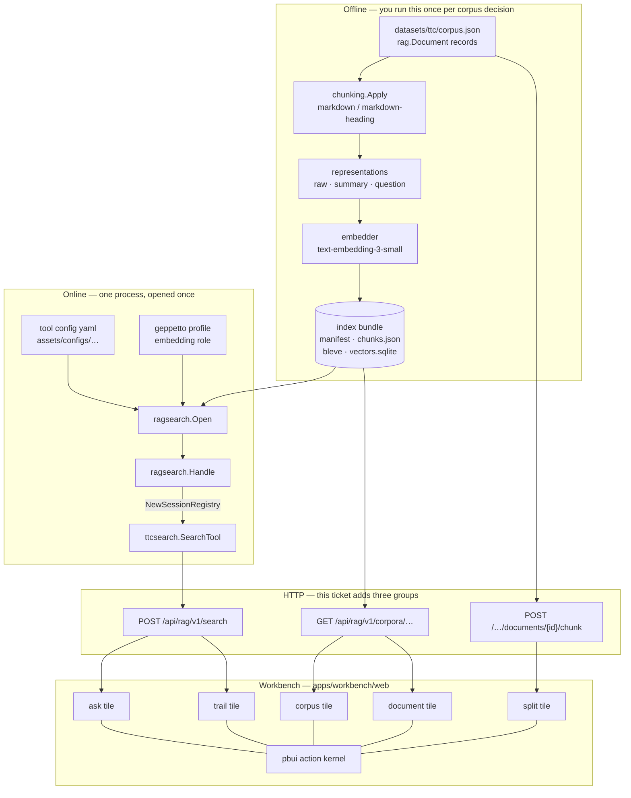

# Intern Guide: The Explore Workbench, End to End

## 0. Read this first

You are building three things on top of a system that already works:

1. a way to **run one search** against a built index and see, in full, what
   the retrieval pipeline did;
2. a way to **browse the material** — the documents and the chunks the
   indexer actually produced;
3. a way to **compare chunking strategies** on a single document without
   spending any money.

None of these require the optimization machinery — no campaigns, no
candidates, no proposals, no measurement epochs. That is deliberate. The
larger program treats retrieval as a scientific instrument; this ticket
builds the part you use *before* you have a hypothesis, when you are still
finding out what the system does at all.

Everything you need already exists in the repository: the corpus, an
evaluation set with real judgments, the chunker, the index builder, the
retrieval pipeline, the workbench shell, and the action kernel. Your job is
to connect them.

## 1. The system in one picture



Read it in three passes: what produces the bundle, what serves it, and what
renders it. The rest of this guide walks each layer in that order.

## 2. The substrate: from documents to a bundle

### 2.1 What a corpus is

A corpus is a JSON array of `rag.Document` records
(`github.com/go-go-golems/ragkit/rag`):

```go
type Document struct {
    ID            string
    SourceURI     string
    Title         string
    Text          string
    ContentDigest string
    Metadata      map[string]string
}
```

Three corpora are committed in `datasets/ttc/`, all real TTC content:

| File | Documents | What it is |
|---|---|---|
| `corpus.json` | 200 | the custody-bound candidate set the first experiments used |
| `corpus-2000.json` | 2,000 | intermediate slice |
| `corpus-full.json` | 3,149 | the complete published content — 483 articles, 19 guides, 2,594 products, 3.0M words |

Alongside them, `evaluation.json` holds `candidate:ttc-expansion-v1` — **148
queries with 243 graded judgments**, valid against all three corpora
(the full corpus splices the 200 in verbatim). You do not need to author
ground truth to have some.

### 2.2 What the build does

`rag-ttc index build` (`cmd/rag-ttc/cmds/indexes/build.go`) runs four phases:

```text
chunk        chunking.Apply(chunker, documents)      → []rag.Chunk
represent    per chunk, per kind                     → []rag.Representation
embed        embedder over representation texts      → []rag.Vector
index        bleve (lexical) + sqlite (exact vector) → bundle directory
```

The chunker is selected by `selectChunker` (`build.go:57`) and there are
exactly two:

- **`markdown`** — split at headings, then window the oversized sections
  with `--chunk-runes` and `--overlap-runes`;
- **`markdown-heading`** — keep heading sections whole, merging sections
  below `--min-section-runes` into the next.

Representations are `raw` (always present — the hydration invariant needs a
source representation, or a bundle could retrieve something it cannot cite)
plus any of `summary`, `contextual`, `question`, `entities`. Generated kinds
cost one model call per chunk per kind, which is why `--generation-budget`
exists and why `raw` alone costs nothing but embeddings.

Measured dry-run numbers, for calibration:

| Corpus | Documents | Chunks | Embedding items | Generation calls (raw only) |
|---|---|---|---|---|
| `corpus.json` | 200 | 1,979 | 1,979 | 0 |
| `corpus-full.json` | 3,149 | 17,749 | 17,749 | 0 |

Add `--representations raw,summary` to the full corpus and it becomes 17,749
generation calls — the hour-long job that motivates OPTKIT-028.

Running a dry run requires the profile registries, because the command
resolves an embedding provider even when it will not call one:

```bash
./rag-ttc index build \
  --corpus datasets/ttc/corpus.json \
  --profile-registries "$HOME/.config/pinocchio/profiles.yaml,$PWD/profiles.yaml" \
  --profile ttc-live-openai \
  --dry-run
```

### 2.3 What a bundle contains

A bundle is an immutable directory. Its manifest
(`ragkit/rag/indexbundle/types.go:40`) is the identity of everything
downstream:

```go
type Manifest struct {
    SchemaVersion       int
    BundleID            string
    CreatedAt           time.Time
    CorpusDigest        string
    CorpusPath          string
    DocumentCount       int
    ChunkCount          int
    RepresentationCount int
    Chunker             ChunkerIdentity   // {Name, MaximumRunes, OverlapRunes, MinSectionRunes}
    RepresentationKinds []string
    Lexical             BackendIdentity   // {Backend, Version, Channel, TitleBoost, BodyBoost}
    Vector              *VectorIdentity   // {Backend, Provider, Model, Dimensions, …}
}
```

Note what the manifest already records: **the chunker and its parameters**.
That is why the split tile (§7.3) can eventually say "this is exactly what
bundle X did" rather than "this is what these settings would do".

Two read APIs matter to you, and both are pure library calls with no server:

```go
inspection, err := indexbundle.Inspect(ctx, bundlePath)
// → *Inspection{Path, Manifest, Chunks []rag.Chunk, Documents []Document, Corpus}
statistics := indexbundle.Measure(inspection, indexbundle.StatisticsOptions{ShortRunes: 300})
// → Statistics{Chunks, Histogram []Bucket, Uncounted, Signals, Percentiles map[int]int,
//              TotalChunks, MaximumRunes}
```

`Inspect` reads `manifest.json` and `chunks.json` and nothing else — not the
vectors, not bleve — so it is cheap and safe to call on every request.
`Measure` computes the histogram, percentiles, and signals (short chunks,
chunks at the chunker limit, optional furniture heuristics). `Statistics`
reports `Uncounted` explicitly so a histogram whose bars do not sum to the
chunk count says so rather than lying quietly. That is the house style
throughout this codebase and you should preserve it.

The CLI commands in `cmd/rag-ttc/cmds/corpus/command.go` are thin wrappers
over exactly these two calls. **Slice 2 wraps them again, as HTTP.**

## 3. The retrieval pipeline

### 3.1 What one search does

`ttcsearch.SearchTool.RunRoute` (`pkg/ttc/search/search.go:168`) is the entry
point. Its shape:

```go
func (t *SearchTool) RunRoute(
    ctx context.Context, input SearchInput, requestedRoute string,
) (SearchOutput, error)

type SearchInput struct {
    Query string
    Limit int
    Route string
}
```

Internally it prepares the query, calls `Service.Retrieve`, and hydrates the
result into tool output. The stages you will see, for the default hybrid
route:

```text
lexical.raw           bleve BM25 over representation texts        → ranked hits
lexical.collapsed     collapse multiple representations per chunk → best per chunk
lexical.policy        source-role policy filter                   → allowed only
vector.knn            exact vector search over embeddings         → ranked hits
fusion.rrf            reciprocal rank fusion of the channels      → fused ranking
final                 limit + evidence ledger admission           → returned results
```

### 3.2 What a search records — and this is the important part

```go
type SearchOutput struct {
    Query                string
    Route                SearchRouteObservation
    Identity             RuntimeIdentity
    Stages               []RetrievalStage
    EffectiveLimit       int
    EffectiveLimitSource string
    Results              []SearchResult
    NewEvidenceCount     int
    Truncated            bool
    ChunkCatalog         []ChunkSummary
}

type RetrievalStage struct {
    Name              string
    Status            string
    InputCount        int
    OutputCount       int
    ChunkIDs          []string
    Candidates        []StageCandidate    // ← the good stuff
    CandidateArtifact CandidateArtifactReference
    ErrorClass        string
}

type StageCandidate struct {
    ChunkID          string
    Rank             int
    Channel          string
    RepresentationID string              // what it matched ON
    Score            *float64            // pointer: nil ≠ zero
    RerankerScore    *float64
    Contributions    []rag.Contribution  // {Channel, Rank, Weight, Value}
}
```

Three things to internalise:

- **`Score` is a pointer.** A stage that tracked only membership leaves it
  nil, and the UI must render "kept" rather than "0.00". Fabricating a score
  is worse than omitting one.
- **`RepresentationID` names the derived text the hit matched.** Once a
  bundle carries summaries, this is the field that tells you whether a match
  came from the author's words or a model's paraphrase.
- **`ChunkCatalog` carries the text of every chunk any stage touched**,
  including ones filtered out later, so a reviewer can read the candidate
  that lost, not just the winners.

This data is recorded on every campaign episode already. It is dropped by
`specialistapi.StageSummary` on the way to the browser — which is why the
`trail` tile in this ticket reads the **search response directly** and needs
no projection change at all.

### 3.3 The composition root

`internal/customer/ragsearch/ragsearch.go` is the reference for assembling a
live search. Read it before writing anything; your CLI command and your HTTP
handler both do what it does.

```go
handle, err := ragsearch.Open(ctx, ragsearch.Options{
    RepositoryRoot:   root,          // absolute; every other path resolves under it
    IndexBundle:      bundlePath,    // the immutable directory
    ToolConfig:       configPath,    // yaml: limits, top-Ks, RRF constant, routing
    ScratchDirectory: scratchPath,   // verifier scratch
    Settings:         settings,      // resolved geppetto inference settings
})
defer handle.Close()

registry, tool, err := handle.NewSessionRegistry()   // fresh evidence ledger
out, err := tool.RunRoute(ctx, ttcsearch.SearchInput{Query: q, Limit: n}, route)
```

What `Open` does, in order (`ragsearch.go:46`):

1. `toolconfig.Load` — reads the yaml, refuses if search is disabled;
2. `raggeppetto.NewBundle(Roles{Embedding: true})` — resolves the embedding
   provider from the geppetto profile;
3. `indexbundle.LoadVerifiedDocuments` — verifies source metadata **before**
   opening the serving index, because bleve holds an exclusive lock for the
   lifetime of an open handle;
4. `indexbundle.Open` — opens lexical, vector, and content stores with the
   query embedder attached;
5. `ttcsearch.NewSourceCatalog` — document metadata for citation;
6. builds a `ttcsearch.SearchConfig` from the tool config (`DefaultResults`,
   `MaxResultsPerCall`, `BM25TopK`, `VectorTopK`, `RRFConstant`,
   `AllowedSourceRoles`, plus the bundle and config digests);
7. compiles named routes and optional connected-RAG augmentation.

Two operational facts that will cost you an hour each if you learn them the
hard way:

- **Bleve's exclusive lock** means one process may hold a bundle open. Your
  server opens it once at startup, not per request.
- **`NewSessionRegistry` per request** is correct and cheap. The evidence
  ledger is turn-scoped by design — search evidence must never cross session
  boundaries — and the tool is a thin wrapper over shared, already-open
  stores.

## 4. The workbench, in five concepts

The frontend is `apps/workbench/web`. It is built on pbui, an action kernel
whose vocabulary is deliberately small. You need five ideas.

**A presentation** is a value plus a type name. `{type: "chunk", value:
{chunkId, documentId, title}}`. The registry
(`src/pbui/registry.ts`) maps each type to a **descriptor** —
`{tone, label, describe}` — and that is all a descriptor does. It never
decides what actions exist.

**A verb** is serializable data describing an intention:
`{kind: "open.chunk", chunkId: "…"}`. The product union lives in
`src/pbui/verbs.ts`. Verbs are never closures, because an agent has to be
able to emit them and a trace has to be able to record them.

**An action rule** is a contribution in `src/pbui/actions.ts` that says: for
this presentation type, in this scope, under these facts, offer this label
and bind this verb. Rules read a `SelectionSnapshot` of derived facts — never
tables, never fetches. Availability is explicit: an action can be
`available`, `unavailable` with a stated reason, or `inapplicable`. A greyed
row that explains itself beats a hidden one, because an agent plans against
the same vocabulary.

**A tile** is a React component registered with `defineApp`
(`src/apps/index.ts`). A tile is either a **singleton** (one instance, e.g.
`inspector`) or **doc-bound** (`docBound: true, bindings: [FOCUS_BINDING]`),
in which case it renders whatever its bound pointer document names. Pointer
documents are how navigation works: `open.chunk` writes a focus document
naming a chunk, and every tile bound to that document re-renders.

**A workspace** is a named layout in the workbench document —
`layout(split(...), {id, name})` in `src/workbench.ts`. The product ships one
today, called *Evidence*. This ticket adds *Explore*.

The data path for a read-only tile is uniform:

```text
tile → useFocusDoc(view) → pointer body → RTK Query hook (src/api/specialist.ts)
     → fetch /api/rag/v1/… → render, with every domain object wrapped in
       <Presentation reference={{type, value}}> so it carries its own menu
```

## 5. What this ticket does not touch

Worth stating plainly so you are not confused by the surrounding code:

- **No campaigns.** `serve` opens a store and composes handlers; an empty
  store is fine, and every campaign-bound tile renders its honest empty
  state. You are adding routes beside those, not changing them.
- **No journal, no episodes, no observations.** An ad-hoc search is not a
  measurement. It must never appear as one.
- **No proposals, candidates, or sealing.** The propose workspace is
  untouched.
- **No projection change.** `specialistapi.StageSummary` stays lossy for now;
  fixing it is a separate ticket that improves *recorded* episodes.

## 6. The three slices

### 6.1 Slice 1 — ad-hoc search and the trail

**The CLI command** comes first, because it is the composition seam and it
proves the wiring without a browser. `rag-ttc search` as a glazed command,
modelled on `cmd/rag-ttc/cmds/corpus/command.go` for structure and on
`ragsearch.Open` for behaviour.

```text
rag-ttc search
  --bundle PATH          --tool-config PATH     --repository-root PATH
  --query TEXT           --limit N              --route NAME
  --profile NAME         --profile-registries LIST
  --stages               # emit stage rows instead of result rows
```

Output rows (glazed, so you get table/json/yaml for free):

```text
results mode:  rank · chunk_id · document_id · title · score · citation · text_head
stages  mode:  stage · status · in · out · candidate · rank · channel ·
               representation · score · contributions
```

**The HTTP endpoint** is the same composition, opened once at startup:

```text
POST /api/rag/v1/search
  request   {"query": "...", "limit": 10, "route": ""}
  response  the SearchOutput verbatim, plus an identity block:
            {"bundle_id", "corpus_digest", "config_digest", "route"}
```

Three rules for this endpoint, each of which is a property the rest of the
program depends on:

- **It is not an episode.** Nothing is journaled. The identity block is what
  keeps a scratch result from ever being mistaken for a measured one.
- **It is metered, not gated.** Each call spends one query embedding. Show
  the cost; do not put an approval dialog in front of exploration.
- **It refuses honestly.** No bundle configured → a typed error with a code,
  the same `{error: {code, message}}` envelope every other route uses, which
  `normalizeApiError` in `src/api/specialist.ts` already understands.

**The tiles.** `ask` is a singleton with a query box, a lane (an arm or the
default config), and a result list. `trail` is doc-bound and renders one
result's path through every stage.

```text
┌ ⠿ ASK ─────────────────────────────────────────────────────────┐
│ [where is my order?                                     ][ask] │
│ AGAINST  ▌default route · limit 10        1 query · 312 tok    │
│ 10 results · 41 ms                                             │
│  1 ▌chunk 8f2… Shipping · Tracking          0.0492  [why?]     │
│  2 ▌chunk c17… Order status FAQ             0.0490  [why?]     │
│  3 ▌chunk a04… Returns policy               0.0401  [why?]     │
│ [clear]                                                        │
└────────────────────────────────────────────────────────────────┘

┌ ⠿ TRAIL · ptr-51ac ────────────────────────────────────────────┐
│ ▌chunk c17… "Order status FAQ"    in ▌run scratch-4f21         │
│ QUERY  where is my order?          FINAL rank 2 of 10          │
│ PATH                                                           │
│  lexical.raw          rank 7    bm25 4.11    on ▌raw           │
│  lexical.collapsed    rank 5    bm25 4.11    kept, best of 3   │
│  lexical.policy       kept                   no rule matched   │
│  vector.knn           rank 2    cos 0.81     on ▌raw           │
│  fusion.rrf           rank 2    0.0490                         │
│     ▌lexical  rank 5  weight 1.0  → 0.0167                     │
│     ▌vector   rank 2  weight 1.0  → 0.0323                     │
│  final                rank 2    returned                       │
│ BEATEN BY                                                      │
│  1 ▌chunk 8f2…  lex 1 · vec 3  → 0.0492   [why?]               │
└────────────────────────────────────────────────────────────────┘
```

New presentation types:

```ts
interface RunRef  { runId: string; query: string; route: string;
                    resultCount?: number }
interface HitRef  { runId: string; chunkId: string; rank: number;
                    score?: number; channel?: string;
                    representationId?: string; title?: string }
```

New verbs:

```ts
| { kind: "ask.run";   query: string; limit: number; route: string }
| { kind: "ask.clear" }
| { kind: "open.trail"; runId: string; chunkId: string }
```

Scratch runs live in a small Redux slice keyed by `runId`; the trail tile
binds to a focus document naming `{runId, chunkId}` and reads the run from
that slice. They are **not** synced as workbench documents: a `SearchOutput`
carries full chunk text, and pushing that through the document host would
put content into a store with no sensitivity model for it. Losing scratch
runs on reload is correct behaviour, not a defect.

### 6.2 Slice 2 — corpus and document

```text
GET /api/rag/v1/corpora/{bundleId}/survey
    → manifest identity, document/chunk counts, chunker identity,
      representation kinds, histogram buckets, percentiles, signal counts,
      uncounted

GET /api/rag/v1/corpora/{bundleId}/documents?sort=chunks&limit=&offset=
    → [{document_id, title, source_uri, chunks, runes, bytes}]

GET /api/rag/v1/corpora/{bundleId}/documents/{documentId}
    → {document_id, title, source_uri, text, chunks:[{chunk_id, index,
       byte_start, byte_end, runes, signals}]}
```

All three are `indexbundle.Inspect` + `indexbundle.Measure` reshaped. Cache
the inspection at startup beside the open handle; it is the same immutable
bundle for the process lifetime.

```text
┌ ⠿ CORPUS · ptr-a41f ───────────────────────────────────────────┐
│ ▌bundle 9ac2f1… · corpus af65383f… · built 2026-08-27          │
│ 200 documents · 1,979 chunks · representations raw             │
│ CHUNKER  markdown · max 1200 · overlap 120                     │
│ LENGTH   ▁▃▇▅▂▁   p50 402 · p95 1,180 · at-limit 61 · short 88 │
│ DOCUMENTS · showing 40 of 200          [sort: chunks ▾]        │
│  ▌doc Shipping and delivery       guide     31 chunks          │
│  ▌doc Blue Ice Hydrangea          product    9 chunks          │
│  ▌doc Returns policy              faq        4 chunks          │
└────────────────────────────────────────────────────────────────┘

┌ ⠿ DOCUMENT · ptr-c2b9 ─────────────────────────────────────────┐
│ ▌doc Shipping and delivery · 31 chunks · 12,401 runes          │
│ SOURCE  https://thetreecenter.com/shipping                     │
│ CHUNKS                                                         │
│  ▌1 [0,842)      "# Shipping\nWe ship Monday through…"         │
│  ▌2 [780,1610)   "## Tracking\nYour tracking number…"  at-limit│
│  ▌3 [1548,2190)  "## Delays\nWeather can delay…"               │
│ TEXT · boundaries marked inline                                │
│  # Shipping ⟦1⟧ We ship Monday through Thursday…               │
└────────────────────────────────────────────────────────────────┘
```

New types `CorpusRef` and `DocumentRef`; new verbs `open.corpus`,
`open.document`. The payoff is that an ask result becomes clickable through
to the document it came from.

### 6.3 Slice 3 — the chunking split

```text
POST /api/rag/v1/corpora/{bundleId}/documents/{documentId}/chunk
  request   {"settings":[{"id":"A","chunker":"markdown",
                          "max_runes":1200,"overlap_runes":120},
                         {"id":"B","chunker":"markdown-heading",
                          "max_runes":1200,"min_section_runes":200}]}
  response  {"document_id":…,"runes":…,
             "settings":[{"id":"A","chunks":[{index, byte_start, byte_end,
                                              runes, heading_path, orphaned}],
                          "stats":{count, median_runes, at_limit, orphaned}}]}
```

Pure CPU: `chunking.Apply` over one document, once per setting. No bundle
lock, no model, no budget. The only judgement call is `orphaned` — a chunk
that lost its heading context — which is a heuristic and must be labelled as
one in the UI.

```text
┌ ⠿ SPLIT · ptr-3e70 ────────────────────────────────────────────┐
│ ▌doc Shipping and delivery · 12,401 runes                      │
│ A markdown 1200/120        B markdown-heading 1200/200         │
│ A · 31 chunks  p50 402  ⚠ 7 orphaned    B · 18 chunks  p50 690 │
│ ┌─ A ─────────────────────┐┌─ B ──────────────────────────────┐│
│ │ ▌1 [0,842)    # Shipping ││ ▌1 [0,1610)   # Shipping        ││
│ │ ▌2 [780,1610) ## Tracking││   (heading section kept whole)  ││
│ │ ▌3 [1548,2190)## Delays  ││ ▌2 [1610,2190)## Delays         ││
│ └─────────────────────────┘└──────────────────────────────────┘│
└────────────────────────────────────────────────────────────────┘
```

`ChunkPreviewRef` is a distinct type from `chunk` and gets a nearly empty
menu — Inspect only. A previewed chunk exists in no index; offering "open the
chunk" would offer an operation that cannot mean anything.

## 7. API reference

### 7.1 Existing routes (for orientation)

| Route | Purpose |
|---|---|
| `GET /api/rag/v1/campaigns/{c}/cockpit` | campaign summary — untouched |
| `GET /api/rag/v1/campaigns/{c}/episodes/{e}/pipeline` | recorded stages (lossy — see §3.2) |
| `POST /api/rag/workbench/v1/…` | command API, bearer auth — untouched |
| `/api/rag/workbench-docs/v1/…` | workbench document host — layout and pointers |

### 7.2 New routes

| Route | Method | Auth | Spends |
|---|---|---|---|
| `/api/rag/v1/search` | POST | none (read tier) | one query embedding |
| `/api/rag/v1/corpora` | GET | none | nothing |
| `/api/rag/v1/corpora/{id}/survey` | GET | none | nothing |
| `/api/rag/v1/corpora/{id}/documents` | GET | none | nothing |
| `/api/rag/v1/corpora/{id}/documents/{docId}` | GET | none | nothing |
| `/api/rag/v1/corpora/{id}/documents/{docId}/chunk` | POST | none | nothing |

Every response uses the existing error envelope:

```json
{ "error": { "code": "bundle_not_configured",
             "message": "serve was started without --index-bundle" } }
```

### 7.3 New serve flags

```text
--index-bundle PATH     immutable bundle directory; absent disables the
                        search and corpus routes with a typed error
--tool-config PATH      retrieval tool configuration yaml
--repository-root PATH  root every other path resolves under (default .)
--profile NAME          geppetto profile carrying the embedding role
--profile-registries L  comma-separated registry sources
```

## 8. File reference

**You will create:**

```text
rag-ttc/cmd/rag-ttc/cmds/search/command.go        the search CLI
rag-ttc/pkg/ttc/exploreapi/                       the new projections
    search.go        POST /search over a ragsearch.Handle
    corpus.go        survey / documents / document
    split.go         chunking preview
    types.go         wire types
    http.go          route registration
rag-ttc/apps/workbench/web/src/apps/AskApp.tsx
rag-ttc/apps/workbench/web/src/apps/TrailApp.tsx
rag-ttc/apps/workbench/web/src/apps/CorpusApp.tsx
rag-ttc/apps/workbench/web/src/apps/DocumentApp.tsx
rag-ttc/apps/workbench/web/src/apps/SplitApp.tsx
rag-ttc/apps/workbench/web/src/api/explore.ts     RTK Query slice
rag-ttc/apps/workbench/web/src/store/runs.ts      scratch run slice
```

**You will modify:**

```text
cmd/rag-ttc/cmds/experiments/optkitrag/serve.go   open the bundle, mount routes
cmd/rag-ttc/main.go                               register the search command
apps/workbench/web/src/pbui/types.ts              5 new refs + Values entries
apps/workbench/web/src/pbui/verbs.ts              new verb kinds + describeVerb
apps/workbench/web/src/pbui/actions.ts            type graph + contributions
apps/workbench/web/src/pbui/registry.ts           5 descriptors
apps/workbench/web/src/pbui/descriptors/*.ts      5 new files
apps/workbench/web/src/apps/index.ts              5 defineApp entries
apps/workbench/web/src/workbench.ts               the Explore workspace
apps/workbench/web/src/documents/formats.ts       focus body fields
pkg/ttc/workbenchhost/documents.go                focus validator fields
pkg/ttc/workbenchhost/catalog.go                  5 app catalog entries
```

**You will read (do not modify):**

```text
internal/customer/ragsearch/ragsearch.go          the composition to copy
pkg/ttc/search/search.go, service.go              the retrieval contract
cmd/rag-ttc/cmds/corpus/command.go                the inspection to wrap
cmd/rag-ttc/cmds/indexes/build.go                 chunker selection
apps/workbench/web/src/apps/AutopsyApp.tsx        the closest tile to copy
apps/workbench/web/src/apps/focus.ts              pointer document reading
```

## 9. Invariants you must not break

These are program-wide rules. Violating one produces a system that lies,
which is worse than one that is incomplete.

- **Missing is never zero.** A nil score renders as absent, not `0.00`. A
  stage with no candidates says "membership only".
- **A refusal is data.** An action that cannot run is `unavailable` with a
  reason, never a silent no-op and never a hidden row.
- **Scratch is not measured.** An ad-hoc search must be visibly distinct from
  a recorded episode, everywhere it appears.
- **Identity travels with results.** Every response carries the bundle,
  corpus, and config digests that produced it.
- **One vocabulary.** Anything a human can do from a menu is a verb in the
  union, and therefore something an agent could request and the trace will
  record. Do not add a side channel.
- **Derived state is never stored.** Counts, percentiles and diffs are
  computed at render from what the server returned.

## 10. Running it end to end

```bash
# 1. build a small bundle (needs an OpenAI key on the profile)
./rag-ttc index build \
  --corpus datasets/ttc/corpus.json \
  --output-root .cache/rag-ttc/indexes \
  --profile-registries "$HOME/.config/pinocchio/profiles.yaml,$PWD/profiles.yaml" \
  --profile ttc-live-openai \
  --embedding-budget 2500 --max-estimated-usd 1.00 --allow-unpriced-provider

# 2. look at what it produced
./rag-ttc inspect corpus stats     --bundle .cache/rag-ttc/indexes/<id>
./rag-ttc inspect corpus documents --bundle .cache/rag-ttc/indexes/<id>

# 3. search it from the terminal
./rag-ttc search --bundle .cache/rag-ttc/indexes/<id> \
  --tool-config assets/configs/tool-qa/production-v1.yaml \
  --query "where is my order?" --stages

# 4. serve it and open the workbench
./rag-ttc experiment optkit-rag serve \
  --store .cache/rag-ttc/store --listen 127.0.0.1:8517 \
  --workbench-docs-store .cache/rag-ttc/docs \
  --index-bundle .cache/rag-ttc/indexes/<id> \
  --tool-config assets/configs/tool-qa/production-v1.yaml
cd apps/workbench/web && pnpm dev
```

## 11. Glossary

| Term | Meaning here |
|---|---|
| **bundle** | an immutable built index directory: manifest, chunks, bleve, vectors |
| **chunk** | one unit of retrievable text with a byte range into its document |
| **representation** | a derived searchable text for a chunk (raw, summary, …) |
| **channel** | one retriever's output stream (lexical, vector) |
| **stage** | one recorded step of the pipeline with its candidates |
| **RRF** | reciprocal rank fusion — combines channel rankings by rank, not score |
| **run** | one retrieval; here always *scratch* (ad-hoc), never recorded |
| **hit** | one chunk as one run saw it: rank, score, channel, representation |
| **presentation** | a typed value that carries its own menu |
| **verb** | serializable intention data — the only way anything changes |
| **tile** | a registered workbench app, singleton or bound to a pointer document |
| **workspace** | a named layout of tiles |
