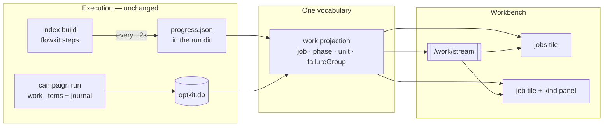

# Watching a Build: Progress, Phases, and the Job View

## 1. What this ticket is for

A ten-minute build is worth watching. A ninety-minute one — the full corpus
with generated summaries, 17,749 model calls — is worth watching carefully,
because the things that go wrong in it (rate limits, a degraded provider, a
budget projection crossing its ceiling) all announce themselves in the first
few minutes if anything is showing them.

Today nothing is. `rag-ttc index build` prints a table when it finishes. Kill
it halfway and you learn nothing about what it did. The engine underneath is
better than that: it counts everything, classifies every error, tracks spend
per resource, and quarantines what it cannot retry. It simply never says so
until the end.

This ticket makes the in-flight state visible. It is scoped to **watching**;
control (pause, stop, retry a failure group) is designed here but deliberately
implemented last, because the observability is what pays for itself
immediately.

## 2. What already exists

Two work engines run in this system, and neither needs rewriting.

**Engine A — campaigns** (`pkg/ttc/optkitcampaign`). Episodes are `work_items`
rows with leases; state transitions are journal events; budget reserves before
and commits after each episode. It is already queryable live: the data for a
progress view is sitting in SQLite right now.

**Engine B — builds and flow-based experiments** (`flowkit/flow` +
`ragopt/pkg/runstore`). This is what `index build` uses, and it already
produces almost exactly the view this ticket wants:

```go
// flowkit/flow/report.go
type StepReport struct {
    Items            int
    Hits             int              // cache hits — free, and counted as free
    Misses           int
    Stored           int
    WorkCalls        int
    StartedSequences int
    Retries          int
    Quarantined      int
    Skipped          int
    RetriesByClass   map[string]int                      // ← failure grouping
    Spend            map[string]execution.BudgetSnapshot // ← per-resource
    Meters           Meters                              // ← tokens, cost
}

type Report struct { Steps map[string]StepReport }
```

and errors are already classified (`flowkit/flow/classify.go`):

```go
type ErrorClass int
const (
    Transient  ErrorClass = iota  // retried with backoff
    DataError                     // malformed response; never retried
    Fatal                         // fails the run regardless
)
```

and every run already has a durable identity (`ragopt/pkg/runstore`):
`Manifest{RunID, Name, StartedAt, ConfigDigest, Dimensions, Host, ModuleVersion}`,
`Status{State, StartedAt, FinishedAt, Error}`, `Summary{Message, Metrics}`,
plus `InputRef` records with SHA-256 for every input file copied into the run.

**The gap is one word: terminal.** `flow.Report` is returned when the run
ends. Nothing publishes it while the run is going.

## 3. The design in one sentence

**Publish the in-flight report periodically to the run directory, project both
engines into one job vocabulary, and render that vocabulary in two tiles.**



The critical decision is that **the engines do not converge**. Unifying them
in the runtime would be a rewrite of two working systems to serve a read
surface. Unifying them in the projection costs one adapter each.

## 4. The one behavioural change: progress snapshots

### 4.1 What to write

A `progress.json` in the `runstore` run directory, rewritten atomically every
few seconds and once more at each phase boundary:

```json
{
  "schema_version": 1,
  "run_id": "…",
  "state": "running",
  "current_step": "embed",
  "step_order": ["chunk", "represent", "embed", "index"],
  "updated_at": "2026-08-27T14:31:02Z",
  "steps": {
    "chunk":     {"items": 1979, "work_calls": 0,    "done": true},
    "represent": {"items": 1979, "work_calls": 1979, "done": true,
                  "meters": {"generation.tokens": 2143221},
                  "spend": {"generation.calls": {"used": 1979, "ceiling": 2500}}},
    "embed":     {"items": 1979, "work_calls": 1140, "done": false,
                  "retries": 54, "retries_by_class": {"transient": 54},
                  "quarantined": 0,
                  "meters": {"embedding.tokens": 610233},
                  "spend": {"embedding.items": {"used": 1140, "ceiling": 2500}}}
  }
}
```

This is `flow.Report` plus three fields: the ordered step list, the current
step, and a timestamp.

### 4.2 Why a file and not a callback

A progress callback on `flow.Policy` is the better long-term design and
should be proposed upstream in flowkit. This ticket does not wait for it, for
three reasons:

- **It works for every existing command** with a change at the call site
  rather than in the engine, so `index build`, `chunkcompare` and
  `answerquality` all become watchable at once.
- **It survives the process dying.** The last snapshot is on disk with a
  timestamp, so a stalled or killed job reads as *visibly stale* rather than
  as a frozen number pretending to be live. A UI that cannot tell those apart
  is worse than no UI.
- **It requires no coordination** between a running CLI and a serving
  process. The server watches a directory; that is the entire integration.

The honesty rule that falls out: the projection reports `updated_at`, and the
tile shows staleness explicitly once a snapshot is older than a threshold.

### 4.3 Where it hooks in

`cmd/rag-ttc/cmds/indexes/build.go` already creates a run through
`runstore.Create` and copies its inputs. The change is a small publisher
started beside the flow execution:

```text
publisher := progress.Start(run.Dir(), stepOrder, 2*time.Second)
defer publisher.Close()          // writes a final snapshot with terminal state
… flow execution, publisher.Observe(stepName, report) per step tick …
```

## 5. The job vocabulary

Four types, projected from both engines.

```ts
interface JobRef {
  jobId: string;
  kind: "build" | "campaign" | "judge" | "sweep";
  label: string;
  state: "queued" | "running" | "paused" | "stopped" | "done" | "failed";
  stale?: boolean;          // snapshot older than the freshness threshold
  supervised?: boolean;     // can this process control it?
}
interface PhaseRef {
  jobId: string; phase: string;
  state: "pending" | "running" | "done" | "failed";
  done?: number; total?: number; ratePerMin?: number;
}
interface UnitRef {
  jobId: string; phase: string; unitId: string;
  state: "queued" | "running" | "done" | "failed";
  attempt?: number; subjectLabel?: string;
}
interface FailureGroupRef {
  jobId: string; cause: string;
  class: "transient" | "data" | "fatal";
  count: number; growing?: boolean;
}
```

**Engine A adapter** (campaigns): phases are plan / execute / score; units are
episodes from `work_items`; failure groups come from terminal failures with
their error class; spend comes from the budget ledger. Pure projection over
data that exists today — this adapter can be written and tested before any
snapshot work.

**Engine B adapter** (builds): phases are flow steps in declared order; the
counters come straight from the snapshot; failure groups come from
`RetriesByClass` plus quarantine records; spend comes from `Spend` and
`Meters`. Units are only individually addressable where the engine records
them — quarantined items are, in-flight ones are not, and the projection must
say `units_addressable: false` rather than invent a list.

## 6. Projections

| Endpoint | Returns |
|---|---|
| `GET /api/rag/v1/work` | every job: kind, state, current phase, progress, rate, spend against ceiling, staleness |
| `GET /api/rag/v1/work/{jobId}` | inputs, ordered phases with counters and projections, throughput settings |
| `GET /api/rag/v1/work/{jobId}/failures` | groups by cause and class, counts, growth |
| `GET /api/rag/v1/work/{jobId}/units?phase=&status=` | units where addressable |
| `GET /api/rag/v1/work/stream` | SSE: phase advanced, counters changed, group grew, state changed |

Serve gains `--runs-root PATH`, the directory it watches for run
directories. Absent, the work routes report `runs_root_not_configured` — a
typed refusal, never an empty list that looks like "no jobs".

### Projections that must be computed, not stored

- **rate** — units per minute over a trailing window, from consecutive
  snapshots. A rate derived from the whole run average is useless exactly
  when it matters (a run that has just slowed down).
- **estimated remaining** — remaining units ÷ trailing rate, absent when
  the rate is unknown rather than displayed as zero.
- **projected spend** — remaining units × observed cost per unit, compared to
  the ceiling. This is the number that earns the ticket: it turns "I ran out
  of budget at 80%" into a warning at 40%.

## 7. Tiles

### `jobs` — everything at once (singleton)

```text
┌ ⠿ JOBS ────────────────────────────────────────────────────────┐
│ RUNNING · 2                               spend today  $4.18   │
│ ▌job build ttc-full raw+summary       embed   8,412/17,749     │
│    ▇▇▇▇░░░░░░  47% · 41/min · ~3h48m · $3.02 of $12.00         │
│ ▌job campaign rrf-sweep               execute    41/60  ✖1     │
│    ▇▇▇▇▇▇▇░░░  68% · 4.2/min · ~4m                             │
│ FINISHED · 24h                                                 │
│ ▌job build ttc-200 raw            ✔ 4m11s · $0.04              │
│ ▌job build ttc-full raw           ■ stopped · 9,120 done       │
└────────────────────────────────────────────────────────────────┘
```

### `job` — one job in detail (doc-bound: focus)

The frame is identical for every kind — identity, inputs, phases, failures,
throughput, control — and a **kind panel** renders what is specific. That
registry is the same pattern as the specialist app's schema-keyed output
widgets, and it is what stops this becoming four bespoke tiles.

```text
┌ ⠿ JOB · ptr-71bd ──────────────────────────────────────────────┐
│ ▌job build ttc-full · running · started 09:14 (1h47m)          │
│ INPUTS  corpus af65383f… (3,149 docs) · chunker markdown 1200  │
│         representations raw,summary · embed text-embedding-3-… │
│ PHASES                                                         │
│  ✔ ▌chunk         17,749/17,749     3m11s              free    │
│  ✔ ▌represent     17,749/17,749    52m04s   $2.71 · 2.1M tok   │
│  ▶ ▌embed          8,412/17,749    41/min   $3.02 · 1.3M tok   │
│      ▇▇▇▇░░░░░░ 47%  ~3h48m left   ⚠ projects $6.4 of $12.0    │
│  ○ ▌index              0/1         projected 4m                │
│ FAILURES · 61 in 3 groups                                      │
│  ▌group rate_limit        transient  54  ▲ growing  [retry]    │
│  ▌group context_too_long  data        6    stopped  [retry]    │
│  ▌group provider_5xx      transient   1    stopped             │
│ SNAPSHOT  2s ago                                               │
│ CONTROL  [pause] [stop]        not supervised — started in a   │
│                                terminal; watch only            │
└────────────────────────────────────────────────────────────────┘
```

Note the control bar in its honest state. A job this process did not start
cannot be controlled, and the tile says which it is. Buttons that do nothing
are the failure mode to avoid.

## 8. Control (designed now, built last)

```ts
| { kind: "job.pause";  jobId: string }
| { kind: "job.stop";   jobId: string }
| { kind: "job.resume"; jobId: string; approvalId?: string }   // DANGER
| { kind: "job.retryGroup"; jobId: string; cause: string; approvalId?: string }
| { kind: "job.setConcurrency"; jobId: string; workers?: number; batchSize?: number }
```

Through the command API with a new `job.control` authorizer action. Resume and
retry are danger verbs — they spend money — so they ride the existing approval
flow: an agent may request, a human approves.

- **Engine A** pauses and resumes naturally: leases expire, `campaign resume`
  continues. This is proven behaviour and is where control should start.
- **Engine B** needs a stop sentinel in the run directory, polled between
  items so nothing is interrupted mid-call. A stopped run writes a terminal
  snapshot saying it was stopped deliberately, which must be distinguishable
  from a crash.

## 9. What this ticket does not build

- **No third execution engine.** The projection gets the same result for a
  fraction of the cost of unifying the runtimes.
- **No alerting.** No email, no push, no webhooks. The finished list with
  outcomes and costs is the overnight answer; delivery is a separate concern.
- **No scheduling.** Jobs start because a person or a dependency starts them.
- **No log viewer.** The unit is the unit of inspection.
- **No per-kind tiles.** Kind panels inside one job tile.
- **No automatic remediation.** Retry policy and classification belong to
  flowkit and are already there; the UI surfaces them and lets a human act.

## 10. Sequencing

| Phase | Work | Gates on |
|---|---|---|
| P1 | Progress snapshot publisher + `index build` hook | nothing |
| P2 | Work projection, engine B adapter, `--runs-root` | P1 |
| P3 | `jobs` and `job` tiles, build kind panel, SSE | P2 |
| P4 | Engine A adapter (campaigns join the same view) | P2 |
| P5 | Control: engine A first, then the engine B sentinel | P3 |

P1 through P3 is the ticket's value: a build you can watch. P4 makes the view
complete; P5 makes it interactive.

## 11. Open questions

- **Where does the projection discover runs?** Watching a runs root is
  proposed. A registry table in the store is the alternative and would let a
  run on another machine appear. The choice is not reversible cheaply.
- **Snapshot interval.** Two seconds is a guess. It should be a flag, and the
  freshness threshold in the UI should be derived from it rather than
  hard-coded.
- **Is a campaign plus its judge batch one job or two?** Proposed: two, with
  an explicit dependency, because that keeps each job's phases honest.
- **Unit addressability.** Engine B can name quarantined items but not
  in-flight ones. Is `units_addressable: false` enough, or should the flow
  steps record identifiers for the items they are working on right now?
